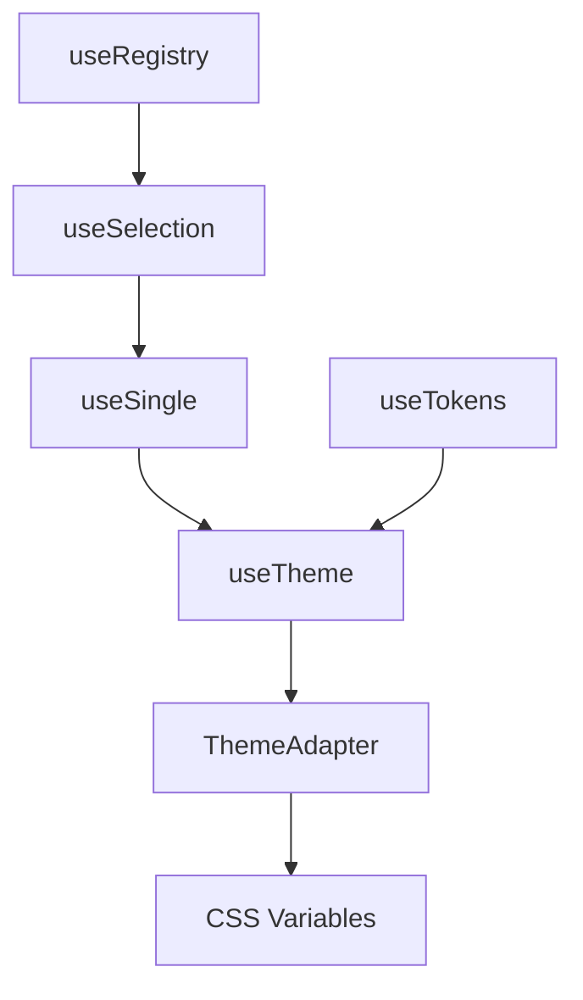

# useTheme

The `useTheme` composable provides comprehensive theme management capabilities, allowing you to register multiple themes, switch between them dynamically, and automatically generate CSS custom properties. Built on `useSingle` for single-theme selection and `useTokens` for design token alias resolution.

<DocsPageFeatures :frontmatter />

## Installation

Install the Theme plugin in your app's entry point:

```ts main.ts
import { createApp } from 'vue'
import { createThemePlugin } from '@vuetify/v0'
import App from './App.vue'

const app = createApp(App)

app.use(
  createThemePlugin({
    default: 'light',
    themes: {
      light: {
        dark: false,
        colors: {
          primary: '#3b82f6',
        },
      },
      dark: {
        dark: true,
        colors: {
          primary: '#675496',
        },
      },
    },
  })
)

app.mount('#app')
```

## Usage

Once the plugin is installed, use the `useTheme` composable in any component:

```vue UseTheme
<script setup lang="ts">
  import { useTheme } from '@vuetify/v0'

  const theme = useTheme()

  function toggleTheme() {
    theme.cycle(['light', 'dark'])
  }
</script>

<template>
  <div>
    <h1>Current Theme: {{ theme.selectedId }}</h1>
    <p>Dark mode: {{ theme.isDark ? 'enabled' : 'disabled' }}</p>
    <button @click="toggleTheme">Toggle Theme</button>
  </div>
</template>
```

## Architecture

`useTheme` extends `useSingle` for theme selection and `useTokens` for color resolution:



<DocsApi />
