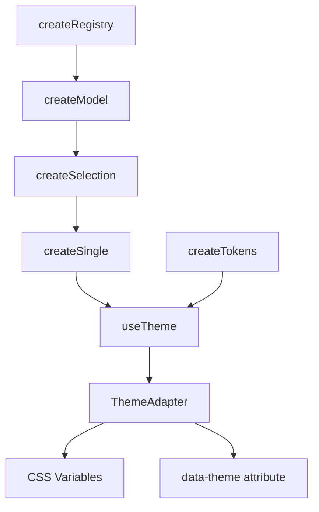

# useTheme

Theme management with multiple themes, CSS custom properties, and token alias resolution.

<DocsPageFeatures :frontmatter />

## Installation

Install the Theme plugin in your app's entry point:

```ts main.ts
import { createApp } from 'vue'
import { createThemePlugin } from '@vuetify/v0'
import App from './App.vue'

const app = createApp(App)

app.use(
  createThemePlugin({
    default: 'light',
    themes: {
      light: {
        dark: false,
        colors: {
          primary: '#3b82f6',
        },
      },
      dark: {
        dark: true,
        colors: {
          primary: '#675496',
        },
      },
    },
  })
)

app.mount('#app')
```

## Usage

Once the plugin is installed, use the `useTheme` composable in any component:

```vue collapse no-filename UseTheme
<script setup lang="ts">
  import { useTheme } from '@vuetify/v0'

  const theme = useTheme()

  function toggleTheme() {
    theme.cycle(['light', 'dark'])
  }
</script>

<template>
  <div>
    <h1>Current Theme: {{ theme.selectedId }}</h1>
    <p>Dark mode: {{ theme.isDark ? 'enabled' : 'disabled' }}</p>
    <button @click="toggleTheme">Toggle Theme</button>
  </div>
</template>
```

## Adapters

Adapters let you swap the underlying CSS injection strategy without changing your application code.

| Adapter | Import | Description |
|---------|--------|-------------|
| `V0StyleSheetThemeAdapter` | `@vuetify/v0` | Injects CSS via `adoptedStyleSheets` (default, SPA only) |
| `V0UnheadThemeAdapter` | `@vuetify/v0/theme/adapters/unhead` | Injects CSS via [Unhead](https://unhead.unjs.io/) for SSR/SSG |

Both adapters set a `data-theme` attribute on the root element. Theme CSS is scoped to `[data-theme="light"]` / `[data-theme="dark"]` selectors so multiple themes can coexist in the same stylesheet.

**When to use each:**

- **`V0StyleSheetThemeAdapter`** (default) — SPAs without SSR. Uses `document.adoptedStyleSheets` to inject a live `CSSStyleSheet` — no DOM `<style>` element, zero flicker, works well with CSP when configured.
- **`V0UnheadThemeAdapter`** — SSR or SSG (Nuxt, VitePress). Manages the `<style>` tag and `data-theme` attribute via Unhead so the correct theme is rendered in the initial HTML, avoiding a flash of the wrong theme on hydration. Requires `@unhead/vue`.

## Architecture

`useTheme` extends `createSingle` for theme selection and `createTokens` for color resolution:


```mermaid "Theme Hierarchy"
flowchart TD
  createRegistry --> createModel
  createModel --> createSelection
  createSelection --> createSingle
  createSingle --> useTheme
  createTokens --> useTheme
  useTheme --> Adapter[ThemeAdapter]
  Adapter --> CSS[CSS Variables]
  Adapter --> Attr["data-theme attribute"]
```

## Reactivity

Theme selection and computed colors are reactive. Switching themes automatically updates CSS variables.

| Property/Method | Reactive | Notes |
| - | :-: | - |
| `selectedId` | <AppSuccessIcon /> | Current theme ID |
| `selectedItem` | <AppSuccessIcon /> | Current theme ticket |
| `selectedValue` | <AppSuccessIcon /> | Current theme colors |
| `selectedIndex` | <AppSuccessIcon /> | Index in registry |
| `colors` | <AppSuccessIcon /> | Resolved colors for all registered themes (keyed by theme ID) |
| `isDark` | <AppSuccessIcon /> | Current theme is dark |
| `select(id)` | — | Switch to a specific theme by ID |
| `cycle(ids?)` | — | Advance to the next theme. Pass an array to restrict which themes to cycle |

## Examples

::: gn-example
/composables/use-theme/context.ts 1
/composables/use-theme/Preview.vue 2
/composables/use-theme/color-studio.vue 3

### Color Studio

A full theme explorer built on `useTheme` with four pre-registered themes sharing a common palette of token aliases. `context.ts` defines the palette (a nested object of color shades) and registers each theme's color map as aliases that reference palette tokens — so changing one palette shade propagates to every theme that references it.

The swatch grid iterates `theme.colors.value[theme.selectedId.value]` to show all resolved colors for the active theme. Clicking a swatch copies the hex value to the clipboard via a short-lived `copied` ref, demonstrating that `useTheme` returns plain objects from `colors` rather than reactive refs — the resolved values are stable strings that can be handed directly to clipboard APIs or inline styles.

The "Register" buttons at the bottom call `theme.register({ id, dark, colors })` at runtime — themes do not need to be declared at plugin install time. Registering a theme that already exists is a no-op; `theme.has(id)` guards the call and falls through to `theme.select(id)` instead. Use `theme.cycle()` without arguments to advance through all registered themes in insertion order, or pass an array to restrict the cycle to a subset.

Reach for `useTheme` when you need to read the active theme's colors in script (e.g. to pass to a canvas renderer or a charting library), or when you want to register themes at runtime from user preferences. For subtree theme isolation — a component tree with its own independent theme — see the [Theme provider](/components/providers/theme). For the token alias system that powers multi-theme color resolution, see [createTokens](/composables/registration/create-tokens).

| File | Role |
|------|------|
| `context.ts` | Defines palette aliases and registers four themes via `createThemeContext` |
| `Preview.vue` | Mini app UI that renders using resolved theme colors passed as props |
| `color-studio.vue` | Theme selector, swatch grid, palette token inspector, and dynamic registration |

:::

<DocsApi />
