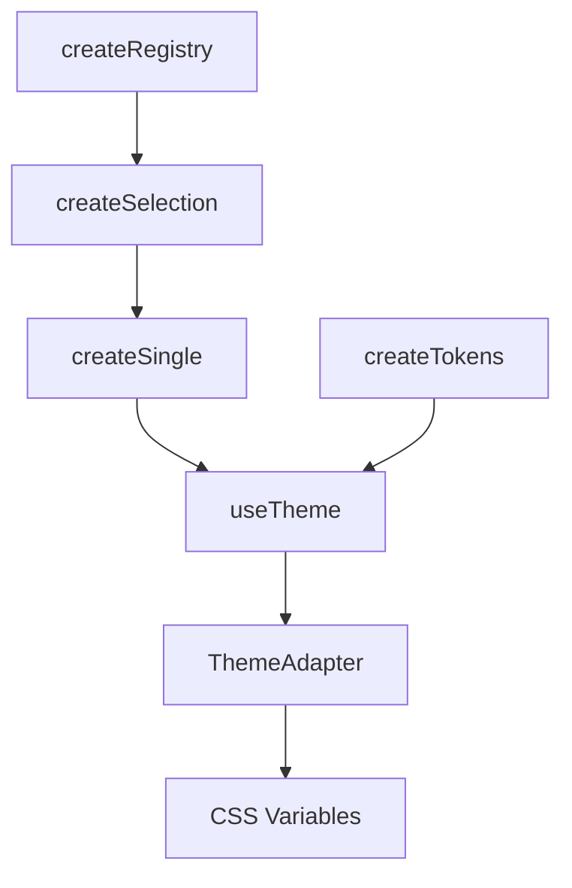

# useTheme

<DocsPageFeatures :frontmatter />

Theme management with multiple themes, CSS custom properties, and token alias resolution.

## Installation

Install the Theme plugin in your app's entry point:

```ts main.ts
import { createApp } from 'vue'
import { createThemePlugin } from '@vuetify/v0'
import App from './App.vue'

const app = createApp(App)

app.use(
  createThemePlugin({
    default: 'light',
    themes: {
      light: {
        dark: false,
        colors: {
          primary: '#3b82f6',
        },
      },
      dark: {
        dark: true,
        colors: {
          primary: '#675496',
        },
      },
    },
  })
)

app.mount('#app')
```

## Usage

Once the plugin is installed, use the `useTheme` composable in any component:

```vue collapse no-filename UseTheme
<script setup lang="ts">
  import { useTheme } from '@vuetify/v0'

  const theme = useTheme()

  function toggleTheme() {
    theme.cycle(['light', 'dark'])
  }
</script>

<template>
  <div>
    <h1>Current Theme: {{ theme.selectedId }}</h1>
    <p>Dark mode: {{ theme.isDark ? 'enabled' : 'disabled' }}</p>
    <button @click="toggleTheme">Toggle Theme</button>
  </div>
</template>
```

## Adapters

Adapters let you swap the underlying CSS injection strategy without changing your application code.

| Adapter | Import | Description |
|---------|--------|-------------|
| `V0StyleSheetThemeAdapter` | `@vuetify/v0` | Injects CSS via `<style>` elements (default) |
| `V0UnheadThemeAdapter` | `@vuetify/v0/theme/adapters/unhead` | Injects CSS via [Unhead](https://unhead.unjs.io/) for SSR |

## Architecture

`useTheme` extends `createSingle` for theme selection and `createTokens` for color resolution:


```mermaid "Theme Hierarchy"
flowchart TD
  createRegistry --> createSelection
  createSelection --> createSingle
  createSingle --> useTheme
  createTokens --> useTheme
  useTheme --> Adapter[ThemeAdapter]
  Adapter --> CSS[CSS Variables]
```

## Reactivity

Theme selection and computed colors are reactive. Switching themes automatically updates CSS variables.

| Property | Reactive | Notes |
| - | :-: | - |
| `selectedId` | <AppSuccessIcon /> | Current theme ID |
| `selectedItem` | <AppSuccessIcon /> | Current theme ticket |
| `selectedValue` | <AppSuccessIcon /> | Current theme colors |
| `selectedIndex` | <AppSuccessIcon /> | Index in registry |
| `colors` | <AppSuccessIcon /> | Resolved colors with aliases |
| `isDark` | <AppSuccessIcon /> | Current theme is dark |

## Examples

### Color Studio

::: example
/composables/use-theme/context.ts 1
/composables/use-theme/Preview.vue 2
/composables/use-theme/color-studio.vue 3

### Color Studio

A theme explorer using `createTheme` with a shared palette of token aliases. Switch between predefined themes, inspect resolved colors, and register new themes at runtime.

| File | Role |
|------|------|
| `context.ts` | Creates `createTheme` with palette aliases and four themes |
| `Preview.vue` | Mini app UI that renders using resolved theme colors |
| `color-studio.vue` | Theme selector, swatch grid, and dynamic registration |
:::

<DocsApi />
