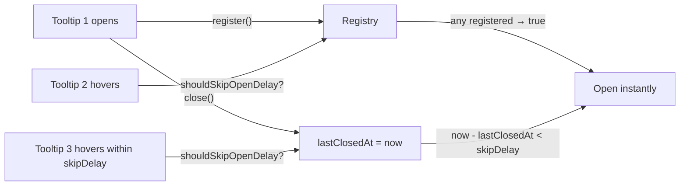

# useTooltip

Region-scoped coordination plugin for tooltip open/close delays. Holds shared `openDelay` / `closeDelay` / `skipDelay` defaults plus a registry of currently-open tooltip tickets so neighboring `<Tooltip.Root>` instances can skip their open delay during the warmup window.

<DocsPageFeatures :frontmatter />

## Usage

```ts collapse
import { createTooltipPlugin, useTooltip } from '@vuetify/v0'

// App-wide defaults
app.use(createTooltipPlugin({
  openDelay: 500,
  closeDelay: 150,
  skipDelay: 300,
}))

// Inside a component
const region = useTooltip()

region.openDelay.value          // 500
region.isAnyOpen.value          // false
region.shouldSkipOpenDelay()    // false until a tooltip opens
```

`<Tooltip.Root>` reads from `useTooltip()` automatically; you do not call this composable yourself unless you're building a non-component consumer.

## Architecture



## Reactivity

| Property | Type | Description |
|----------|------|-------------|
| `openDelay` | `Readonly<Ref<number>>` | Default open delay in ms (700) |
| `closeDelay` | `Readonly<Ref<number>>` | Default close delay in ms (150) |
| `skipDelay` | `Readonly<Ref<number>>` | Skip-window after last close in ms (300) |
| `disabled` | `Readonly<Ref<boolean>>` | Region-wide disabled flag |
| `isAnyOpen` | `Readonly<Ref<boolean>>` | True when any registered tooltip is currently open |
| `shouldSkipOpenDelay` | `() => boolean` | Whether the next open should bypass the delay |
| `register` | `(input: { id: ID }) => RegistryTicket` | Track a newly-opened tooltip |
| `unregister` | `(id: ID) => void` | Untrack a closed tooltip |

## Examples

::: example
/composables/use-tooltip/basic

### Region inspection

The example surfaces the live `isAnyOpen` flag and the resolved delay defaults. Click the button to register a synthetic tooltip ticket for one second; rapid clicks keep `isAnyOpen` true and demonstrate how `shouldSkipOpenDelay` behaves through the skip-window after a close.

Reach for `useTooltip()` directly only when you're wiring a tooltip surface that doesn't go through `<Tooltip.Root>` — most consumers should use the component family and let it call this composable internally.

| File | Role |
|------|------|
| `basic.vue` | Inspects region state and exercises register / unregister |

:::

## FAQ

::: faq

??? Why is the registry global instead of per-region?

Skip-window coordination is most useful when neighbors across UI regions cooperate — once any tooltip in the app is open, you want toolbar tooltips and content tooltips to all skip their delay. Splintering the registry per `<Tooltip>` scope-wrapper would force consumers to choose between scoped defaults and shared coordination; the current design gives you both.

??? Can I install useTooltip without using `<Tooltip.Root>`?

Yes. The plugin is just a small shared state object — register and unregister tickets manually if you're building a custom tooltip surface and want it to coordinate with v0 tooltips on the page.

??? What if I never install the plugin?

`useTooltip()` returns synthesized fallback defaults (700 / 150 / 300) so `<Tooltip.Root>` works without an `app.use(createTooltipPlugin())` call.

:::

<DocsApi />
