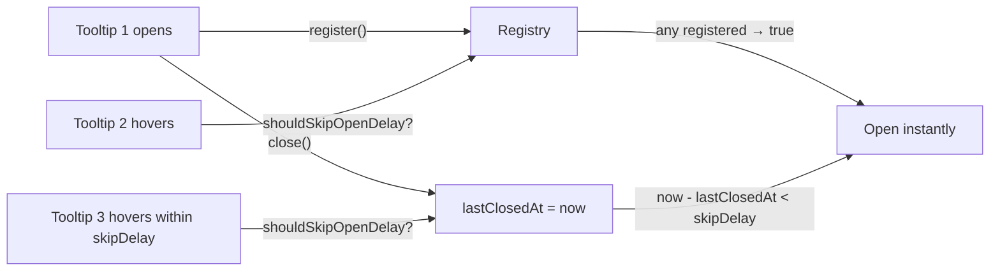

# useTooltip

Region-scoped coordination plugin for tooltip open/close delays. Holds shared `openDelay` / `closeDelay` / `skipDelay` defaults plus a registry of currently-open tooltip tickets so neighboring `<Tooltip.Root>` instances can skip their open delay during the warmup window.

<DocsPageFeatures :frontmatter />

## Usage

```ts collapse
import { createTooltipPlugin, useTooltip } from '@vuetify/v0'

// App-wide defaults
app.use(
  createTooltipPlugin({
    openDelay: 500,
    closeDelay: 150,
    skipDelay: 300,
  })
)

// Inside a component
const region = useTooltip()

region.openDelay.value          // 500
region.isAnyOpen.value          // false
region.shouldSkipOpenDelay()    // false until a tooltip opens
```

`<Tooltip.Root>` reads from `useTooltip()` automatically; you do not call this composable yourself unless you're building a non-component consumer.

## Architecture



## Reactivity

| Property | Type | Description |
|----------|------|-------------|
| `openDelay` | `Readonly<Ref<number>>` | Default open delay in ms (700) |
| `closeDelay` | `Readonly<Ref<number>>` | Default close delay in ms (150) |
| `skipDelay` | `Readonly<Ref<number>>` | Skip-window after last close in ms (300) |
| `disabled` | `Readonly<Ref<boolean>>` | Region-wide disabled flag |
| `isAnyOpen` | `Readonly<Ref<boolean>>` | True when any registered tooltip is currently open |
| `shouldSkipOpenDelay` | `() => boolean` | Whether the next open should bypass the delay |
| `register` | `(input?: Partial<RegistryTicketInput>) => RegistryTicket` | Track a newly-opened tooltip |
| `unregister` | `(id: ID) => void` | Untrack a closed tooltip |

## Examples

::: gn-example
/composables/use-tooltip/context.ts 1
/composables/use-tooltip/RegionProvider.vue 2
/composables/use-tooltip/RegionControls.vue 3
/composables/use-tooltip/TooltipToolbar.vue 4
/composables/use-tooltip/tooltip-region.vue 5

### Coordinated tooltip region

A text-editor toolbar where every button shares one tooltip region. `RegionProvider` owns the writable delay state, passes those refs into `createTooltipContext` so the region tracks them reactively, and provides the context at the default `v0:tooltip` namespace — which is exactly where every `Tooltip.Root` reads its region from via `useTooltip()`. That single provide configures the open delay, close delay, skip window, and a region-wide disabled flag for the whole subtree at once, without touching any individual tooltip.

`RegionControls` is the payoff of the split: it injects the same writable settings to step the delays and flip the disabled toggle, and it reads the region back through `useTooltip()` to surface the live `isAnyOpen` flag and the resolved delays the toolbar actually sees. The warmup behavior is the headline — hover one button, wait out the open delay, then move to a neighbor while the first is still open and it opens instantly. The instant reveals are tinted via the `data-[state=instant-open]` hook so the skip-window coordination is visible, not just felt. Idle the toolbar past the skip window and the next hover pays the full delay again.

Reach for `useTooltip()` directly only when you are wiring a tooltip surface that does not go through the component family — most consumers should use [Tooltip](/components/disclosure/tooltip) and let it call this composable internally. The delay and anchoring mechanics underneath come from [useDelay](/composables/system/use-delay) and [usePopover](/composables/system/use-popover).

| File | Role |
|------|------|
| `context.ts` | Defines the writable settings context plus the toolbar's tool data |
| `RegionProvider.vue` | Owns the delay state, feeds it to `createTooltipContext`, and provides the region |
| `RegionControls.vue` | Injects the settings to adjust them and reads the region's live state |
| `TooltipToolbar.vue` | Renders the buttons, each a `Tooltip.Root` reading the shared region |
| `tooltip-region.vue` | Wraps the provider around the controls and toolbar |
:::

## FAQ

::: faq

??? Why is the registry global instead of per-region?

Skip-window coordination is most useful when neighbors across UI regions cooperate — once any tooltip in the app is open, you want toolbar tooltips and content tooltips to all skip their delay. Splintering the registry into per-subtree scopes would force consumers to choose between scoped defaults and shared coordination; one global registry gives you coordination everywhere.

??? Can I install useTooltip without using `<Tooltip.Root>`?

Yes. The plugin is just a small shared state object — register and unregister tickets manually if you're building a custom tooltip surface and want it to coordinate with v0 tooltips on the page.

??? What if I never install the plugin?

`useTooltip()` returns synthesized fallback defaults (700 / 150 / 300) so `<Tooltip.Root>` works without an `app.use(createTooltipPlugin())` call.

:::

<DocsApi />
