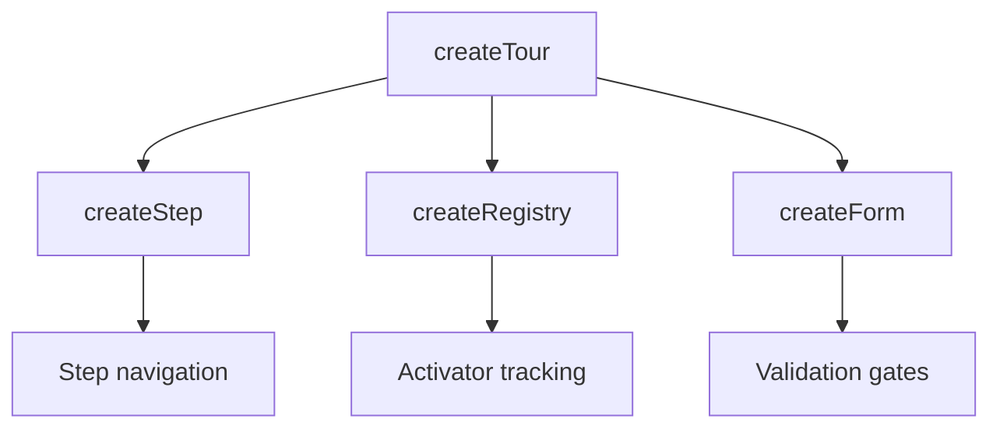

# useTour

<DocsPageFeatures :frontmatter />

Headless guided tour plugin composing createStep, createRegistry, and createForm for step orchestration, activator tracking, and validation gates.

## Installation

Install the Tour plugin in your app's entry point:

```ts main.ts
import { createApp } from 'vue'
import { createTourPlugin } from '@vuetify/v0'
import App from './App.vue'

const app = createApp(App)

app.use(createTourPlugin())

app.mount('#app')
```

## Usage

```ts collapse
import { useTour } from '@vuetify/v0'

const tour = useTour()

// Register steps
tour.steps.onboard([
  { id: 'welcome', type: 'dialog' },
  { id: 'search', type: 'tooltip' },
  { id: 'profile', type: 'tooltip' },
  { id: 'action', type: 'wait' },
])

// Start tour
tour.start()

// Navigate
await tour.next()
tour.prev()
await tour.step(3)

// Lifecycle
tour.stop()      // Dismiss without completing
tour.complete()  // Mark as finished
tour.reset()     // Clear all state
tour.ready()     // Unblock a 'wait' step
```

## Architecture



## Reactivity

| Property | Type | Description |
| - | - | - |
| `isActive` | `Readonly<ShallowRef<boolean>>` | Whether the tour is currently running |
| `isComplete` | `Readonly<ShallowRef<boolean>>` | Whether the tour finished via `complete()` |
| `isReady` | `Readonly<ShallowRef<boolean>>` | Whether the current step allows navigation |
| `isFirst` | `Readonly<Ref<boolean>>` | Whether the current step is the first |
| `isLast` | `Readonly<Ref<boolean>>` | Whether the current step is the last |
| `canGoBack` | `Readonly<Ref<boolean>>` | Ready and not first |
| `canGoNext` | `Readonly<Ref<boolean>>` | Ready and not last |
| `selectedId` | `Ref<ID \| undefined>` | Current step ID |
| `total` | `number` | Total registered steps |

## Examples

### Basic

::: example
/composables/use-tour/basic
:::

<DocsApi />
