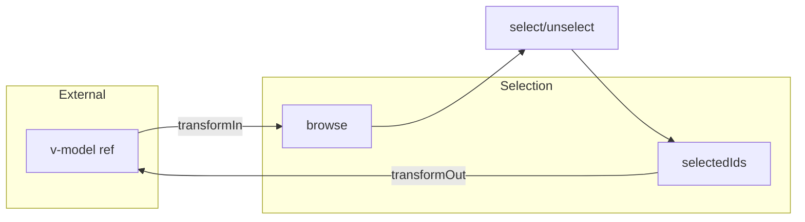

# useProxyModel

A composable for syncing refs bidirectionally with selection contexts, enabling seamless v-model integration with selection state.

<DocsPageFeatures :frontmatter />

## Usage

The `useProxyModel` composable syncs an existing ref (like from `defineModel()`) with a selection context bidirectionally. Changes in either direction automatically propagate.

```ts
import { ref } from 'vue'
import { createSelection, useProxyModel } from '@vuetify/v0'

const model = ref<string>()
const selection = createSelection({ events: true })

selection.onboard([
  { id: 'apple', value: 'Apple' },
  { id: 'banana', value: 'Banana' },
])

// Sync model with selection
const stop = useProxyModel(selection, model)

model.value = 'Apple'
console.log(selection.selectedIds) // Set { 'apple' }

selection.select('banana')
console.log(model.value) // 'Banana'
```

## With defineModel

Perfect for Vue components with v-model:

```vue UseProxyModel
<script setup lang="ts">
  import { createSelection, useProxyModel } from '@vuetify/v0'

  const model = defineModel<string>()
  const selection = createSelection({ events: true })

  selection.onboard([
    { id: '1', value: 'Option 1' },
    { id: '2', value: 'Option 2' },
  ])

  useProxyModel(selection, model)
</script>

<template>
  <div>
    <button
      v-for="item in selection.entries.value"
      :key="item[0]"
      @click="selection.toggle(item[0])"
    >
      {{ item[1].value }}
    </button>
  </div>
</template>
```

## Architecture

`useProxyModel` creates bidirectional sync between v-model refs and selection state:



<DocsApi />

## Examples

### Multi-select with Array Mutations

```ts
const model = ref<string[]>([])
useProxyModel(selection, model, { multiple: true })

selection.onboard([
  { id: 'a', value: 'A' },
  { id: 'b', value: 'B' },
])

// Array mutations sync automatically
model.value.push('A')
console.log(selection.selectedIds) // Set { 'a' }

model.value.splice(0, 1, 'B')
console.log(selection.selectedIds) // Set { 'b' }
```

### Transform Functions

```ts
const model = ref<string>()

useProxyModel(selection, model, {
  transformIn: (val) => String(val).toUpperCase(),
  transformOut: (val) => String(val).toLowerCase(),
})

selection.onboard([
  { id: '1', value: 'HELLO' },
])

model.value = 'hello' // Transforms to 'HELLO' before lookup
console.log(selection.selectedIds) // Set { '1' }
console.log(model.value) // 'hello' (transformed output)
```

### Late Registration

```ts
const model = ref<string>('Item 2')
useProxyModel(selection, model)

// Item 2 doesn't exist yet, but will be auto-selected when registered
setTimeout(() => {
  selection.register({ id: '2', value: 'Item 2' })
  console.log(selection.selectedIds) // Set { '2' }
}, 1000)
```

### Manual Cleanup

```ts
const stop = useProxyModel(selection, model)

// Later, stop syncing
stop()

// Changes no longer sync
model.value = 'New Value'
// selection.selectedIds unchanged
```

