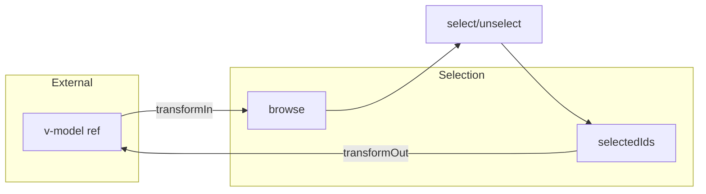

# useProxyModel

A composable for syncing refs bidirectionally with selection contexts, enabling seamless v-model integration with selection state.

<DocsPageFeatures :frontmatter />

## Usage

The `useProxyModel` composable syncs an existing ref (like from `defineModel()`) with a selection context bidirectionally. Changes in either direction automatically propagate.

```ts
import { ref } from 'vue'
import { createSelection, useProxyModel } from '@vuetify/v0'

const model = ref<string>()
const selection = createSelection({ events: true })

selection.onboard([
  { id: 'apple', value: 'Apple' },
  { id: 'banana', value: 'Banana' },
])

// Sync model with selection
const stop = useProxyModel(selection, model)

model.value = 'Apple'
console.log(selection.selectedIds) // Set { 'apple' }

selection.select('banana')
console.log(model.value) // 'Banana'
```

## Architecture

`useProxyModel` creates bidirectional sync between v-model refs and selection state:



<DocsApi />
