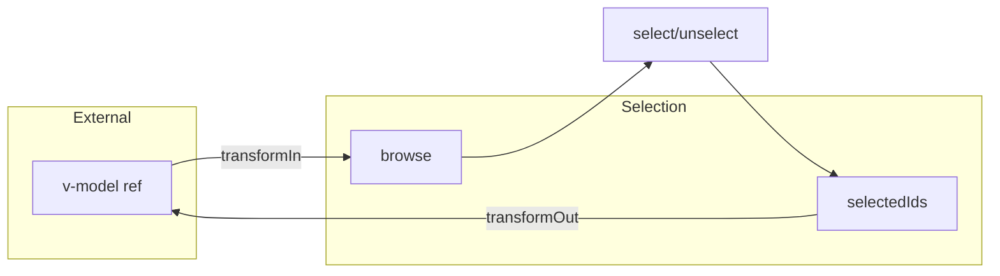

# useProxyModel

A composable for syncing refs bidirectionally with selection contexts, enabling seamless v-model integration with selection state.

<DocsPageFeatures :frontmatter />

## Usage

The `useProxyModel` composable syncs an existing ref (like from `defineModel()`) with a selection context bidirectionally. Changes in either direction automatically propagate.

```ts collapse no-filename
import { ref } from 'vue'
import { createSelection, useProxyModel } from '@vuetify/v0'

const model = ref<string>()
const selection = createSelection({ events: true })

selection.onboard([
  { id: 'apple', value: 'Apple' },
  { id: 'banana', value: 'Banana' },
])

// Sync model with selection
const stop = useProxyModel(selection, model)

model.value = 'Apple'
console.log(selection.selectedIds) // Set { 'apple' }

selection.select('banana')
console.log(model.value) // 'Banana'
```

### Multiple mode

Pass `multiple: true` to sync an array model with a multi-select context. This **must be explicit** — `multiple` is never inferred from the context:

```ts no-filename
const model = ref<string[]>([])
const selection = createGroup({ events: true })

selection.onboard([
  { id: 'red', value: 'Red' },
  { id: 'green', value: 'Green' },
  { id: 'blue', value: 'Blue' },
])

const stop = useProxyModel(selection, model, { multiple: true })

selection.toggle('red')
selection.toggle('blue')
console.log(model.value) // ['Red', 'Blue']
```

The `multiple` option accepts `MaybeRefOrGetter<boolean>`, so you can drive it from a prop or computed:

```ts no-filename
const props = defineProps<{ multiple?: boolean }>()
const stop = useProxyModel(selection, model, { multiple: () => props.multiple ?? false })
```

### Disabled items

When a new item registers with the selection, `useProxyModel` checks whether the model already holds that item's value and selects it if so — this is how items that were selected before they mounted get their initial state. The check is skipped if the item is disabled. The `disabled` property is automatically unwrapped if it is a `Ref<boolean>`:

```ts no-filename
selection.onboard([
  { id: 'a', value: 'A' },
  { id: 'b', value: 'B', disabled: ref(true) }, // reactive disabled
])

model.value = 'B'
// 'b' is NOT auto-selected because disabled is true at registration time
```

## Architecture

`useProxyModel` creates bidirectional sync between v-model refs and selection state:


```mermaid "Proxy Model Flow"
flowchart LR
  subgraph External
    model[v-model ref]
  end

  subgraph Selection
    selectedIds[selectedIds]
    browse[browse]
  end

  model -- transformIn --> browse
  browse --> select/unselect
  select/unselect --> selectedIds
  selectedIds -- transformOut --> model
```

## Reactivity

`useProxyModel` creates **bidirectional reactive sync** between a ref and a selection registry. It uses Vue watchers internally for automatic propagation.

| Behavior | Reactive | Notes |
| - | :-: | - |
| Model → Selection | <AppSuccessIcon /> | Changes to model auto-select items |
| Selection → Model | <AppSuccessIcon /> | Selection changes update model |

> [!TIP] Automatic cleanup
> The watchers are disposed automatically via `onScopeDispose`. The returned `stop()` function allows early manual cleanup.

## Examples

::: gn-example
/composables/use-proxy-model/color-picker

### Color Picker

A color swatch selector that wires a plain `shallowRef<string>` to a `createSelection` instance via `useProxyModel`, demonstrating the bidirectional sync the composable provides. The six color swatches are bulk-registered with `onboard()` and rendered by iterating `selection.values()` — each ticket carries `isSelected` and `select()` so the template never touches the ref directly. A second set of buttons writes to `selected` from the outside, which `useProxyModel` detects and calls `browse()` on the selection to match. The debug panel displays both the ref value and `selection.selectedValues` simultaneously so you can confirm both sides stay in lock-step regardless of which triggers the change.

Reach for `useProxyModel` when you need to expose a selection context through a `v-model` prop — for example, a wrapper component that consumes a parent's `defineModel()` while internally using `createSelection` for multi-item management. The composable returns a `stop()` function for early cleanup; in a component, Vue's scope disposal handles this automatically via `onScopeDispose`. For multi-select v-model sync, pass `{ multiple: true }` and use a `ref<string[]>` — the single-value path shown here applies to radio-style exclusive choices.

:::

## FAQ

::: faq

??? Why isn't my array model syncing with a multi-select context?

`multiple` is never inferred from the context — you must pass `{ multiple: true }` explicitly and back it with a `ref<string[]>`. It accepts `MaybeRefOrGetter<boolean>`, so you can also drive it from a prop or computed.

??? Why isn't a disabled item selected when the model already holds its value?

On registration, useProxyModel selects an item whose value the model already holds — but it skips that check for disabled items. The `disabled` property is unwrapped first if it's a `Ref<boolean>`, so a reactively-disabled item also won't auto-select.

??? Do I need to call the returned `stop()` function?

Not inside a component — the watchers dispose automatically via `onScopeDispose`. `stop()` is for early manual cleanup, or when you use the composable outside a component scope where automatic disposal doesn't apply.

:::

<DocsApi />
