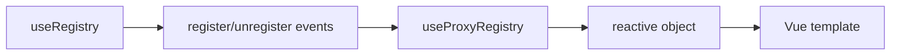

# useProxyRegistry

A reactive proxy wrapper for registry collections that automatically updates refs when items are registered or unregistered.

<DocsPageFeatures :frontmatter />

## Usage

The `useProxyRegistry` composable creates reactive objects that automatically sync with a registry's state. It listens for registry changes and updates the reactive properties accordingly, making it ideal for template-driven UIs that need to react to registry mutations.

**Important:** The registry must have `events: true` enabled for the proxy to receive updates.

```ts
import { useRegistry, useProxyRegistry } from '@vuetify/v0'

const registry = useRegistry({ events: true })
const proxy = useProxyRegistry(registry)

registry.register({ value: 'Item 1' })
registry.register({ value: 'Item 2' })

console.log(proxy.size) // 2
console.log(proxy.keys) // [id1, id2]
```

## Architecture

`useProxyRegistry` creates a reactive proxy over registry collections:



<DocsApi />
