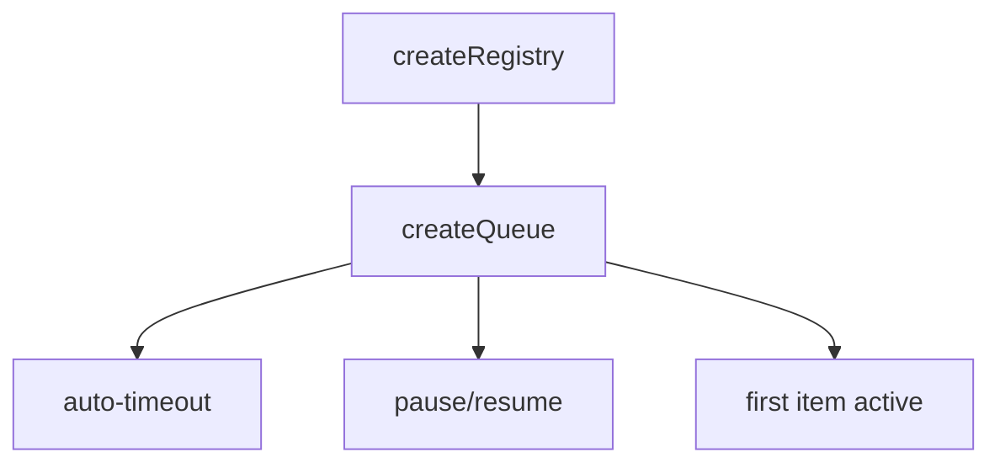
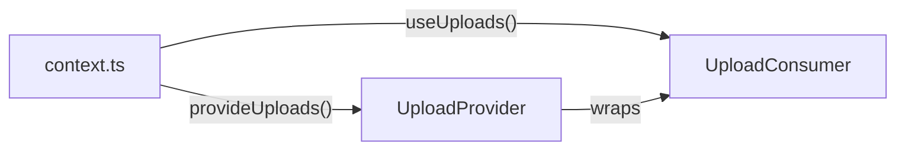

# createQueue

A queue composable for managing time-based collections with automatic timeout-based removal, pause/resume functionality, and FIFO (First In, First Out) ordering.

<DocsPageFeatures :frontmatter />

## Usage

```ts collapse
import { createQueue, type QueueTicket } from '@vuetify/v0'

interface Task extends QueueTicket {
  name: string
  priority: number
}

const queue = createQueue<Task>({ timeout: 5000 })

const task = queue.register({ name: 'Build assets', priority: 1 })

console.log(task.isPaused) // false (first item is active)
console.log(queue.size) // 1

// Pause all timers
queue.pause()

// Resume timers
queue.resume()
```

## Architecture

`createQueue` extends `createRegistry` with FIFO ordering and timeout management:



## Examples

::: example
/composables/create-queue/context.ts
/composables/create-queue/UploadProvider.vue
/composables/create-queue/UploadConsumer.vue
/composables/create-queue/uploads.vue

### Upload Queue

This example demonstrates sequential processing with `createQueue`. Unlike notifications that display simultaneously, the queue processes **one item at a time**—the first item uploads while others wait their turn.



**File breakdown:**

| File | Role |
|------|------|
| `context.ts` | Defines `UploadInput`/`Upload` types and the context with `first`, `add`, `cancel` |
| `UploadProvider.vue` | Creates the queue, exposes `first` computed, watches it to start processing |
| `UploadConsumer.vue` | Displays first item with progress bar, pending items in FIFO order |
| `uploads.vue` | Entry point that composes Provider around Consumer |

**Key patterns:**

- Expose `first` as a computed from `proxy.values[0]`
- Watch `first` to react when a new item becomes active
- `useProxyRegistry` for reactive access to queue items
- Items auto-advance when the first one completes

Click "Add File" multiple times to see queuing behavior. Only one file uploads at a time.

:::

<DocsApi />
