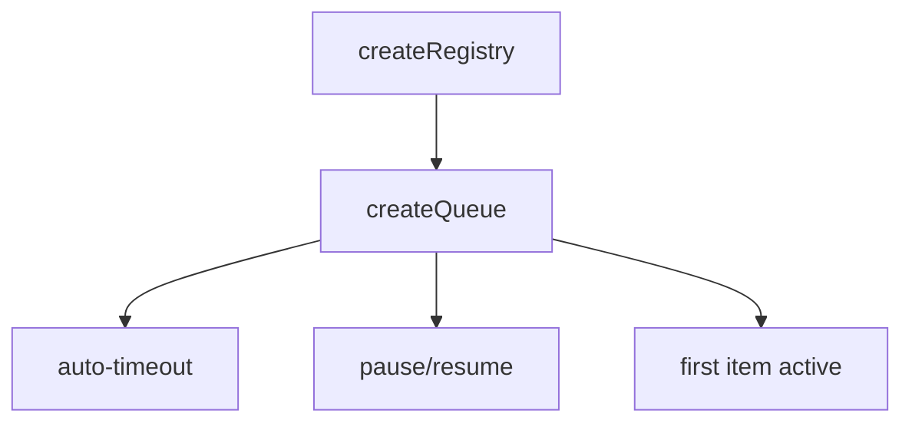

<script setup lang="ts">
import TaskRunnerExample from '@/examples/composables/create-queue/task-runner.vue'
import TaskRunnerExampleRaw from '@/examples/composables/create-queue/task-runner.vue?raw'
</script>

# createQueue

A queue composable for managing time-based collections with automatic timeout-based removal, pause/resume functionality, and FIFO (First In, First Out) ordering.

<DocsPageFeatures :frontmatter />

## Usage

The `createQueue` composable provides a powerful interface for managing time-based queues. Built on top of `createRegistry`, it automatically manages timeouts for items, ensuring only the first item in the queue is active at any time. When an item expires or is removed, the next item in the queue automatically becomes active.

```ts
import { createQueue } from '@vuetify/v0'

const queue = createQueue()

const item1 = queue.register({ value: 'First' })
const item2 = queue.register({ value: 'Second' })
const item3 = queue.register({ value: 'Third' })

console.log(item1.isPaused) // false (first item is active)
console.log(item2.isPaused) // true (waiting in queue)
console.log(queue.size) // 3
```

## Examples

### Task Runner

A background task queue with progress tracking and FIFO ordering.

<DocsExample file="task-runner.vue" :code="TaskRunnerExampleRaw">
  <TaskRunnerExample />
</DocsExample>

## Architecture

`createQueue` extends `createRegistry` with FIFO ordering and timeout management:



<DocsApi name="useQueue" />
