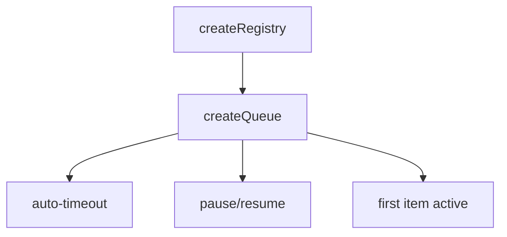
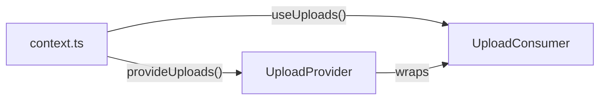

# createQueue

FIFO queue for time-based collections with automatic timeout removal and pause/resume support.

<DocsPageFeatures :frontmatter />

## Usage

```ts collapse
import { createQueue } from '@vuetify/v0'
import type { QueueTicket } from '@vuetify/v0'

interface Task extends QueueTicket {
  name: string
  priority: number
}

const queue = createQueue<Task>({ timeout: 5000 })

const task = queue.register({ name: 'Build assets', priority: 1 })

console.log(task.isPaused.value) // false (first item is active)
console.log(queue.size) // 1

// Pause all timers
queue.pause()

// Resume timers
queue.resume()
```

## Context / DI

Use `createQueueContext` to share a queue instance across a component tree:

```ts
import { createQueueContext } from '@vuetify/v0'

export const [useToasts, provideToasts, toasts] =
  createQueueContext({ namespace: 'my:toasts', timeout: 5000 })

// In parent component
provideToasts()

// In child component
const queue = useToasts()
queue.register({ id: crypto.randomUUID(), value: 'Saved!' })
```

## Architecture

`createQueue` extends `createRegistry` with FIFO ordering and timeout management:


```mermaid "Queue Hierarchy"
flowchart TD
  createRegistry --> createQueue:::primary
  createQueue --> timeout[auto-timeout]
  createQueue --> pause/resume
  createQueue --> first[first item active]
```

## Timeout Behavior

The `timeout` option controls how long a ticket stays in the queue before auto-removal:

| Value | Behavior |
|-------|----------|
| `undefined` | Uses the global default from queue options (default: `3000`ms) |
| `number` | Auto-removed after that many milliseconds |
| `-1` | Persistent — never auto-removed, must call `ticket.dismiss()` manually |

Only the **first ticket** runs its timer at any time. All others wait with `isPaused: true` until they reach the front.

```ts
const queue = createQueue({ timeout: 5000 }) // global default

queue.register({ value: 'Auto (5s)' })             // uses 5000ms
queue.register({ value: 'Custom (10s)', timeout: 10000 })
queue.register({ value: 'Sticky', timeout: -1 })   // must be dismissed
```

> [!TIP] Hover-to-pause pattern
> Call `queue.pause()` on `mouseenter` and `queue.resume()` on `mouseleave` to pause the active toast while the user reads it.

## Reactivity

`createQueue` extends `createRegistry` with **minimal reactivity** for performance. Timeout state is managed internally.

| Property/Method | Notes |
| - | - |
| `register(ticket?)` | Add to queue; starts timer if first, otherwise paused |
| `unregister(id?)` | Remove by ID, or first ticket if omitted. Returns the removed ticket |
| `pause()` | Pause the first ticket's timer. Returns the paused ticket or `undefined` |
| `resume()` | Resume the first paused ticket's timer. Resets to full duration |
| ticket `isPaused` | `true` while waiting in queue or manually paused |
| ticket `dismiss()` | Shorthand for `queue.unregister(ticket.id)` |

> [!TIP] Need reactive queue items?
> Wrap with `useProxyRegistry(queue)` for full template reactivity.

## Examples

::: example
/composables/create-queue/context.ts
/composables/create-queue/UploadProvider.vue
/composables/create-queue/UploadConsumer.vue
/composables/create-queue/uploads.vue

### Upload Queue

This example demonstrates sequential processing with `createQueue`. Unlike notifications that display simultaneously, the queue processes **one item at a time**—the first item uploads while others wait their turn.


```mermaid "Provider/Consumer Data Flow"
graph LR
  A["context.ts"]:::info -->|"provideUploads()"| B["UploadProvider"]:::success
  A -->|"useUploads()"| C["UploadConsumer"]:::warning
  B -->|"wraps"| C
```

**File breakdown:**

| File | Role |
|------|------|
| `context.ts` | Defines `UploadInput`/`Upload` types and the context with `first`, `add`, `cancel` |
| `UploadProvider.vue` | Creates the queue, exposes `first` computed, watches it to start processing |
| `UploadConsumer.vue` | Displays first item with progress bar, pending items in FIFO order |
| `uploads.vue` | Entry point that composes Provider around Consumer |

**Key patterns:**

- Expose `first` as a computed from `proxy.values[0]`
- Watch `first` to react when a new item becomes active
- `useProxyRegistry` for reactive access to queue items
- Items auto-advance when the first one completes

Click "Add File" multiple times to see queuing behavior. Only one file uploads at a time.

:::

<DocsApi />
