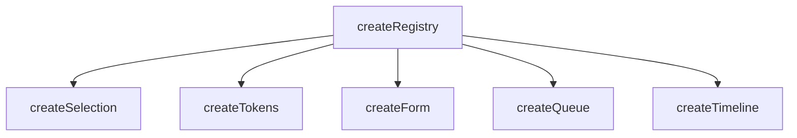
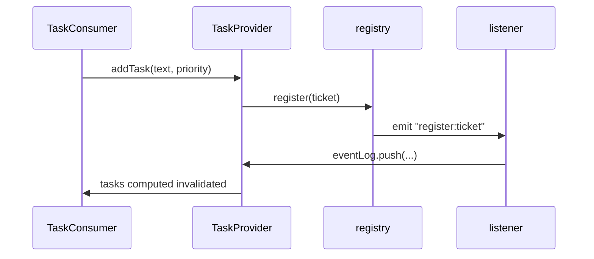

# createRegistry

A foundational composable for building registration-based systems, managing collections of registered items with automatic indexing, and lifecycle management.

<DocsPageFeatures :frontmatter />

## Usage

The `createRegistry` composable provides a powerful interface for managing collections of items in a registration-based system. It allows you to register, unregister, and look up items efficiently, while maintaining an index for quick access.

```ts collapse
import { createRegistry } from '@vuetify/v0'
import type { RegistryTicket } from '@vuetify/v0'

interface Item extends RegistryTicket<string> {
  label: string
}

const registry = createRegistry<Item>()

// Register individual items
const a = registry.register({ label: 'Alpha' })
const b = registry.register({ label: 'Beta' })
const c = registry.register({ label: 'Gamma' })

console.log(registry.size) // 3
console.log(a.index)       // 0

// Look up by id
const found = registry.get(b.id)
console.log(found?.label)  // 'Beta'

// Patch a field without replacing the ticket
registry.upsert(b.id, { label: 'Beta (updated)' })

// Remove one
registry.unregister(c.id)
console.log(registry.size) // 2

// Bulk load
registry.onboard([
  { id: 'x', label: 'X' },
  { id: 'y', label: 'Y' },
])

// Bulk remove
registry.offboard(['x', 'y'])
```

## Architecture

`createRegistry` is the foundation for specialized registration systems:



Each branch extends the base ticket pattern with domain-specific capabilities. See individual composable docs for their extension hierarchies.

## Examples

::: example
/composables/create-registry/context.ts
/composables/create-registry/TaskProvider.vue
/composables/create-registry/TaskConsumer.vue
/composables/create-registry/task-manager.vue

### Task Manager

This example demonstrates the full `createRegistry` lifecycle paired with `createContext` so registry mutations stay encapsulated in the provider and the consumer only sees clean, typed methods.



**File breakdown:**

| File | Role |
|------|------|
| `context.ts` | Defines `TaskTicketInput` (extending `RegistryTicketInput`) and `TaskContext`, then creates the `[useTaskRegistry, provideTaskRegistry]` tuple |
| `TaskProvider.vue` | Creates the registry with `events: true`, wires lifecycle listeners, seeds initial data via `onboard`, and exposes mutation methods through context |
| `TaskConsumer.vue` | Calls `useTaskRegistry()` to access tasks and methods; owns local UI state (filter, new-task input) and derives `filteredTasks` and `stats` as computed |
| `task-manager.vue` | Entry point—composes `TaskProvider` around `TaskConsumer` |

**Key patterns:**

- onboard — bulk-loads the initial task list in a single batch
- `registry.register()` — adds a ticket with custom fields (`value`, `priority`, `done`)
- `registry.upsert()` — patches a single field without touching the rest of the ticket
- `registry.offboard()` — batch-removes all completed tasks in one call
- `registry.on('register:ticket')` / `on('unregister:ticket')` — reacts to lifecycle events for the audit log
- `void version.value` inside a computed — the standard pattern for making a non-reactive `registry.values()` snapshot reactive

Add tasks, toggle completion, and filter by priority. Watch the event log at the bottom track every registration change in real time.

:::

## Reactivity

`createRegistry` uses **minimal reactivity by default** for performance. Collection methods are not reactive unless you opt in.

> [!TIP] Need reactive collections?
> Wrap with `useProxyRegistry(registry)` for full template reactivity, or pass `reactive: true` when creating the registry.

<DocsApi />
