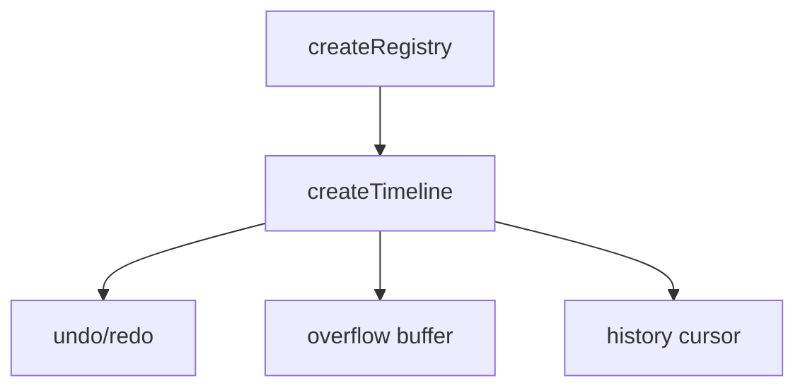
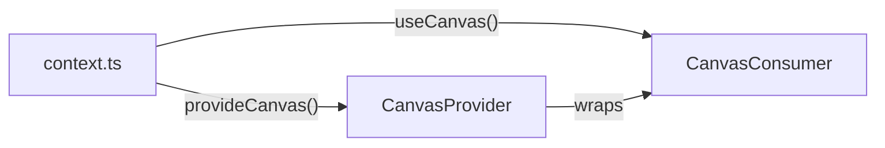

# createTimeline

A bounded undo/redo system that manages a fixed-size timeline of registered items with automatic overflow handling and history management.

<DocsPageFeatures :frontmatter />

## Usage

The `createTimeline` composable extends `createRegistry` to provide undo/redo functionality with a bounded history. When the timeline reaches its size limit, older items are moved to an overflow buffer, allowing you to undo back to them while maintaining a fixed active timeline size.

```ts
import { createTimeline } from '@vuetify/v0'

const timeline = createTimeline({ size: 10 })

// Register actions
timeline.register({ id: 'action-1', value: 'Created document' })
timeline.register({ id: 'action-2', value: 'Added title' })
timeline.register({ id: 'action-3', value: 'Added paragraph' })

console.log(timeline.size) // 3

// Undo the last action
timeline.undo()
console.log(timeline.size) // 2

// Redo the undone action
timeline.redo()
console.log(timeline.size) // 3
```

## Architecture

`createTimeline` extends `createRegistry` with bounded history and overflow management:



## Reactivity

`createTimeline` uses **minimal reactivity** like its parent `createRegistry`. History state is managed internally without reactive primitives.

> [!TIP] Need reactive history?
> Wrap with `useProxyRegistry(timeline)` for full template reactivity on the active timeline.

## Examples

::: example
/composables/create-timeline/context.ts 2
/composables/create-timeline/CanvasProvider.vue 3
/composables/create-timeline/CanvasConsumer.vue 4
/composables/create-timeline/canvas.vue 1

### Drawing Canvas

A freehand drawing canvas split into four files demonstrating timeline-powered undo/redo:

| File | Role |
|------|------|
| `context.ts` | Defines `Point`, `Stroke`, `CanvasContext` types and the DI pair |
| `CanvasProvider.vue` | Creates the timeline, tracks redo state, exposes `add`/`undo`/`redo`/`clear` |
| `CanvasConsumer.vue` | Owns the `<canvas>` element, mouse/touch handlers, and render loop |
| `canvas.vue` | Entry point — wraps Provider around Consumer |



**Key patterns:**

- Provider owns `createTimeline` + `useProxyRegistry` — consumer never touches the timeline directly
- `strokes` computed maps `proxy.values` to raw `Stroke[]` — consumer only sees domain data
- `redoStackSize` tracked manually via `shallowRef` since redo stack is internal to the timeline
- `watchEffect` in consumer reads `strokes.value` for reactive canvas re-rendering
- History bar visualizes the 20-slot bounded timeline capacity

Draw on the canvas, then use Undo/Redo to time-travel through your strokes.

:::

<DocsApi />
