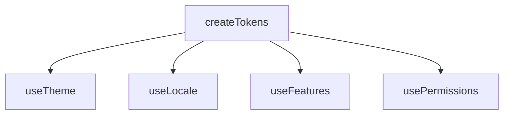
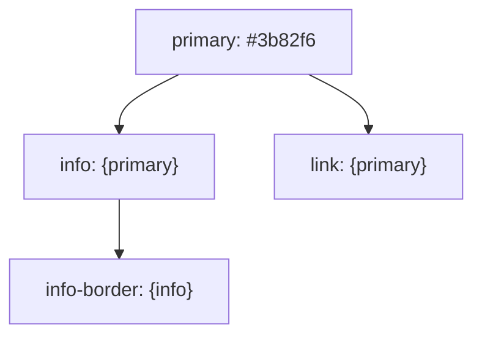

# createTokens

A utility for managing design tokens with support for hierarchical collections, aliases, and token resolution across your application's design system. Inspired by [Design Tokens](https://www.designtokens.org/tr/drafts/format/#design-token).

<DocsPageFeatures :frontmatter />

## Usage

The `createTokens` composable allows you to define a collection of design tokens, which can be primitive values or aliases that reference other tokens. It provides a context for resolving these tokens, making it easy to access design values throughout your application.

```ts
import { createTokens } from '@vuetify/v0'

// Default behavior (depth = Infinity): fully flatten nested objects
const tokens = createTokens({
  color: {
    primary: '#3b82f6',
    secondary: '#64748b',
    info: '{primary}'
  },
  radius: {
    sm: '4px',
    md: '8px',
  },
})

tokens.resolve('color.primary') // '#3b82f6'
tokens.resolve('color.info') // '#3b82f6' (alias resolved)
tokens.resolve('radius.md') // '8px'

const features = createTokens({
  dark: true,
  rtl: { value: true, variation: 'toggle' },
}, { flat: true })

// With flat: true, nested objects are kept as-is at their base id
features.resolve('rtl') // { value: true, variation: 'toggle' }
```

## Architecture

`createTokens` extends `createRegistry` and powers token-based systems:



<DocsApi name="createTokens" />

## Frequently Asked Questions

::: faq
??? What's the difference between `depth: Infinity` and `flat: true`?

They control how nested objects are processed:

| Option | Behavior | Token IDs |
| - | - | - |
| `depth: Infinity` (default) | Recursively flatten all nested objects | `color.primary`, `color.secondary` |
| `flat: true` | Keep objects as-is at their base key | `rtl` → `{ value: true, ... }` |

```ts
// depth: Infinity (default) - flattens nested objects
const colors = createTokens({
  color: { primary: '#3b82f6', secondary: '#64748b' }
})
colors.resolve('color.primary') // '#3b82f6'
colors.resolve('color') // undefined - 'color' itself isn't a token

// flat: true - preserves object structure
const features = createTokens({
  rtl: { value: true, variation: 'toggle' }
}, { flat: true })
features.resolve('rtl') // { value: true, variation: 'toggle' }
```

Use `flat: true` when your token values are objects you want to keep intact (e.g., feature flags with metadata).

??? Can token aliases be circular? What happens?

Circular aliases will cause infinite recursion. The resolver doesn't detect cycles:

```ts
// DON'T DO THIS - infinite loop
const tokens = createTokens({
  a: '{b}',
  b: '{a}', // circular reference
})
tokens.resolve('a') // Maximum call stack exceeded
```

Design your token hierarchy as a directed acyclic graph (DAG). The [Design Tokens spec](https://www.designtokens.org/tr/drafts/format/#aliases-references) recommends keeping alias chains shallow:



??? Can I use refs or computed values as tokens?

No. Token values are static at registration time. For reactive design systems, resolve tokens into refs:

```ts
// Static tokens
const tokens = createTokens({
  color: { primary: '#3b82f6', dark: '#1e3a8a' }
})

// Reactive usage
const isDark = ref(false)
const primaryColor = computed(() =>
  tokens.resolve(isDark.value ? 'color.dark' : 'color.primary')
)
```

For fully reactive theming, see [useTheme](/composables/plugins/use-theme) which builds on `createTokens`.

??? Can tokens reference tokens in different collections?

No. Aliases only resolve within the same `createTokens` instance:

```ts
const colors = createTokens({ primary: '#3b82f6' })
const spacing = createTokens({ gap: '{primary}' }) // Won't resolve - different instance

spacing.resolve('gap') // '{primary}' - returned as literal string
```

To share tokens across collections, use a single unified token set or compose at the application level.

??? How do I update tokens at runtime?

Use `register` and `unregister` inherited from `createRegistry`:

```ts
const tokens = createTokens({
  color: { primary: '#3b82f6' }
})

// Update a token
tokens.unregister('color.primary')
tokens.register({ id: 'color.primary', value: '#ef4444' })

tokens.resolve('color.primary') // '#ef4444'
```

For theme switching, consider [useTheme](/composables/plugins/use-theme) which handles this pattern with proper reactivity.

??? What's the performance of alias resolution at scale?

Alias resolution is recursive string replacement—each `{alias}` triggers another `resolve()` call. For deep chains:

```
token → alias1 → alias2 → alias3 → value
        ↓         ↓         ↓
     resolve   resolve   resolve
```

Keep alias chains shallow (2-3 levels max) for predictable performance. If you need deep composition, resolve intermediate values at build time.

??? How does createTokens relate to the W3C Design Tokens spec?

`createTokens` is inspired by the [Design Tokens Community Group specification](https://www.designtokens.org/tr/drafts/format/). Key alignments:

| Spec Concept | createTokens |
| - | - |
| Token value | `register({ id, value })` |
| Alias syntax `{path.to.token}` | Supported via `resolve()` |
| Nested groups | Flattened with dot notation |

The spec is still in draft, so `createTokens` focuses on the stable patterns. For CSS custom property output, pair with [useTheme](/composables/plugins/use-theme) which handles CSS variable generation.
:::
