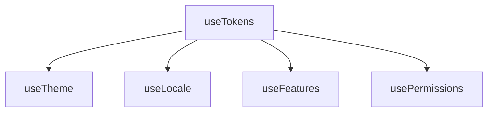

# createTokens

A utility for managing design tokens with support for hierarchical collections, aliases, and token resolution across your application's design system. Inspired by [Design Tokens](https://www.designtokens.org/tr/drafts/format/#design-token).

<DocsPageFeatures :frontmatter />

## Usage

The `useTokens` composable allows you to define a collection of design tokens, which can be primitive values or aliases that reference other tokens. It provides a context for resolving these tokens, making it easy to access design values throughout your application.

```ts
import { useTokens } from '@vuetify/v0'

// Default behavior (depth = Infinity): fully flatten nested objects
const tokens = useTokens({
  color: {
    primary: '#3b82f6',
    secondary: '#64748b',
    info: '{primary}'
  },
  radius: {
    sm: '4px',
    md: '8px',
  },
})

tokens.resolve('color.primary') // '#3b82f6'
tokens.resolve('color.info') // '#3b82f6' (alias resolved)
tokens.resolve('radius.md') // '8px'

const features = useTokens({
  dark: true,
  rtl: { value: true, variation: 'toggle' },
}, { flat: true })

// With flat: true, nested objects are kept as-is at their base id
features.resolve('rtl') // { value: true, variation: 'toggle' }
```

## Architecture

`useTokens` extends `useRegistry` and powers token-based systems:



<DocsApi name="useTokens" />
