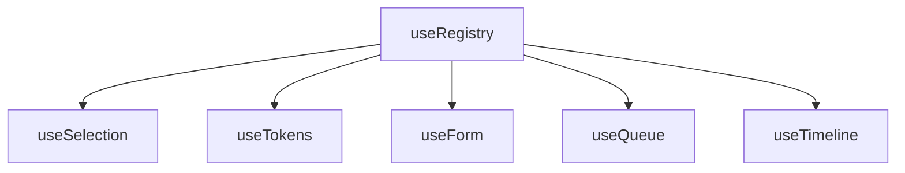

# useRegistry

A foundational composable for building registration-based systems, managing collections of registered items with automatic indexing, and lifecycle management.

<DocsPageFeatures :frontmatter />

## Usage

The `useRegistry` composable provides a powerful interface for managing collections of items in a registration-based system. It allows you to register, unregister, and look up items efficiently, while maintaining an index for quick access.

```ts
import { useRegistry } from '@vuetify/v0'

const registry = useRegistry()

const ticket1 = registry.register()
const ticket2 = registry.register()
const ticket3 = registry.register()

console.log(registry.size) // 3
```

## Architecture

`useRegistry` is the foundation for specialized registration systems:



Each branch extends the base ticket pattern with domain-specific capabilities. See individual composable docs for their extension hierarchies.

## API

### `useRegistry`

- **Type**

  ```ts
  interface RegistryTicket {
    id: ID
    index: number
    value: unknown
    valueIsIndex: boolean
  }

  interface RegistryContext<Z extends RegistryTicket = RegistryTicket> {
    collection: Map<ID, Z>
    clear: () => void
    has: (id: ID) => boolean
    keys: () => ID[]
    browse: (value: unknown) => ID[] | undefined
    lookup: (index: number) => ID | undefined
    get: (id: ID) => Z | undefined
    upsert: (id: ID, patch?: Partial<Z>) => Z
    values: () => Z[]
    entries: () => [ID, Z][]
    register: (item?: Partial<Z>) => Z
    unregister: (id: ID) => void
    reindex: () => void
    seek: (direction?: 'first' | 'last', from?: number, predicate?: (ticket: Z) => boolean) => Z | undefined
    on: (event: string, cb: Function) => void
    off: (event: string, cb: Function) => void
    emit: (event: string, data: any) => void
    dispose: () => void
    onboard: (registrations: Partial<Z>[]) => Z[]
    offboard: (ids: ID[]) => void
    size: number
  }

  interface RegistryOptions {
    events?: boolean
  }
  ```
- **Details**

  - `collection`: A [JavaScript Map](https://developer.mozilla.org/en-US/docs/Web/JavaScript/Reference/Global_Objects/Map) that holds registered items, indexed by their unique IDs.
  - `clear()`: Clears the entire registry, removing all registered items.
  - `has(id: ID)`: Checks if an item with the given ID exists in the registry.
  - `keys()`: Returns an array of all registered IDs.
  - `browse(value: unknown)`: Searches for IDs by value. Returns an array of matching IDs, or `undefined` if no match found.
  - `lookup(index: number)`: Looks up an ID by its index number.
  - `get(id: ID)`: Retrieves a ticket by its ID, returning `undefined` if not found.
  - `upsert(id: ID, patch?: Partial<Z>)`: Creates or updates a ticket by its ID. If the ID does not exist, it creates a new ticket; if it does exist, it updates the existing ticket with the provided patch.
  - `values()`: Returns an array of all registered tickets.
  - `entries()`: Returns an array of entries, each being a tuple of [ID, ticket].
  - `register(item?: Partial<Z>)`: Registers a new item, returning the created ticket. If `item` is provided, it will be merged with the default ticket structure.
  - `unregister(id: ID)`: Unregisters an item by its ID, removing it from the registry.
  - `reindex()`: Rebuilds the index of registered items, useful if the order of items has changed.
  - `seek(direction?, from?, predicate?)`: Searches for a ticket based on direction ('first' or 'last'), optional starting index, and optional predicate function.
  - `on(event: string, cb: Function)`: Registers an event listener for a specific event.
  - `off(event: string, cb: Function)`: Unregisters an event listener for a specific event.
  - `emit(event: string, data: any)`: Emits an event with the provided data, triggering all registered listeners for that event.
  - `dispose()`: Resets the collection and clears all listeners. Useful to call during onScopeDispose to clean up resources.
  - `onboard(registrations: Partial<Z>[])`: Registers multiple items in a single call, returning an array of tickets.
  - `offboard(ids: ID[])`: Unregisters multiple items by their IDs in a single call.
  - `size`: Returns the number of registered items in the registry.

- **Options**

  - `events`: If `true`, enables event emission for registry operations like `register` and `unregister`. Defaults to `false`.

### `register`

- **Type**
  ```ts
  function register (item?: Partial<Z>): Z
  ```

- **Details**
  Registers a new item. Behavior rules:
  - If `value` is omitted, the ticket's `value` is set to its (possibly provided) `index` and `valueIsIndex` is `true`.
  - If `value` is provided (even `null`), `valueIsIndex` is `false`.
  - The `index` assigned at registration is immutable via `upsert` (only `reindex()` can change ordering indices globally).
  Returns the created ticket.

- **Example**
  ```ts
  const registry = useRegistry()

  const ticket = registry.register({ id: 'foo', value: 'bar' })

  console.log(ticket) // { id: 'foo', index: 0, value: 'bar', valueIsIndex: false }
  ```

### `get`

- **Type**
  ```ts
  function get (id: ID): Z | undefined
  ```

- **Details**
  Retrieves a registered item by its ID. Returns `undefined` if the item does not exist

- **Example**
  ```ts
  const registry = useRegistry()

  registry.register({ id: 'foo' })

  const found = registry.get('foo')
  const notfound = registry.get('bar')
  ```

### `upsert`

- **Type**
  ```ts
  function upsert (id: ID, patch?: Partial<Z>): Z
  ```

- **Details**
  Creates a ticket when the `id` does not exist (following the same rules as `register`), otherwise updates the existing ticket. Special handling only applies to `value`:
  - Supplying a new `value` sets `valueIsIndex` to `false`.
  - Supplying `value: undefined` resets `value` to the ticket's immutable `index` and sets `valueIsIndex` to `true`.
  - Omitting `value` leaves both `value` and `valueIsIndex` unchanged.
  - The `index` of an existing ticket is never changed by `upsert`.

- **Example**
  ```ts
  const registry = useRegistry()

  registry.register({ id: 1 })
  registry.upsert(1, { value: 'custom' })
  registry.upsert(1, { value: undefined })

  console.log(registry.get(1)) // { id: 1, index: 0, value: 0, valueIsIndex: true }

  registry.upsert(2, { value: 'new' }) // creates new ticket
  ```

### `clear`

- **Type**
  ```ts
  function clear(): void
  ```

- **Details**
  Removes all registered items from the registry, resetting it to an empty state.

- **Example**
  ```ts
  const registry = useRegistry()

  registry.register({ id: 'a', value: 'Apple' })
  registry.register({ id: 'b', value: 'Banana' })

  console.log(registry.size) // 2

  registry.clear()

  console.log(registry.size) // 0
  console.log(registry.get('a')) // undefined
  ```

### `has`

- **Type**
  ```ts
  function has(id: ID): boolean
  ```

- **Details**
  Checks whether the registry contains an item with the given ID.

- **Example**
  ```ts
  const registry = useRegistry()
  registry.register({ id: 'x', value: 'Xylophone' })

  console.log(registry.has('x')) // true
  console.log(registry.has('y')) // false
  ```

### `keys`

- **Type**
  ```ts
  function keys(): ID[]
  ```

- **Details**
  Returns an array of all registered IDs in the order they were indexed.
  Performance Note: The result is cached for efficiency, meaning repeated calls to keys() reuse a stored array instead of reconstructing it every time. If the registry changes (items are registered or unregistered), the cache is refreshed automatically.

- **Example**
  ```ts
  const registry = useRegistry()
  registry.register({ id: 'cat', value: 'Cat' })
  registry.register({ id: 'dog', value: 'Dog' })

  console.log(registry.keys())
  // ['cat', 'dog']
  ```

### `browse`

- **Type**
  ```ts
  function browse(value: unknown): ID[] | undefined
  ```

- **Details**
  Searches the registry for item(s) whose value matches the provided value argument.

  Returns an array of matching IDs, preserving their registration order.
  If no match is found, it returns undefined.

- **Example**
  ```ts
  const registry = useRegistry()
  registry.register({ id: '1', value: 'Red' })
  registry.register({ id: '2', value: 'Blue' })
  registry.register({ id: '3', value: 'Red' }) // Duplicate value

  console.log(registry.browse('Red'))
  // ['1', '3']  <-- Multiple matches

  console.log(registry.browse('Blue'))
  // ['2']  <-- Single match (still an array)

  console.log(registry.browse('Green'))
  // undefined  <-- No matches
  ```

### `lookup`

- **Type**
  ```ts
  function lookup(index: number): ID | undefined
  ```

- **Details**
  Finds the ID of the item at a given index position in the registry.

- **Example**
  ```ts
  const registry = useRegistry()
  registry.register({ id: 'apple', value: 'Apple' })
  registry.register({ id: 'banana', value: 'Banana' })

  console.log(registry.lookup(0)) // 'apple'
  console.log(registry.lookup(1)) // 'banana'
  console.log(registry.lookup(5)) // undefined
  ```

### `values`

- **Type**
  ```ts
  function values(): Z[]
  ```

- **Details**
  Returns an array of all registered items.
  Performance Note: The result is cached internally to avoid reconstructing the list on every call. The cache is automatically invalidated and rebuilt whenever the registry changes, so you always get the latest data without unnecessary overhead.

- **Example**
  ```ts
  const registry = useRegistry()
  registry.register({ id: 'x', value: 'X' })
  registry.register({ id: 'y', value: 'Y' })

  console.log(registry.values())
  // [ { id: 'x', value: 'X' }, { id: 'y', value: 'Y' } ]
  ```

### `entries`

- **Type**
  ```ts
  function entries(): [ID, Z][]
  ```

- **Details**
  Returns all registry entries as [id, item] pairs.
  Performance Note: Like keys() and values(), the results of entries() are cached for performance. The cache is refreshed whenever the registry is modified, so calls remain fast and up-to-date.

- **Example**
  ```ts
  const registry = useRegistry()
  registry.register({ id: 'car', value: 'Car' })
  registry.register({ id: 'bus', value: 'Bus' })

  for (const [id, item] of registry.entries()) {
    console.log(id, item.value)
  }
  // car Car
  // bus Bus
  ```

### `unregister`

- **Type**
  ```ts
  function unregister(id: ID): void
  ```

- **Details**
  Removes an item from the registry by its ID.

- **Example**
  ```ts
  const registry = useRegistry()
  registry.register({ id: 'x', value: 'Xylophone' })

  registry.unregister('x')

  console.log(registry.has('x')) // false
  ```

### `onboard`

- **Type**
  ```ts
  function onboard(registrations: Partial<Z>[]): Z[]
  ```

- **Details**
  Registers multiple items in a single call. `onboard` simply calls `register` for each object in the input array, in order, and returns an array of the resulting tickets. It preserves registration order and will apply the same rules as `register` for id generation, index assignment, value defaults, caching and event emission (if `events` is enabled).

- **Example**
  ```ts
  const registry = useRegistry()

  const tickets = registry.onboard([
    { id: 'a', value: 'Apple' },
    { value: 'Banana' }, // id generated automatically
    { id: 'a', value: 'Duplicate' } // duplicate id -> returns existing ticket
  ])

  console.log(tickets.length) // 3
  console.log(registry.size) // 2 (third reused existing)
  ```

### `offboard`

- **Type**
  ```ts
  function offboard(ids: ID[]): void
  ```

- **Details**
  Unregisters multiple items by their IDs in a single call. This is useful for batch removal operations and is more efficient than calling `unregister` multiple times. If an ID does not exist, it is silently skipped. Emits an `unregister:ticket` event for each removed ticket if events are enabled.

- **Example**
  ```ts
  const registry = useRegistry()

  registry.onboard([
    { id: 'a', value: 'Apple' },
    { id: 'b', value: 'Banana' },
    { id: 'c', value: 'Cherry' },
  ])

  console.log(registry.size) // 3

  registry.offboard(['a', 'c'])

  console.log(registry.size) // 1
  console.log(registry.get('b')?.value) // 'Banana'
  ```

### `reindex`

- **Type**
  ```ts
  function reindex(): void
  ```

- **Details**
  Recalculates the index numbers for all registered items, useful after order changes.

- **Example**
  ```ts
  const registry = useRegistry()
  registry.register({ id: 'first', value: 'First' })
  registry.register({ id: 'second', value: 'Second' })

  // Simulate moving items
  registry.unregister('first')
  registry.register({ id: 'first', value: 'First' })

  registry.reindex()
  console.log(registry.lookup(0)) // 'second'
  console.log(registry.lookup(1)) // 'first'
  ```

### `seek`

- **Type**
  ```ts
  function seek(
    direction?: 'first' | 'last',
    from?: number,
    predicate?: (ticket: Z) => boolean
  ): Z | undefined
  ```

- **Details**
  Searches for a ticket based on direction and an optional predicate function.

  - `direction`: The direction to seek - `'first'` (default) searches from start to end, `'last'` searches from end to start
  - `from`: Optional starting index position. Defaults to beginning/end based on direction
  - `predicate`: Optional filter function. Returns the first ticket that satisfies the predicate

  Returns `undefined` if no matching ticket is found.

- **Example**
  ```ts
  const registry = useRegistry()

  registry.register({ id: 'ticket-1', value: 'apple' })
  registry.register({ id: 'ticket-2', value: 'banana' })
  registry.register({ id: 'ticket-3', value: 'cherry' })

  // Get first ticket
  const first = registry.seek('first')
  console.log(first?.value) // 'apple'

  // Get last ticket
  const last = registry.seek('last')
  console.log(last?.value) // 'cherry'

  // Find first ticket with value 'banana'
  const banana = registry.seek('first', undefined, ticket => ticket.value === 'banana')
  console.log(banana?.id) // 'ticket-2'

  // Seek from index 1 to find the next ticket with value starting with 'c'
  const cherry = registry.seek('first', 1, ticket =>
    (ticket.value as string).startsWith('c')
  )
  console.log(cherry?.value) // 'cherry'
  ```

### `on`

- **Type**
  ```ts
  function on(event: string, cb: Function): void
  ```

- **Details**
  Attaches a listener for a specific event (only if events are enabled).

- **Example**
  ```ts
  const registry = useRegistry({ events: true })

  registry.on('register:ticket', item => {
    console.log('Registered:', item)
  })

  registry.register({ id: '1', value: 'New Item' })
  // Output: Registered: { id: '1', value: 'New Item' }
  ```

### `off`

- **Type**
  ```ts
  function off(event: string, cb: Function): void
  ```

- **Details**
  Removes a previously attached event listener.

- **Example**
  ```ts
  const registry = useRegistry({ events: true })

  function logItem(item) {
    console.log('Registered:', item)
  }

  registry.on('register:ticket', logItem)
  registry.off('register:ticket', logItem)
  ```

### `emit`

- **Type**
  ```ts
  function emit(event: string, data: any): void
  ```

- **Details**
  Manually triggers an event, passing optional data to listeners.

- **Example**
  ```ts
  const registry = useRegistry({ events: true })

  registry.on('custom', payload => {
    console.log('Custom event data:', payload)
  })

  registry.emit('custom', { foo: 'bar' })
  // Output: Custom event data: { foo: 'bar' }
  ```

### `dispose`

- **Type**
  ```ts
  function dispose(): void
  ```

- **Details**
  Resets the registry and clears all event listeners. This is useful for cleaning up resources when the registry is no longer needed, such as when a component is destroyed or a scope ends.

- **Example**
  ```ts
  import { onScopeDispose } from 'vue'

  const registry = useRegistry()

  onScopeDispose(() => {
    registry.dispose()
  })
  ```

### `size`

- **Type**
  ```ts
  number
  ```

- **Details**
  The total count of registered items in the registry.

- **Example**
  ```ts
  const registry = useRegistry()
  registry.register({ id: 'a', value: 'Apple' })
  registry.register({ id: 'b', value: 'Banana' })

  console.log(registry.size) // 2
  ```

### `createRegistryContext`{ #create-registry-context }

- **Type**
  ```ts
  function createRegistryContext<
    Z extends RegistryTicket = RegistryTicket,
    E extends RegistryContext<Z> = RegistryContext<Z>
  >(options?: RegistryContextOptions): ContextTrinity<E>
  ```

- **Details**
  Creates a new registry context with the trinity pattern, returning a tuple of `[useContext, provideContext, defaultContext]`. The context can be extended with additional methods by specifying a custom type for `E`.

<DocsRelated :frontmatter />
