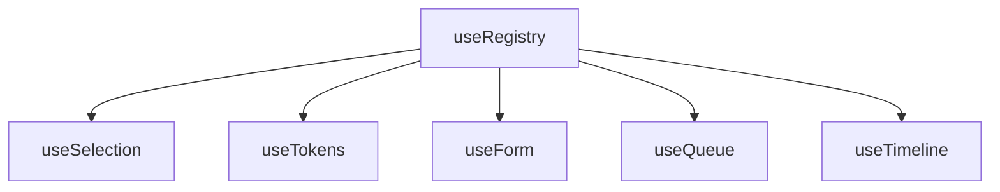

# useRegistry

A foundational composable for building registration-based systems, managing collections of registered items with automatic indexing, and lifecycle management.

<DocsPageFeatures :frontmatter />

## Usage

The `useRegistry` composable provides a powerful interface for managing collections of items in a registration-based system. It allows you to register, unregister, and look up items efficiently, while maintaining an index for quick access.

```ts
import { useRegistry } from '@vuetify/v0'

const registry = useRegistry()

const ticket1 = registry.register()
const ticket2 = registry.register()
const ticket3 = registry.register()

console.log(registry.size) // 3
```

## Architecture

`useRegistry` is the foundation for specialized registration systems:



Each branch extends the base ticket pattern with domain-specific capabilities. See individual composable docs for their extension hierarchies.

<DocsApi />
