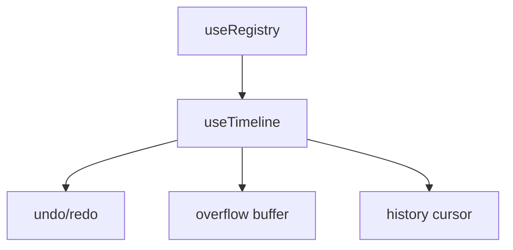

# useTimeline

A bounded undo/redo system that manages a fixed-size timeline of registered items with automatic overflow handling and history management.

<DocsPageFeatures :frontmatter />

## Usage

The `useTimeline` composable extends `useRegistry` to provide undo/redo functionality with a bounded history. When the timeline reaches its size limit, older items are moved to an overflow buffer, allowing you to undo back to them while maintaining a fixed active timeline size.

```ts
import { useTimeline } from '@vuetify/v0'

const timeline = useTimeline({ size: 10 })

// Register actions
timeline.register({ id: 'action-1', value: 'Created document' })
timeline.register({ id: 'action-2', value: 'Added title' })
timeline.register({ id: 'action-3', value: 'Added paragraph' })

console.log(timeline.size) // 3

// Undo the last action
timeline.undo()
console.log(timeline.size) // 2

// Redo the undone action
timeline.redo()
console.log(timeline.size) // 3
```

## Architecture

`useTimeline` extends `useRegistry` with bounded history and overflow management:



<DocsApi />
