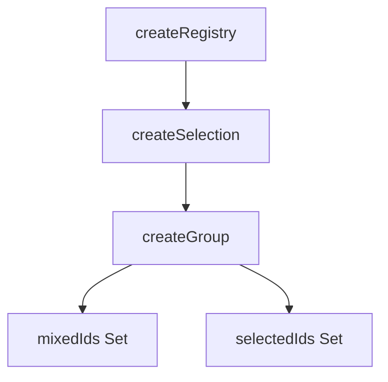

<script setup lang="ts">
import ChipFilterExample from '@/examples/composables/create-group/chip-filter.vue'
import ChipFilterExampleRaw from '@/examples/composables/create-group/chip-filter.vue?raw'
</script>

# createGroup

The `createGroup` composable is designed to manage a group of related components, allowing for shared state and behavior across them. It supports tri-state (mixed/indeterminate) for checkbox trees and similar use cases where items can be selected, unselected, or in a mixed state.

<DocsPageFeatures :frontmatter />

## Usage

The `createGroup` composable manages a group of selectable items, letting you work with both their IDs and their position indexes.
It supports selecting, unselecting, toggling, and reading the indexes of selected items.

```ts
import { createGroup } from '@vuetify/v0'

// Instantiate group
const group = createGroup()

// Register items
group.register({ id: 'apple', value: 'Apple' })
group.register({ id: 'banana', value: 'Banana' })
group.register({ id: 'cherry', value: 'Cherry' })
group.register({ id: 'date', value: 'Date' })

// Select some items
group.select(['apple', 'banana'])
console.log(group.selectedIndexes.value) // Set { 0, 1 }

// Toggle an item (banana will become unselected)
group.toggle('banana')
console.log(group.selectedIndexes.value) // Set { 0 }

// Unselect apple
group.unselect('apple')
console.log(group.selectedIndexes.value) // Set {}
```

## Examples

### Chip Filter

Multi-select chips with tri-state "select all" and live result filtering.

<DocsExample file="chip-filter.vue" :code="ChipFilterExampleRaw">
  <ChipFilterExample />
</DocsExample>

## Architecture

`createGroup` extends `createSelection` with multi-select and tri-state capabilities:



<DocsApi />
