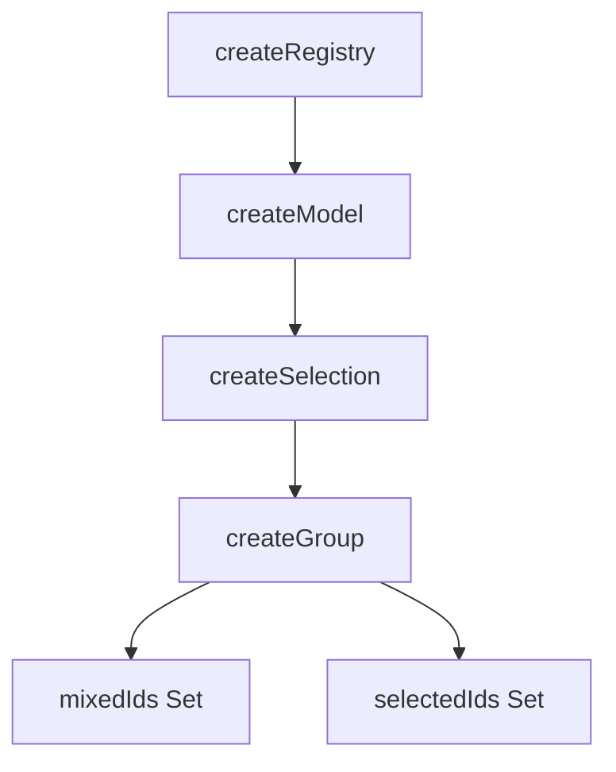

# createGroup

Multi-selection with tri-state (mixed/indeterminate) support for checkbox trees, grouped toggles, and any pattern where items can be partially selected.

<DocsPageFeatures :frontmatter />

## Usage

The `createGroup` composable manages a group of selectable items, letting you work with both their IDs and their position indexes.
It supports selecting, unselecting, toggling, and reading the indexes of selected items.

```ts collapse no-filename
import { createGroup } from '@vuetify/v0'

// Instantiate group
const group = createGroup()

// Register items
group.register({ id: 'apple', value: 'Apple' })
group.register({ id: 'banana', value: 'Banana' })
group.register({ id: 'cherry', value: 'Cherry' })
group.register({ id: 'date', value: 'Date' })

// Select some items
group.select(['apple', 'banana'])
console.log(group.selectedIndexes.value) // Set { 0, 1 }

// Toggle an item (banana will become unselected)
group.toggle('banana')
console.log(group.selectedIndexes.value) // Set { 0 }

// Unselect apple
group.unselect('apple')
console.log(group.selectedIndexes.value) // Set {}
```

## Context / DI

Use `createGroupContext` to share a group-selection instance across a component tree:

```ts
import { createGroupContext } from '@vuetify/v0'

export const [useCheckboxGroup, provideCheckboxGroup, checkboxGroup] =
  createGroupContext({ namespace: 'my:checkboxes' })

// In parent component
provideCheckboxGroup()

// In child component
const group = useCheckboxGroup()
group.selectAll()
```

## Architecture

`createGroup` extends `createSelection` with multi-select and tri-state capabilities:


```mermaid "Group Selection Hierarchy"
flowchart TD
  createRegistry --> createModel
  createModel --> createSelection
  createSelection --> createGroup
  createGroup --> mixedIds[mixedIds Set]
  createGroup --> selectedIds[selectedIds Set]
```

## Reactivity

Group selection state is **always reactive**, including the tri-state `mixedIds` set.

| Property/Method | Reactive | Notes |
| - | :-: | - |
| `selectedIds` | <AppSuccessIcon /> | `shallowReactive(Set)` — always reactive |
| `mixedIds` | <AppSuccessIcon /> | `shallowReactive(Set)` — tracks indeterminate state |
| `mixedItems` | <AppSuccessIcon /> | `ComputedRef<Set>` — ticket instances in mixed state |
| `selectedIndexes` | <AppSuccessIcon /> | Computed from `selectedIds` |
| `selectedItems` | <AppSuccessIcon /> | Computed from `selectedIds` |
| `selectedValues` | <AppSuccessIcon /> | Computed from `selectedItems` |
| `isAllSelected` | <AppSuccessIcon /> | `true` when all non-disabled items are selected |
| `isNoneSelected` | <AppSuccessIcon /> | `true` when no items are selected |
| `isMixed` | <AppSuccessIcon /> | `true` when some but not all items are selected — use for header checkbox |
| `selectAll()` | - | Select all non-disabled items |
| `unselectAll()` | - | Unselect all items |
| `toggleAll()` | - | Toggle all non-disabled items |
| `mix(ids)` | - | Set one or more tickets to indeterminate state |
| `unmix(ids)` | - | Clear indeterminate state from one or more tickets |
| `mixed(id)` | - | Returns `true` if the ticket is in mixed state |
| ticket `isSelected` | <AppSuccessIcon /> | Computed from `selectedIds` |
| ticket `isMixed` | <AppSuccessIcon /> | `Readonly<Ref<boolean>>` — whether this ticket is indeterminate |
| ticket `mix()` | - | Set this ticket to indeterminate state |
| ticket `unmix()` | - | Clear indeterminate state from this ticket |

## Examples

::: gn-example
/composables/create-group/context.ts 1
/composables/create-group/TagFilter.vue 2
/composables/create-group/chip-filter.vue 3
@import @mdi/js

### Chip Filter

Chip filters are a common pattern for narrowing content by tags. This example builds a togglable tag cloud using `createGroup` and shows three concerns working together: per-item toggling via `ticket.toggle()` and `ticket.isSelected`, batch selection via `toggleAll()`, and tri-state header state from `isAllSelected`, `isMixed`, and `isNoneSelected`.

`context.ts` defines the `TagInput` type, a typed `createTagFilter()` factory, and the seed data so the shape of each tag (id, value, color) is agreed on before either component touches the group. `TagFilter.vue` calls `onboard()` to register all tags in one shot and exposes `{ group, tickets }` via `defineExpose` so the parent can reach the group state. The select-all button's icon switches between `mdiCheckboxBlankOutline`, `mdiCheckboxIntermediate`, and `mdiCheckboxMarked` by reading `isMixed` and `isAllSelected` through a `toRef` — no extra local state needed. `chip-filter.vue` reads `group.isNoneSelected` to decide whether to show all tags or only the selected ones in the results strip below.

Reach for this pattern when a fixed tag set needs to control visible content and the user should be able to toggle all at once. The tri-state header is genuinely useful when the set is large enough that "clear all" and "select all" are common operations. For a tree of nested tags with parent/child relationships, see [createNested](/composables/selection/create-nested).

| File | Role |
|------|------|
| `context.ts` | Tag type, factory, and seed data |
| `TagFilter.vue` | Chip cloud with tri-state select-all header |
| `chip-filter.vue` | Entry point — wires filter to a results list |
:::

<DocsApi />
