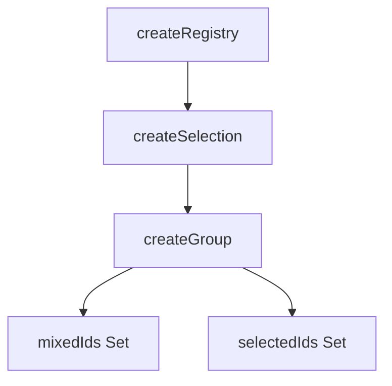

# createGroup

The `createGroup` composable is designed to manage a group of related components, allowing for shared state and behavior across them. It supports tri-state (mixed/indeterminate) for checkbox trees and similar use cases where items can be selected, unselected, or in a mixed state.

<DocsPageFeatures :frontmatter />

## Usage

The `createGroup` composable manages a group of selectable items, letting you work with both their IDs and their position indexes.
It supports selecting, unselecting, toggling, and reading the indexes of selected items.

```ts collapse no-filename
import { createGroup } from '@vuetify/v0'

// Instantiate group
const group = createGroup()

// Register items
group.register({ id: 'apple', value: 'Apple' })
group.register({ id: 'banana', value: 'Banana' })
group.register({ id: 'cherry', value: 'Cherry' })
group.register({ id: 'date', value: 'Date' })

// Select some items
group.select(['apple', 'banana'])
console.log(group.selectedIndexes.value) // Set { 0, 1 }

// Toggle an item (banana will become unselected)
group.toggle('banana')
console.log(group.selectedIndexes.value) // Set { 0 }

// Unselect apple
group.unselect('apple')
console.log(group.selectedIndexes.value) // Set {}
```

## Architecture

`createGroup` extends `createSelection` with multi-select and tri-state capabilities:


```mermaid "Group Selection Hierarchy"
flowchart TD
  createRegistry --> createSelection
  createSelection --> createGroup
  createGroup --> mixedIds[mixedIds Set]
  createGroup --> selectedIds[selectedIds Set]
```

## Reactivity

Group selection state is **always reactive**, including the tri-state `mixedIds` set.

| Property/Method | Reactive | Notes |
| - | :-: | - |
| `selectedIds` | <AppSuccessIcon /> | `shallowReactive(Set)` — always reactive |
| `mixedIds` | <AppSuccessIcon /> | `shallowReactive(Set)` — tracks indeterminate state |
| `selectedIndexes` | <AppSuccessIcon /> | Computed from `selectedIds` |
| `isAllSelected` | <AppSuccessIcon /> | Computed from `selectedIds` and collection size |
| `selectedItems` | <AppSuccessIcon /> | Computed from `selectedIds` |
| `selectedValues` | <AppSuccessIcon /> | Computed from `selectedItems` |
| ticket `isSelected` | <AppSuccessIcon /> | Computed from `selectedIds` |

> [!TIP] Tri-state support
> `mixedIds` is reactive and updates automatically for indeterminate checkbox states in tree structures.

## Examples

### Chip Filter

Chip filters are a common pattern for narrowing content by tags. This example shows how `createGroup` handles per-item toggling, bulk selection via a tri-state header, and reactive state queries (`isAllSelected`, `isMixed`, `isNoneSelected`) — all out of the box.

::: example
/composables/create-group/context.ts 1
/composables/create-group/TagFilter.vue 2
/composables/create-group/chip-filter.vue 3

| File | Role |
|------|------|
| `context.ts` | Tag type, factory, and seed data |
| `TagFilter.vue` | Chip cloud with tri-state select-all header |
| `chip-filter.vue` | Entry point — wires filter to a results list |
:::

<DocsApi />
