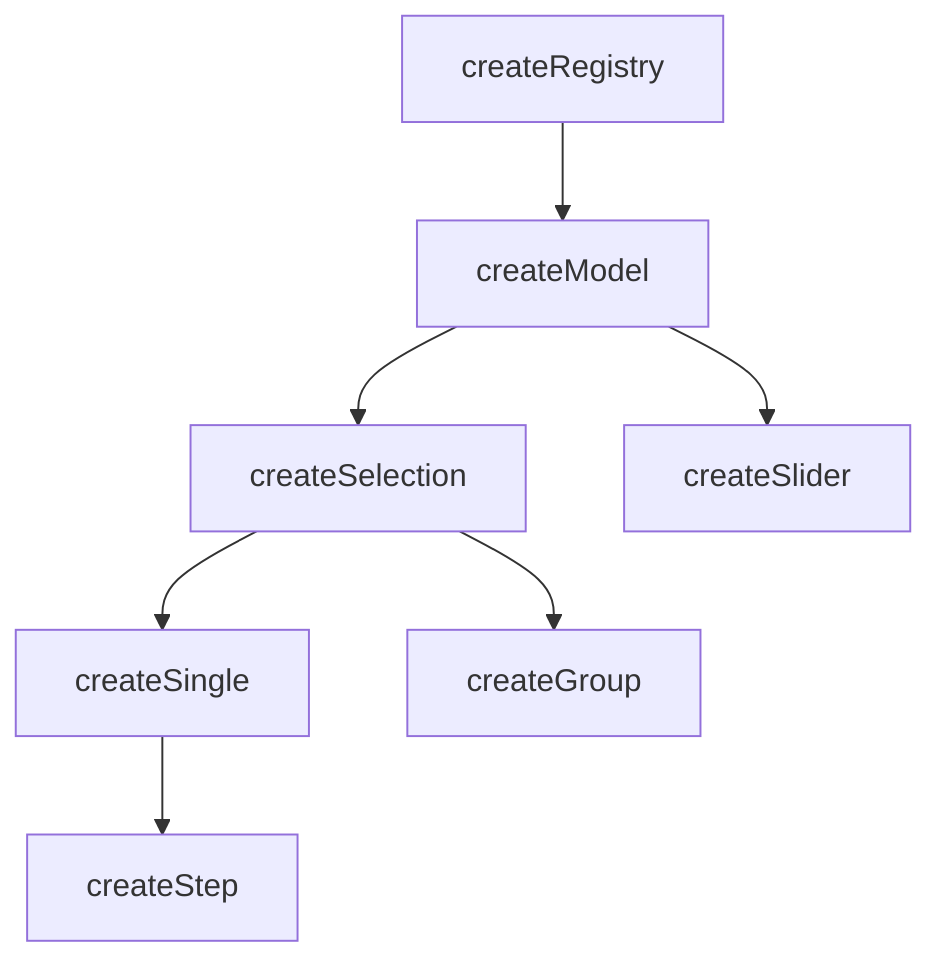

# createModel

A composable that extends `createRegistry` with selection state — a reactive Set of selected IDs, disabled guards, mandatory enforcement, and an `apply` bridge for syncing with `useProxyModel`.

<DocsPageFeatures :frontmatter />

## Usage

`createModel` is the shared selection state layer used by both `createSelection` and `createSlider`. It adds selection tracking, disabled guards, and mandatory enforcement on top of the registry's collection management.

```ts
import { createModel } from '@vuetify/v0'

const model = createModel()

model.register({ id: 'a', value: 'Apple' })
model.register({ id: 'b', value: 'Banana' })

model.select('a')

console.log(model.selectedIds) // Set(1) { 'a' }
console.log(model.selectedValues.value) // Set(1) { 'Apple' }
console.log(model.selected('a')) // true
```

## Architecture

`createModel` sits between `createRegistry` and the higher-level selection composables:



## Mandatory Selection

The `mandatory` option controls whether at least one item must remain selected:

| Value | Behavior |
| - | - |
| `false` | No enforcement — all items can be deselected |
| `true` | Prevents deselecting the last selected item |
| `'force'` | Same as `true`, plus auto-selects the first non-disabled item when `mandate()` is called |

```ts
const model = createModel({ mandatory: 'force' })

model.register({ id: 'a', value: 'Apple' })
model.mandate() // auto-selects 'a'

model.unselect('a') // no-op — last item cannot be deselected
```

## Disabled Guards

Both the model instance and individual tickets support disabled state. Selection operations are silently skipped when disabled:

```ts
// Instance-level disabled
const model = createModel({ disabled: true })
model.register({ id: 'a', value: 'Apple' })
model.select('a') // no-op

// Ticket-level disabled
const model2 = createModel()
model2.register({ id: 'b', value: 'Banana', disabled: true })
model2.select('b') // no-op
```

## The Apply Bridge

`apply` syncs external values (from `useProxyModel`) into the model's `selectedIds`. It resolves values to IDs using the registry's `browse` method and performs a minimal diff:

```ts
const model = createModel({ multiple: true })

model.register({ id: 'a', value: 'Apple' })
model.register({ id: 'b', value: 'Banana' })
model.register({ id: 'c', value: 'Cherry' })

// Sync external values into the model
model.apply(['Apple', 'Cherry'])

console.log(model.selectedIds) // Set(2) { 'a', 'c' }
```

## Reactivity

Selection state is **always reactive**. Collection methods follow the base `createRegistry` pattern.

| Property/Method | Reactive | Notes |
| - | :-: | - |
| `selectedIds` | <AppSuccessIcon /> | `shallowReactive(Set)` — always reactive |
| `selectedItems` | <AppSuccessIcon /> | Computed from `selectedIds` |
| `selectedValues` | <AppSuccessIcon /> | Computed from `selectedItems` |
| ticket `isSelected` | <AppSuccessIcon /> | Computed from `selectedIds` |

> [!TIP] Selection vs Collection
> Most UI patterns only need **selection reactivity** (which is always on). You rarely need the collection itself to be reactive.

## Examples

::: example
/composables/create-model/model.ts
/composables/create-model/ColorProvider.vue
/composables/create-model/ColorConsumer.vue
/composables/create-model/colors.vue

### Color Palette Selector

This example demonstrates `createModel` with `multiple` and `mandatory` options. Each color is a registered ticket with a hex value. Purple is disabled and cannot be selected. The last selected color cannot be deselected due to `mandatory: true`.

**File breakdown:**

| File | Role |
|------|------|
| `model.ts` | Creates the model instance with `multiple: true, mandatory: true`, onboards color tickets, and exports the context tuple |
| `ColorProvider.vue` | Calls `createColorModel()` and provides the context, rendering only a slot |
| `ColorConsumer.vue` | Consumes the context via `useColors()` to render clickable swatches with reactive selected state |
| `colors.vue` | Entry point that composes Provider around Consumer |

**Key patterns:**

- Provider components are invisible wrappers that render only `<slot />`
- Consumers import only from `model.ts`, never from the Provider
- `toggle(id)` handles both select and unselect in one call
- Disabled tickets are visually dimmed and non-interactive

:::

<DocsApi />
