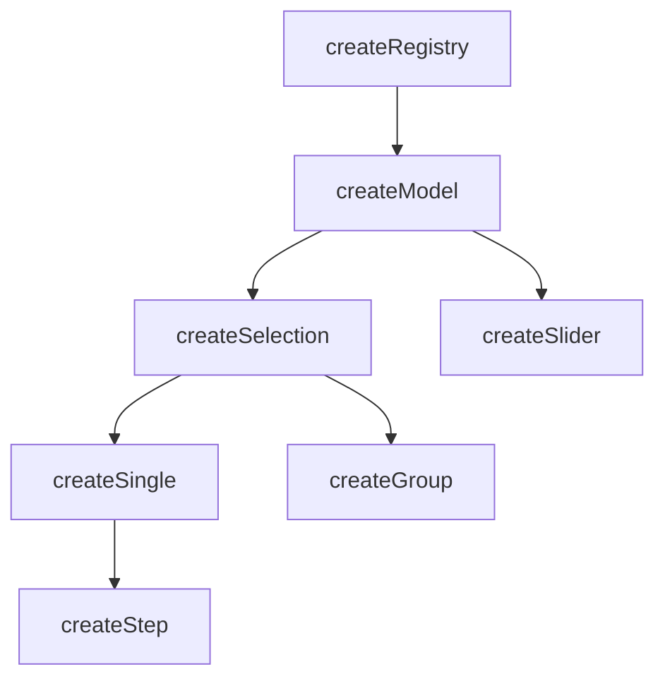

# createModel

A value store composable — register a ticket with a ref, and `createModel` gives you a reactive bridge between that ref and `useProxyModel`.

<DocsPageFeatures :frontmatter />

## Usage

`createModel` is a value store layer — think of it as a creative way to store a single value, more like `defineModel` than `createSelection`. It adds value tracking and disabled guards on top of the registry's collection management.

The typical pattern: register one ticket whose value is a ref, activate it, and let `useProxyModel` keep everything in sync.

```ts
import { ref } from 'vue'
import { createModel, useProxyModel } from '@vuetify/v0'

const value = ref('Apple')
const model = createModel()

model.register({ id: 'fruit', value })
model.select('fruit')

useProxyModel(model, value)

// The ref and the model's stored value are now synced.
// Changing `value.value` updates the model, and vice versa.
```

Selection-specific concepts like `mandatory`, `multiple`, and `enroll` belong in `createSelection`.

## Architecture

`createModel` sits between `createRegistry` and the higher-level composables:



## How It Stores a Value

Each ticket holds a value — typically a `ref`. Calling `select` activates a ticket, making it the model's current value. Because `createModel` is a single-value store, `select` always clears before adding:

```ts
const model = createModel()

model.register({ id: 'a', value: ref('Apple') })
model.register({ id: 'b', value: ref('Banana') })

model.select('a')
// model now stores 'Apple'

model.select('b')
// model now stores 'Banana' — 'a' is deactivated
```

When a ticket's value is a ref, `apply` updates that ref directly — no ID resolution needed. This is what makes `useProxyModel` work seamlessly with reactive ticket values.

For multi-value patterns where multiple tickets are active simultaneously, use `createSelection`.

## Disabled Guards

Both the model instance and individual tickets support a disabled state. Operations are silently skipped when disabled:

```ts
// Instance-level disabled
const model = createModel({ disabled: true })
model.register({ id: 'a', value: ref('Apple') })
model.select('a') // no-op

// Ticket-level disabled
const model2 = createModel()
model2.register({ id: 'b', value: ref('Banana'), disabled: true })
model2.select('b') // no-op
```

## The Apply Bridge

`apply` is the sync mechanism that `useProxyModel` calls to push external values into the model. It has two strategies:

1. **Ref values** (common): If the active ticket's value is a ref, `apply` writes directly to `ticket.value.value`. No lookup needed.
2. **Static values** (fallback): Resolves the value to a ticket ID via the registry's `browse` method, then activates that ticket.

```ts
const value = ref('Apple')
const model = createModel()

model.register({ id: 'fruit', value })
model.select('fruit')

// useProxyModel calls apply internally:
model.apply(['Banana'])

console.log(value.value) // 'Banana' — ref updated directly
```

## Reactivity

Value state is **always reactive**. Collection methods follow the base `createRegistry` pattern.

| Property/Method | Reactive | Notes |
| - | :-: | - |
| `selectedIds` | <AppSuccessIcon /> | `shallowReactive(Set)` — always reactive |
| `selectedItems` | <AppSuccessIcon /> | Computed from `selectedIds` |
| `selectedValues` | <AppSuccessIcon /> | Computed from `selectedItems`, unwraps refs via `toValue` |
| ticket `isSelected` | <AppSuccessIcon /> | Computed from `selectedIds` |

> [!TIP] Value vs Collection
> Most UI patterns only need **value reactivity** (which is always on). You rarely need the collection itself to be reactive.

## Examples

::: example
/composables/create-model/input

### Single Value

One ticket registered with a ref value, activated, and synced via `useProxyModel`. Type in the input — the ref, the store, and the model all stay in sync.

:::

::: example
/composables/create-model/model.ts
/composables/create-model/ColorProvider.vue
/composables/create-model/ColorConsumer.vue
/composables/create-model/colors.vue

### Color Palette

Five tickets, each holding a reactive OKLCH hue ref. Drag a slider to adjust a color in real time — `selectedValues` is the reactive composite of all active hues. Toggle a color off to drop it from the composite. Purple is disabled entirely. Uses `createSelection` (which extends `createModel`) for multi-ticket support.

:::

<DocsApi />
