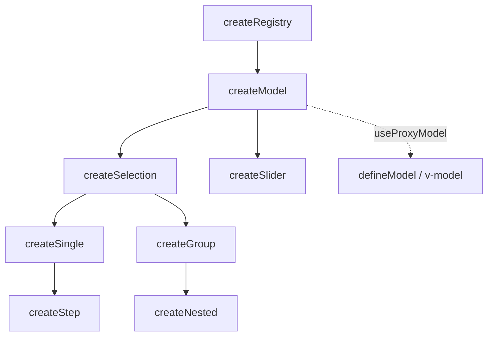
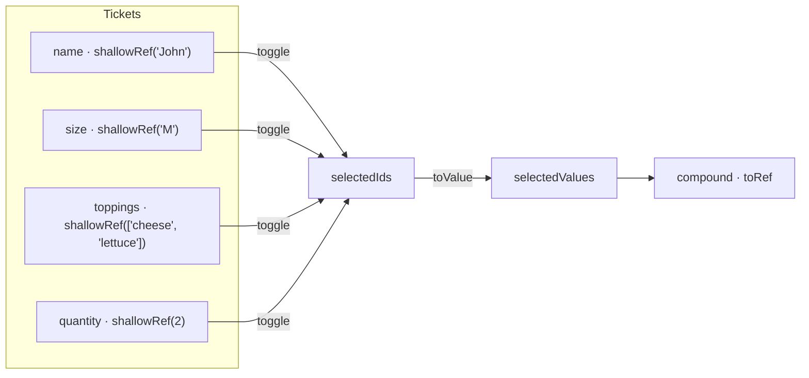
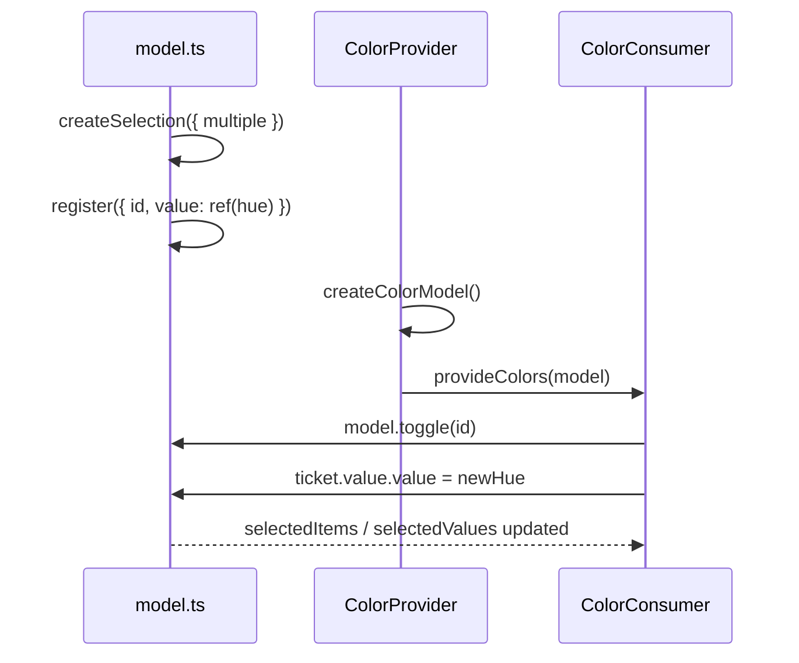

# createModel

Reactive value store that wraps a ref with two-way selection binding.

<DocsPageFeatures :frontmatter />

## Usage

`createModel` stores a reactive value. Register a ref and `useProxyModel` keeps it synced — the same idea as `defineModel` but built on the registry pattern.

```ts
import { shallowRef } from 'vue'
import { createModel, useProxyModel } from '@vuetify/v0'

const value = shallowRef<string>()
const model = createModel()

model.register({ id: 'fruit', value })
// ticket is already selected — enroll defaults to true

useProxyModel(model, value)
```

Tickets are **enrolled on registration** by default (`enroll: true`). With single-value semantics, only the most recently registered ticket is active. Pass `enroll: false` to opt out.

Most of the time you register a single ticket — that's the only value you care about. The registry pattern underneath gives you the ability to compose multiple values into a compound model when you need it, which is what `createSelection` builds on.

Pass `multiple: true` to let `select()` accumulate IDs instead of clearing first. This is how `createSlider` keeps all thumbs selected simultaneously. Selection-specific concepts like `mandatory` belong in `createSelection`. Both composables accept `enroll`, but `createSelection` defaults it to `false`.

## Architecture

`createModel` sits between `createRegistry` and the higher-level composables:



## Reactivity

Value state is **always reactive**. Collection methods follow the base `createRegistry` pattern.

| Property/Method | Reactive | Notes |
| - | :-: | - |
| `selectedIds` | <AppSuccessIcon /> | `shallowReactive(Set)` — always reactive |
| `selectedItems` | <AppSuccessIcon /> | Computed from `selectedIds` |
| `selectedValues` | <AppSuccessIcon /> | Computed from `selectedItems`, unwraps refs via `toValue` |
| ticket `isSelected` | <AppSuccessIcon /> | Computed from `selectedIds` |
| `apply(values, options?)` | <AppErrorIcon /> | Sets selection from an array of values — used by `useProxyModel` to sync a ref with the model |

> [!TIP] Value vs Collection
> Most UI patterns only need **value reactivity** (which is always on). You rarely need the collection itself to be reactive.

## Examples

::: example
/composables/create-model/createCompound.ts
/composables/create-model/compound.vue
@import @mdi/js

### Compound Value

A model isn't limited to one value. Register multiple tickets — each with its own ref and input type — and the model composes them into a single compound output. The compound output at the bottom is a `toRef` over `selectedValues`, so it updates whenever a ticket's value changes or a ticket is toggled in or out of the composition.



Each ticket's value can be any type: a string, a number, an array. The checkbox next to each ticket controls whether it's included in the compound. Disabling a ticket freezes its value and prevents selection changes. Because each value is a ref, edits flow through the model reactively — type in the text field, pick a radio, check a topping, or drag the slider and the compound reflects the change immediately.

This pattern is the foundation for compound inputs like forms, filters, and configuration panels — anywhere multiple independent values need to be composed into a single reactive output.

| File | Role |
|------|------|
| `createCompound.ts` | Creates the model, registers four tickets with typed refs, exports reactive `compound` |
| `compound.vue` | Renders each ticket with its matching input control, toggles composition membership |

:::

::: example
/composables/create-model/model.ts
/composables/create-model/ColorProvider.vue
/composables/create-model/ColorConsumer.vue
/composables/create-model/colors.vue

### Color Palette

This example uses `createSelection` (which extends `createModel`) to compose a palette from five OKLCH hue values. Each color is a ticket with a `ref(hue)` as its value — the hue sliders write directly to those refs, so dragging a slider shifts the color in real time without any re-registration.



The circle next to each color toggles it in or out of the composition. Purple is registered with `disabled: true`, so it can't be toggled or adjusted. The composite strip at the bottom renders only the active colors as equal-width segments, with degree labels underneath.

The provider/consumer split keeps the model definition (`model.ts`) separate from the UI (`ColorConsumer.vue`). The provider creates the model and provides it via `createContext`; the consumer injects it and renders the controls. This is the same pattern you'd use in a real application to share model state across a component tree.

| File | Role |
|------|------|
| `model.ts` | Creates the selection, registers five OKLCH colors with `ref(hue)` values, exports context tuple |
| `ColorProvider.vue` | Calls `createColorModel()` and provides context via slot |
| `ColorConsumer.vue` | Injects context, renders hue sliders with gradient tracks and composite strip |
| `colors.vue` | Entry point composing Provider around Consumer |

:::

<DocsApi />
