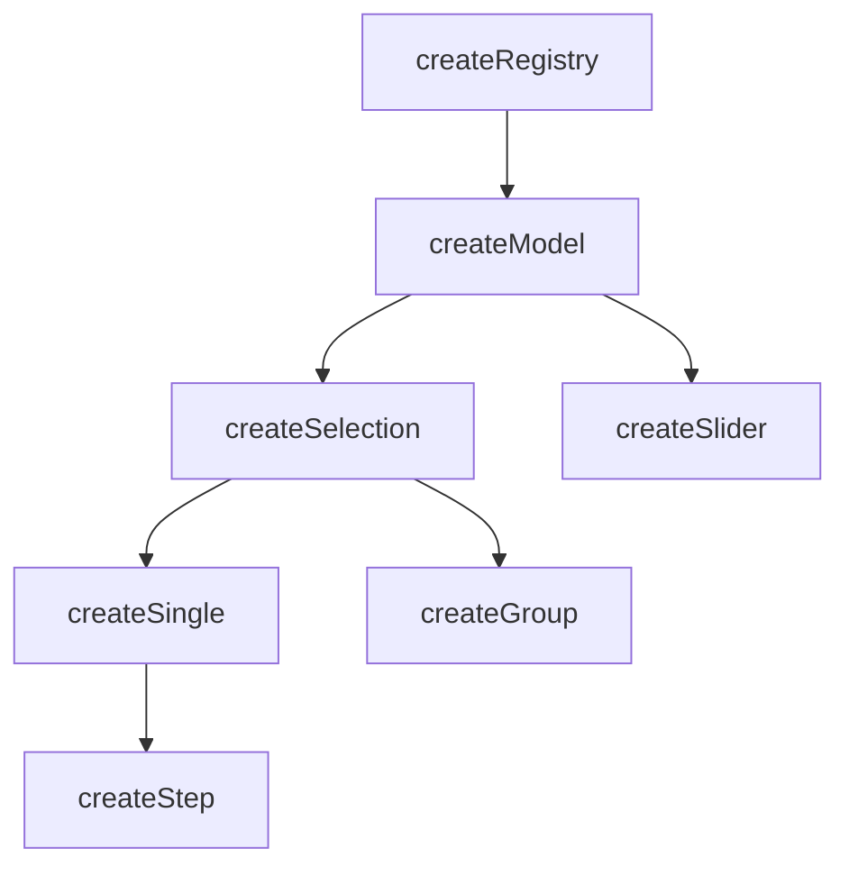

# createModel

Manage a reactive value with two-way sync — wrap a ref in a model and `useProxyModel` keeps it in sync automatically.

<DocsPageFeatures :frontmatter />

## Usage

`createModel` stores a reactive value. Register a ref and `useProxyModel` keeps it synced — the same idea as `defineModel` but built on the registry pattern.

```ts
import { createModel, useProxyModel } from '@vuetify/v0'

const value = defineModel<string>()
const model = createModel()

model.register({ id: 'fruit', value })

useProxyModel(model, value)
```

Most of the time you register a single ticket — that's the only value you care about. The registry pattern underneath gives you the ability to compose multiple values into a compound model when you need it, which is what `createSelection` builds on.

Selection-specific concepts like `mandatory`, `multiple`, and `enroll` belong in `createSelection`.

## Architecture

`createModel` sits between `createRegistry` and the higher-level composables:



## How It Stores a Value

A ticket's value is typically a ref. When registered, `useProxyModel` auto-selects the ticket and writes directly to the ref — changes flow both ways without ID resolution.

When multiple tickets are registered, `select` always clears before adding — only one ticket is active at a time. For compound models where multiple values are active simultaneously, use `createSelection`.

## Disabled Guards

Both the model instance and individual tickets support a disabled state. Operations are silently skipped when disabled:

```ts
// Instance-level disabled
const model = createModel({ disabled: true })
model.register({ id: 'a', value: ref('Apple') })
model.select('a') // no-op

// Ticket-level disabled
const model2 = createModel()
model2.register({ id: 'b', value: ref('Banana'), disabled: true })
model2.select('b') // no-op
```

## The Apply Bridge

`useProxyModel` calls `apply` internally to keep the ref and model in sync. When the active ticket's value is a ref, `apply` writes to it directly — no ID lookup needed. You rarely call `apply` yourself.

## Reactivity

Value state is **always reactive**. Collection methods follow the base `createRegistry` pattern.

| Property/Method | Reactive | Notes |
| - | :-: | - |
| `selectedIds` | <AppSuccessIcon /> | `shallowReactive(Set)` — always reactive |
| `selectedItems` | <AppSuccessIcon /> | Computed from `selectedIds` |
| `selectedValues` | <AppSuccessIcon /> | Computed from `selectedItems`, unwraps refs via `toValue` |
| ticket `isSelected` | <AppSuccessIcon /> | Computed from `selectedIds` |

> [!TIP] Value vs Collection
> Most UI patterns only need **value reactivity** (which is always on). You rarely need the collection itself to be reactive.

## Examples

::: example
/composables/create-model/compound

### Compound Value

Register multiple tickets with different value types — text, radios, checkboxes, a slider, and a color picker. Each ticket's value is a ref. Toggle tickets in and out of the compound, disable them, or change their values. The compound output updates reactively.

:::

::: example
/composables/create-model/model.ts
/composables/create-model/ColorProvider.vue
/composables/create-model/ColorConsumer.vue
/composables/create-model/colors.vue

### Color Palette

Five OKLCH hue sliders composed into a shared palette via `createSelection` (which extends `createModel`). Drag a slider to adjust a color, toggle one off to drop it from the composite. Purple is disabled.

:::

<DocsApi />
