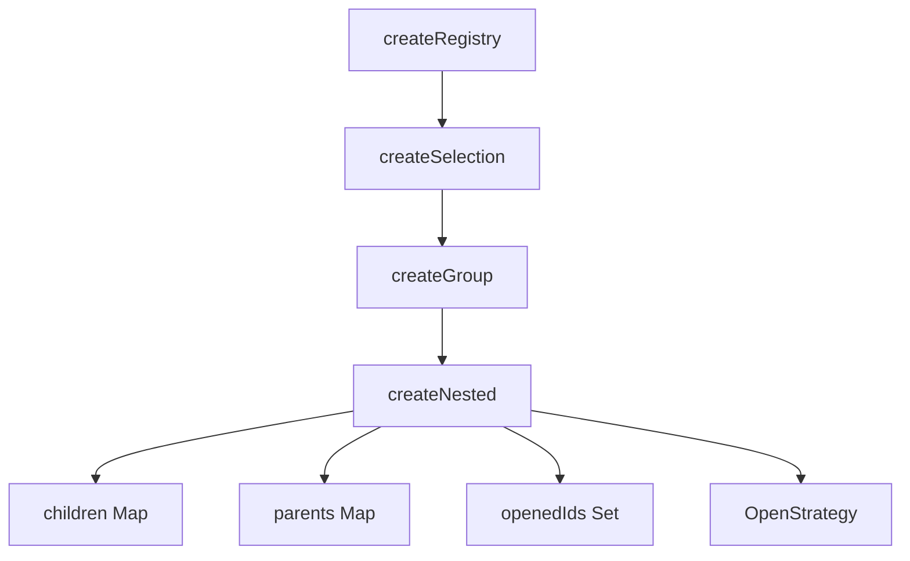

# createNested

The `createNested` composable extends `createGroup` to manage hierarchical tree structures. It provides parent-child relationship tracking, open/close state management, tree traversal utilities, and pluggable open strategies.

<DocsPageFeatures :frontmatter />

## Usage

The `createNested` composable manages hierarchical tree structures with parent-child relationships, open/close states, and tree traversal.

::: example
/composables/create-nested/basic
:::

## Reactivity

`createNested` uses **shallowReactive** for tree state, making structural changes reactive while keeping traversal methods non-reactive for performance.

| Property/Method | Reactive | Notes |
| - | :-: | - |
| `children` | <AppSuccessIcon /> | ShallowReactive Map |
| `parents` | <AppSuccessIcon /> | ShallowReactive Map |
| `openedIds` | <AppSuccessIcon /> | ShallowReactive Set |
| `openedItems` | <AppSuccessIcon /> | Computed from openedIds |
| `roots` | <AppSuccessIcon /> | Computed, root nodes |
| `leaves` | <AppSuccessIcon /> | Computed, leaf nodes |
| `ticket.isOpen` | <AppSuccessIcon /> | Ref via toRef() |
| `ticket.isLeaf` | <AppSuccessIcon /> | Ref via toRef() |
| `ticket.depth` | <AppSuccessIcon /> | Ref via toRef() |

## Architecture

`createNested` extends `createGroup` with hierarchical tree management:



<DocsApi />

## Options

### open

Controls how nodes expand/collapse:

| Value | Behavior |
|-------|----------|
| `'multiple'` | Multiple nodes can be open simultaneously (default) |
| `'single'` | Only one node open at a time (accordion behavior) |

```ts
// Tree view - multiple nodes open
const tree = createNested({ open: 'multiple' })

// Accordion - single node open
const accordion = createNested({ open: 'single' })
```

### selection

Controls how selection cascades through the hierarchy:

| Value | Behavior |
|-------|----------|
| `'cascade'` | Selecting parent selects all descendants; ancestors show mixed state (default) |
| `'independent'` | Each node selected independently, no cascading |
| `'leaf'` | Only leaf nodes can be selected; parent selection selects leaf descendants |

```ts
// Cascading checkbox tree
const tree = createNested({ selection: 'cascade' })

// Independent selection
const flat = createNested({ selection: 'independent' })

// Leaf-only selection (file picker)
const picker = createNested({ selection: 'leaf' })
```

## Selection Modes

### Cascade Mode (Default)

Selection propagates through the hierarchy:

**Selecting a parent** selects all descendants:

```ts
tree.select('root')
// root, child-1, child-2, grandchild-1, etc. are all selected
```

**Selecting a child** updates ancestors to mixed state:

```ts
tree.select('child-1')
// child-1 is selected
// root shows mixed state (some children selected)
```

**Automatic state resolution:**

- **All children selected** → Parent becomes selected (not mixed)
- **Some children selected** → Parent becomes mixed
- **No children selected** → Parent becomes unselected (not mixed)

### Independent Mode

Each node is selected independently with no cascading:

```ts
const tree = createNested({ selection: 'independent' })

tree.select('parent')
// Only 'parent' is selected, children unchanged
```

### Leaf Mode

Only leaf nodes can be selected. Selecting a parent selects all leaf descendants:

```ts
const tree = createNested({ selection: 'leaf' })

tree.select('folder')
// All files (leaves) under 'folder' are selected
// 'folder' itself is not in selectedIds
```

## Custom Open Strategies

For advanced use cases, implement custom strategies:

```ts
import type { OpenStrategy, OpenStrategyContext } from '@vuetify/v0'

const keepParentsOpenStrategy: OpenStrategy = {
  onOpen: (id, context) => {
    // context.openedIds - reactive Set of open node IDs
    // context.children - Map of parent ID to child IDs
    // context.parents - Map of child ID to parent ID
  },
  onClose: (id, context) => {
    // Called after a node is closed
  },
}

const tree = createNested({ openStrategy: keepParentsOpenStrategy })
```

> [!TIP]
> The `openStrategy` option overrides `open` when provided. Use `open` for simple cases.

## Convenience Methods

### Expand/Collapse All

```ts
// Open all non-leaf nodes
tree.expandAll()

// Close all nodes
tree.collapseAll()
```

### Data Transformation

Convert tree to flat array for serialization or API consumption:

```ts
const flat = tree.toFlat()
// Returns: [{ id, parentId, value }, ...]

// Useful for sending to APIs or AI systems
console.log(JSON.stringify(flat))
```

## Inline Children Registration

Define children directly when registering items:

```ts
tree.onboard([
  {
    id: 'nav',
    value: 'Navigation',
    children: [
      { id: 'home', value: 'Home' },
      { id: 'about', value: 'About' },
      {
        id: 'products',
        value: 'Products',
        children: [
          { id: 'widgets', value: 'Widgets' },
          { id: 'gadgets', value: 'Gadgets' },
        ],
      },
    ],
  },
])
```

## Cascade Unregister

Remove a node and optionally all its descendants:

```ts
// Remove node, orphan children (default)
tree.unregister('parent')

// Remove node and all descendants
tree.unregister('parent', true)

// Batch removal with cascade
tree.offboard(['node-1', 'node-2'], true)
```

## Ticket Properties

Each registered node receives additional properties:

```ts
const node = tree.register({ id: 'node', value: 'Node', parentId: 'root' })

// Reactive refs
node.isOpen.value      // boolean - is this node open?
node.isLeaf.value      // boolean - has no children?
node.depth.value       // number - depth in tree (0 = root)

// Methods
node.open()            // Open this node
node.close()           // Close this node
node.flip()            // Flip open/closed state
node.getPath()         // Get path from root to this node
node.getAncestors()    // Get all ancestors
node.getDescendants()  // Get all descendants
```

## Context Pattern

Use with Vue's provide/inject for component trees:

```ts
import { createNestedContext } from '@vuetify/v0'

// Create a trinity
const [useTree, provideTree, defaultTree] = createNestedContext({
  namespace: 'my-tree',
})

// In parent component
provideTree()

// In child components
const tree = useTree()
```
