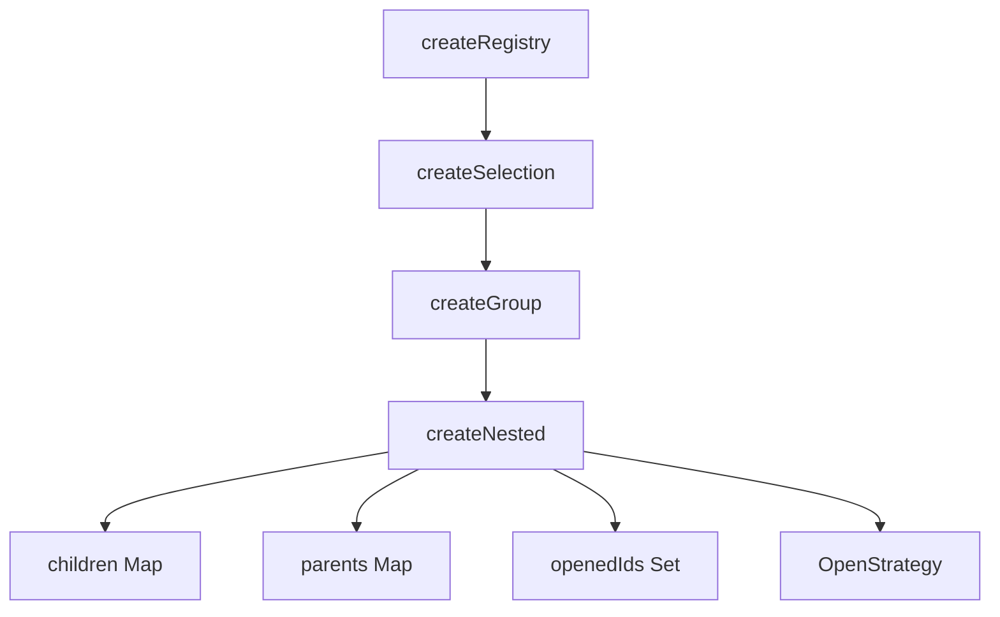

<script setup>
import BasicExample from '@/examples/composables/create-nested/basic.vue'
import BasicExampleRaw from '@/examples/composables/create-nested/basic.vue?raw'
</script>

# createNested

The `createNested` composable extends `createGroup` to manage hierarchical tree structures. It provides parent-child relationship tracking, open/close state management, tree traversal utilities, and pluggable open strategies.

<DocsPageFeatures :frontmatter />

## Usage

The `createNested` composable manages hierarchical tree structures with parent-child relationships, open/close states, and tree traversal.

<DocsExample file="basic.vue" :code="BasicExampleRaw">
  <BasicExample />
</DocsExample>

## Architecture

`createNested` extends `createGroup` with hierarchical tree management:



## Open Strategies

Control how nodes expand/collapse using pluggable strategies:

```ts
import { createNested, multipleOpenStrategy, singleOpenStrategy } from '@vuetify/v0'

// Multiple nodes can be open (default)
const tree = createNested({ openStrategy: multipleOpenStrategy })

// Accordion behavior - only one node open at a time
const accordion = createNested({ openStrategy: singleOpenStrategy })
```

### Custom Strategy

```ts
import type { OpenStrategy } from '@vuetify/v0'

const customStrategy: OpenStrategy = {
  onOpen: (id, context) => {
    // Custom logic when a node opens
    // context provides: openedIds, children, parents
  },
  onClose: (id, context) => {
    // Custom logic when a node closes
  },
}
```

## Convenience Methods

### Expand/Collapse All

```ts
// Open all non-leaf nodes
tree.expandAll()

// Close all nodes
tree.collapseAll()
```

### Data Transformation

Convert tree to flat array for serialization or API consumption:

```ts
const flat = tree.toFlat()
// Returns: [{ id, parentId, value }, ...]

// Useful for sending to APIs or AI systems
console.log(JSON.stringify(flat))
```

## Inline Children Registration

Define children directly when registering items:

```ts
tree.onboard([
  {
    id: 'nav',
    value: 'Navigation',
    children: [
      { id: 'home', value: 'Home' },
      { id: 'about', value: 'About' },
      {
        id: 'products',
        value: 'Products',
        children: [
          { id: 'widgets', value: 'Widgets' },
          { id: 'gadgets', value: 'Gadgets' },
        ],
      },
    ],
  },
])
```

## Cascade Unregister

Remove a node and optionally all its descendants:

```ts
// Remove node, orphan children (default)
tree.unregister('parent')

// Remove node and all descendants
tree.unregister('parent', true)

// Batch removal with cascade
tree.offboard(['node-1', 'node-2'], true)
```

## Ticket Properties

Each registered node receives additional properties:

```ts
const node = tree.register({ id: 'node', value: 'Node', parentId: 'root' })

// Reactive refs
node.isOpen.value      // boolean - is this node open?
node.isLeaf.value      // boolean - has no children?
node.depth.value       // number - depth in tree (0 = root)

// Methods
node.open()            // Open this node
node.close()           // Close this node
node.toggleOpen()      // Toggle open state
node.getPath()         // Get path from root to this node
node.getAncestors()    // Get all ancestors
node.getDescendants()  // Get all descendants
```

## Context Pattern

Use with Vue's provide/inject for component trees:

```ts
import { createNestedContext } from '@vuetify/v0'

// Create a trinity
const [useTree, provideTree, defaultTree] = createNestedContext({
  namespace: 'my-tree',
})

// In parent component
provideTree()

// In child components
const tree = useTree()
```

<DocsApi />
