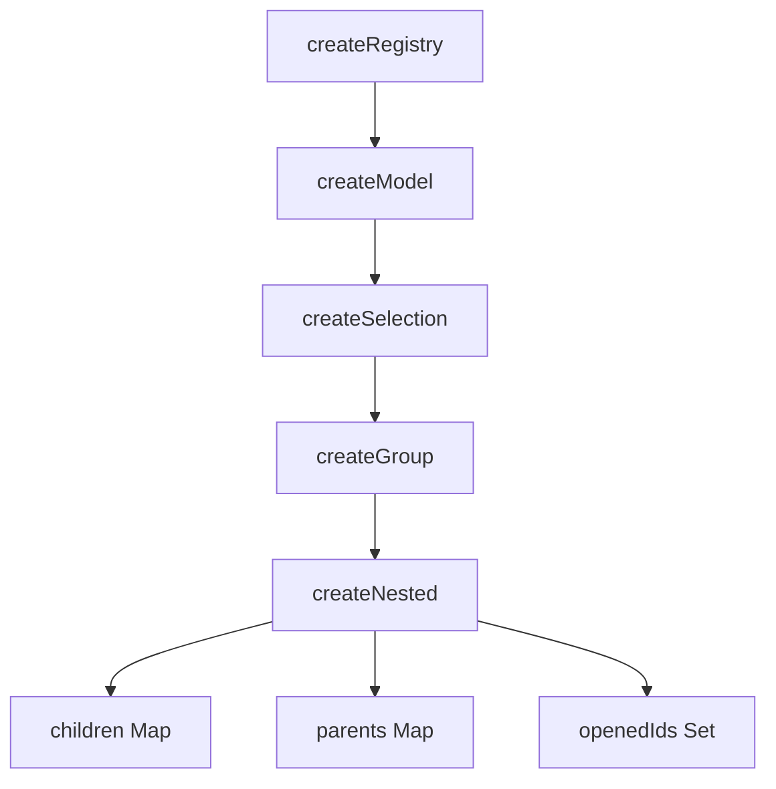

# createNested

Manage hierarchical tree structures with parent-child relationships, open/close state, and pluggable traversal strategies.

<DocsPageFeatures :frontmatter />

## Usage

The `createNested` composable manages hierarchical tree structures with parent-child relationships, open/close states, and tree traversal.

```ts collapse no-filename
import { createNested } from '@vuetify/v0'

const tree = createNested({ open: 'multiple', selection: 'cascade' })

tree.onboard([
  {
    id: 'root',
    value: 'Root',
    children: [
      { id: 'child-1', value: 'Child 1' },
      { id: 'child-2', value: 'Child 2' },
    ],
  },
])

tree.open('root')
tree.select('child-1')
```

## Context / DI

### Context Pattern

Use with Vue's provide/inject for component trees:

```ts
import { createNestedContext } from '@vuetify/v0'

// Create a trinity
const [useTree, provideTree, defaultTree] = createNestedContext({
  namespace: 'my-tree',
})

// In parent component
provideTree()

// In child components
const tree = useTree()
```

## Architecture

`createNested` extends `createGroup` with hierarchical tree management:


```mermaid "Nested Hierarchy"
flowchart TD
  createRegistry --> createModel
  createModel --> createSelection
  createSelection --> createGroup
  createGroup --> createNested
  createNested --> children[children Map]
  createNested --> parents[parents Map]
  createNested --> openedIds[openedIds Set]
```

## Options

### open

Controls how nodes expand/collapse:

| Value | Behavior |
|-------|----------|
| `'multiple'` | Multiple nodes can be open simultaneously (default) |
| `'single'` | Only one node open at a time (accordion behavior) |

```ts
// Tree view - multiple nodes open
const tree = createNested({ open: 'multiple' })

// Accordion - single node open
const accordion = createNested({ open: 'single' })
```

### mandatory

When `true`, deselecting is prevented if it would leave no items selected:

```ts
const tree = createNested({ selection: 'cascade', mandatory: true })

tree.select('child-1')
tree.unselect('child-1') // no-op — would deselect the only selected item
```

`unselectAll()` with `mandatory: true` keeps the first selected item rather than clearing.

### multiple

When `false`, selecting a node in cascade mode clears previous selections first (default: `true`):

```ts
const tree = createNested({ selection: 'cascade', multiple: false })

tree.select('child-1')
tree.select('child-2') // child-1 is deselected first
```

### disabled

When `true`, all tree mutations (`open()`, `close()`, `select()`, `unselect()`, `toggle()`) become no-ops. Individual tickets can also carry a `disabled` flag to skip only that node:

```ts
const tree = createNested({ disabled: true })

tree.open('branch-1')   // no-op — tree is disabled
tree.select('leaf-1')   // no-op
```

Accepts `MaybeRefOrGetter<boolean>` for reactive toggling:

```ts
const isLocked = shallowRef(false)
const tree = createNested({ disabled: isLocked })
```

### selection

Controls how selection cascades through the hierarchy:

| Value | Behavior |
|-------|----------|
| `'cascade'` | Selecting parent selects all descendants; ancestors show mixed state (default) |
| `'independent'` | Each node selected independently, no cascading |
| `'leaf'` | Only leaf nodes can be selected; parent selection selects leaf descendants |

```ts
// Cascading checkbox tree
const tree = createNested({ selection: 'cascade' })

// Independent selection
const flat = createNested({ selection: 'independent' })

// Leaf-only selection (file picker)
const picker = createNested({ selection: 'leaf' })
```

## Reactivity

`createNested` uses **shallowReactive** for tree state, making structural changes reactive while keeping traversal methods non-reactive for performance.

| Property/Method | Reactive | Notes |
| - | :-: | - |
| `children` | <AppSuccessIcon /> | ShallowReactive Map |
| `parents` | <AppSuccessIcon /> | ShallowReactive Map |
| `openedIds` | <AppSuccessIcon /> | ShallowReactive Set |
| `openedItems` | <AppSuccessIcon /> | Computed from openedIds |
| `rootIds` | <AppSuccessIcon /> | ShallowReactive Set — IDs of all top-level (parentless) nodes |
| `roots` | <AppSuccessIcon /> | Computed, root nodes |
| `leaves` | <AppSuccessIcon /> | Computed, leaf nodes |
| `ticket.isOpen` | <AppSuccessIcon /> | Ref via toRef() |
| `ticket.isLeaf` | <AppSuccessIcon /> | Ref via toRef() |
| `ticket.depth` | <AppSuccessIcon /> | Ref via toRef() |

### Ticket Properties

Each registered node receives additional properties:

```ts
const node = tree.register({ id: 'node', value: 'Node', parentId: 'root' })

// Reactive refs
node.isOpen.value      // boolean - is this node open?
node.isLeaf.value      // boolean - has no children?
node.depth.value       // number - depth in tree (0 = root)

// Methods
node.open()            // Open this node
node.close()           // Close this node
node.flip()            // Flip open/closed state
node.getPath()         // Get path from root to this node
node.getAncestors()    // Get all ancestors
node.getDescendants()  // Get all descendants
```

## Examples

::: gn-example
/composables/create-nested/context.ts 1
/composables/create-nested/FileTreeProvider.vue 2
/composables/create-nested/FileTreeExplorer.vue 3
/composables/create-nested/file-explorer.vue 4

### File Tree Explorer

A file-tree explorer split across the provider/consumer pattern, showing how `createNested` coordinates expand/collapse state and cascading selection over a hierarchy. `context.ts` is the only file that touches the composable: it pairs `createNested({ selection: 'cascade' })` with a `createContext` tuple, declares the per-node `FileMeta` (a label plus a `folder`/`file` kind stored as the ticket `value`), and exposes a typed `toRegistration` mapper that turns a plain nested `FileNode[]` into the recursive `children` shape `onboard()` expects. `FileTreeProvider.vue` instantiates the tree, batch-registers the whole structure with one `onboard()` call, opens the root, and provides the context augmented with a typed `meta(id)` reader and a `stats` computed. `FileTreeExplorer.vue` injects that context and renders the UI without ever knowing how the tree was built.

The consumer flattens the tree for rendering with a small `walk()` helper that reads `children.get(id)` and short-circuits wherever `opened(id)` is false, so collapsed branches contribute nothing to the visible list; `getDepth(id)` then drives left-padding, so indentation needs no extra bookkeeping. Selection is the headline: each row uses a standalone [Checkbox](/components/forms/checkbox) bound to `selected(id)` with `:indeterminate="mixed(id)"`, and clicking it calls `toggle(id)`. Because the instance runs in cascade mode, toggling a folder selects or clears every descendant while ancestors automatically resolve to selected, mixed, or empty — the indeterminate dash you see on a partially-selected folder is maintained entirely by the composable, not by the example. `expandAll()` and `collapseAll()` wire straight to the toolbar.

Reach for this pattern when you need a file browser, sidebar nav, or category picker where branches expand independently and a parent's checkbox should reflect its children. The provider/consumer split keeps the consumer reusable against any context that satisfies the interface. For flat multi-select without hierarchy, [createGroup](/composables/selection/create-group) is lighter; for a batteries-included tree with focus and ARIA wired up, see the [Treeview](/components/disclosure/treeview) component. Switch the `selection` option to `independent` or `leaf` to change how toggling a folder propagates.

| File | Role |
|------|------|
| `context.ts` | Creates the nested instance and `createContext` tuple, defines `FileMeta` plus the `toRegistration` mapper and `source` data |
| `FileTreeProvider.vue` | Instantiates the tree, batch-registers via `onboard()`, and provides the context with `meta()` and `stats` |
| `FileTreeExplorer.vue` | Consumes the context to render rows, drive cascade selection, and flatten visible nodes |
| `file-explorer.vue` | Entry point composing the provider around the explorer |
:::

## Recipes

### Selection Modes

#### Cascade Mode (Default)

Selection propagates through the hierarchy:

**Selecting a parent** selects all descendants:

```ts
tree.select('root')
// root, child-1, child-2, grandchild-1, etc. are all selected
```

**Selecting a child** updates ancestors to mixed state:

```ts
tree.select('child-1')
// child-1 is selected
// root shows mixed state (some children selected)
```

**Automatic state resolution:**

- **All children selected** → Parent becomes selected (not mixed)
- **Some children selected** → Parent becomes mixed
- **No children selected** → Parent becomes unselected (not mixed)

#### Independent Mode

Each node is selected independently with no cascading:

```ts
const tree = createNested({ selection: 'independent' })

tree.select('parent')
// Only 'parent' is selected, children unchanged
```

#### Leaf Mode

Only leaf nodes can be selected. Selecting a parent selects all leaf descendants:

```ts
const tree = createNested({ selection: 'leaf' })

tree.select('folder')
// All files (leaves) under 'folder' are selected
// 'folder' itself is not in selectedIds
```

### Convenience Methods

#### Expand/Collapse All

```ts
// Open all non-leaf nodes
tree.expandAll()

// Close all nodes
tree.collapseAll()
```

#### Data Transformation

Convert tree to flat array for serialization or API consumption:

```ts
const flat = tree.toFlat()
// Returns: [{ id, parentId, value }, ...]

// Useful for sending to APIs or AI systems
console.log(JSON.stringify(flat))
```

### Inline Children Registration

Define children directly when registering items:

```ts
tree.onboard([
  {
    id: 'nav',
    value: 'Navigation',
    children: [
      { id: 'home', value: 'Home' },
      { id: 'about', value: 'About' },
      {
        id: 'products',
        value: 'Products',
        children: [
          { id: 'widgets', value: 'Widgets' },
          { id: 'gadgets', value: 'Gadgets' },
        ],
      },
    ],
  },
])
```

### Cascade Unregister

Remove a node and optionally all its descendants:

```ts
// Remove node, orphan children (default)
tree.unregister('parent')

// Remove node and all descendants
tree.unregister('parent', true)

// Batch removal with cascade
tree.offboard(['node-1', 'node-2'], true)
```

## FAQ

::: faq

??? What's the difference between the cascade, independent, and leaf selection modes?

`cascade` (default) selects all descendants when you select a parent and shows ancestors as mixed; `independent` selects each node alone with no propagation; `leaf` lets only leaf nodes be selected, so selecting a parent selects its leaf descendants — the file-picker pattern.

??? How do I make the tree behave like an accordion?

Pass `open: 'single'` so only one node can be open at a time. The default `open: 'multiple'` lets several branches stay expanded simultaneously.

??? When should I use createNested instead of the Treeview component?

Use createNested when you're building custom tree UI and only want the hierarchy logic. The [Treeview](/components/disclosure/treeview) component wraps it with focus management and ARIA already wired up. For flat multi-select with no hierarchy, [createGroup](/composables/selection/create-group) is lighter.

??? What happens to a node's children when I unregister it?

By default they're orphaned — `unregister('parent')` removes only that node. Pass `true` to cascade: `unregister('parent', true)` removes the node and every descendant, and `offboard(['a', 'b'], true)` does the same for a batch.

??? How do I get a node's ancestors, descendants, or path?

Each registered ticket exposes `getPath()` (root-to-node), `getAncestors()`, and `getDescendants()`. Use them to highlight a node's lineage or operate on a whole subtree.

??? How do I serialize the tree for an API or storage?

Call `toFlat()` — it returns a flat `[{ id, parentId, value }, ...]` array (one entry per node) that you can `JSON.stringify` and send to an API or persist.

:::

<DocsApi />
