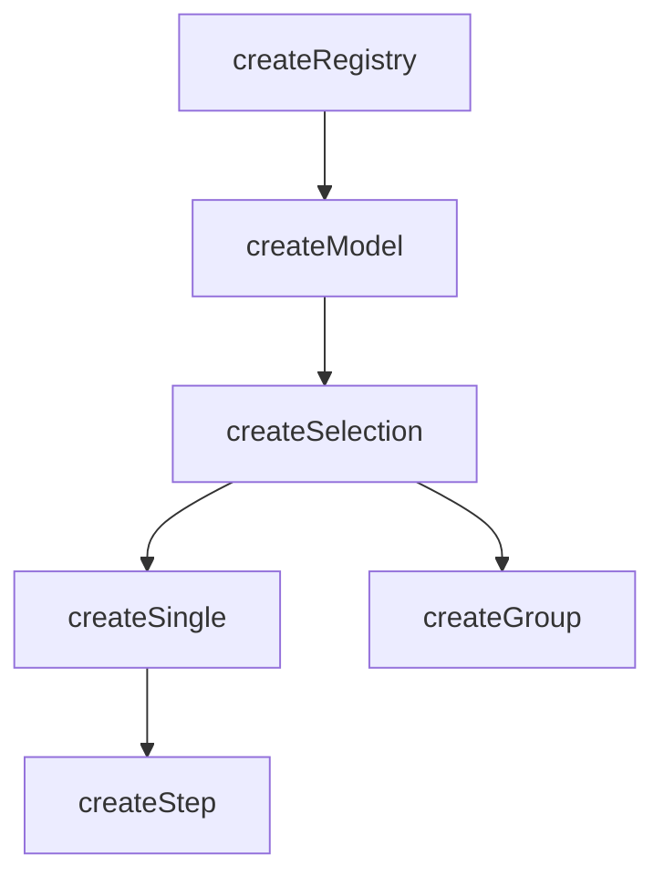

# createSelection

A composable for managing the selection of items in a collection with automatic indexing and lifecycle management.

<DocsPageFeatures :frontmatter />

## Usage

`createSelection` extends `createModel` with selection-specific concepts: `mandatory` enforcement, `multiple` selection mode, auto-enrollment, and ticket self-methods (`select()`, `unselect()`, `toggle()`). It is reactive and provides helper properties for working with selected IDs, values, and items.

```ts
import { createSelection } from '@vuetify/v0'

const selection = createSelection()

selection.register({ id: 'apple', value: 'Apple' })
selection.register({ id: 'banana', value: 'Banana' })

selection.select('apple')
selection.select('banana')

console.log(selection.selectedIds) // Set(2) { 'apple', 'banana' }
console.log(selection.selectedValues.value) // Set(2) { 'Apple', 'Banana' }
console.log(selection.has('apple')) // true
```

## Context / DI

Use `createSelectionContext` to share a selection instance across a component tree:

```ts
import { createSelectionContext } from '@vuetify/v0'

export const [useTabs, provideTabs, tabs] =
  createSelectionContext({ namespace: 'my:tabs', multiple: false })

// In parent component
provideTabs()

// In child component
const selection = useTabs()
selection.select('tab-1')
```

## Architecture

`createSelection` extends `createModel` with auto-enrollment and ticket self-methods:



## Options

| Option | Type | Default | Notes |
| - | - | - | - |
| `mandatory` | `MaybeRefOrGetter<boolean>` | `false` | Prevent deselecting the last selected item |
| `multiple` | `MaybeRefOrGetter<boolean>` | `false` | Allow multiple IDs to be selected simultaneously |
| `enroll` | `MaybeRefOrGetter<boolean>` | `false` | Auto-select tickets on registration[^enroll-createmodel] |

[^enroll-createmodel]: [createModel](/composables/selection/create-model) flips this default to `true` since two-way-bound items are typically expected to start enrolled.

## Reactivity

Selection state is **always reactive**. Collection methods follow the base `createRegistry` pattern.

| Property/Method | Reactive | Notes |
| - | :-: | - |
| `selectedIds` | <AppSuccessIcon /> | `shallowReactive(Set)` — always reactive |
| `selectedItems` | <AppSuccessIcon /> | Computed from `selectedIds` |
| `selectedValues` | <AppSuccessIcon /> | Computed from `selectedItems` |
| ticket `isSelected` | <AppSuccessIcon /> | Computed from `selectedIds` |
| `apply(values, options?)` | — | Sync selection from external values — resolves values to IDs via `browse()`, then adds/removes to match |

> [!TIP] Reactive options
> The `mandatory`, `multiple`, and `enroll` options all accept `MaybeRefOrGetter<boolean>`. Pass a getter to drive selection behavior from a prop or computed:
> ```ts no-filename
> const props = defineProps<{ multiple?: boolean }>()
> const selection = createSelection({ multiple: () => props.multiple ?? false })
> ```

> [!TIP] Selection vs Collection
> Most UI patterns only need **selection reactivity** (which is always on). You rarely need the collection itself to be reactive.

## Examples

::: gn-example
/composables/create-selection/context.ts 2
/composables/create-selection/BookmarkProvider.vue 3
/composables/create-selection/BookmarkConsumer.vue 4
/composables/create-selection/bookmark-manager.vue 1

### Bookmark Manager

A full bookmark manager spread across three components, demonstrating `createSelection` paired with `createContext` to share selection state via provide/inject without prop-drilling.

`context.ts` defines the `BookmarkContext` interface — which extends `SelectionContext` and adds `pinnedIds`, `stats`, and pin/unpin helpers — then exports the `createContext` tuple `[useBookmarks, provideBookmarks]`. `BookmarkProvider.vue` calls `createBookmarks()` (which calls `createSelection({ multiple: true, events: true })`), seeds seven items including one disabled entry, builds the extended context object, and calls `provideBookmarks()` to make it available to all descendants. It is a renderless wrapper: its template is just `<slot />`. `BookmarkConsumer.vue` injects the context with `useBookmarks()` and uses `useProxyRegistry` to iterate tickets reactively — it never holds a reference to the selection instance directly.

The consumer exposes tag-based filtering via a local `filter` ref and derived `filtered` computed, select-all and clear-all bulk actions, an add-bookmark form, a pin/unpin button per row, and a live stats bar. All selection mutations go through `bookmarks.toggle()`, `bookmarks.select()`, and `bookmarks.unselect()` — the same API whether you're in the consumer or anywhere else in the tree.

This pattern is the right shape when a selection instance needs to be created in one component but read or mutated in unrelated components below it. Compare to the single-file [File Picker](#file-picker) below for the simpler, no-DI alternative when everything lives in one component.

| File | Role |
|------|------|
| `bookmark-manager.vue` | Entry point composing provider and consumers |
| `context.ts` | Creates and types the bookmark selection context |
| `BookmarkProvider.vue` | Provides the selection context and renders item list |
| `BookmarkConsumer.vue` | Consumes context to display and toggle selections |

:::

::: gn-example
/composables/create-selection/file-picker

### File Picker

A multi-selectable file list showing how `createSelection` handles disabled items, ticket self-methods, and a reactive status bar — all without any external state.

`createSelection({ multiple: true })` is called once; `onboard()` registers eight items in a single pass, passing each file's `disabled` flag directly into the ticket input so the LICENSE entry is inert from the start. The template iterates the returned `tickets` array — each ticket carries `isSelected`, `toggle()`, and `disabled` — so the row click handler and checkbox styling read directly from `ticket.isSelected.value` and `ticket.disabled` with no index lookups. A `computed` over `selection.selectedValues.value` formats the combined size string in the status bar, updating reactively as the selection changes.

`selection.reset()` is wired to both the toolbar "Clear" button and the inline "Deselect all" link, demonstrating that the same method works from anywhere. The `Button.Root` component wraps each row to give it accessible keyboard focus and `disabled` semantics without native `<button>` element constraints.

Reach for this pattern when the item list is defined up front and you want each item to manage its own selected state via ticket methods. If the list needs to be shared across components, see the [Bookmark Manager](#bookmark-manager) example above for the provider/consumer split.

:::

<DocsApi />
