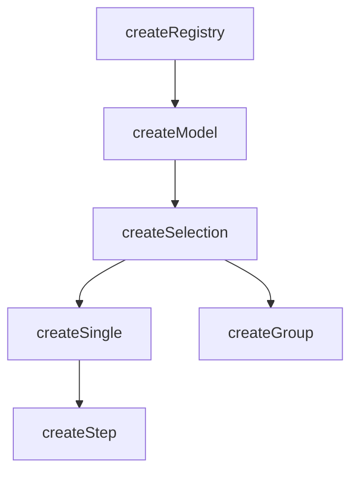
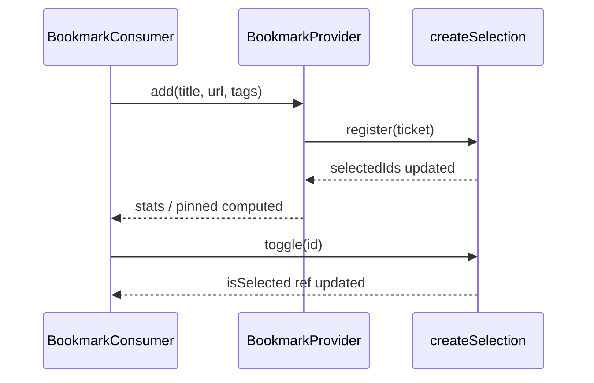

# createSelection

A composable for managing the selection of items in a collection with automatic indexing and lifecycle management.

<DocsPageFeatures :frontmatter />

## Usage

`createSelection` extends `createModel` with selection-specific concepts: `mandatory` enforcement, `multiple` selection mode, auto-enrollment, and ticket self-methods (`select()`, `unselect()`, `toggle()`). It is reactive and provides helper properties for working with selected IDs, values, and items.

```ts collapse no-filename
import { createSelection } from '@vuetify/v0'

const selection = createSelection()

selection.register({ id: 'apple', value: 'Apple' })
selection.register({ id: 'banana', value: 'Banana' })

selection.select('apple')
selection.select('banana')

console.log(selection.selectedIds) // Set(2) { 'apple', 'banana' }
console.log(selection.selectedValues.value) // Set(2) { 'Apple', 'Banana' }
console.log(selection.has('apple')) // true
```

## Architecture

`createSelection` extends `createModel` with auto-enrollment and ticket self-methods:



## Reactivity

Selection state is **always reactive**. Collection methods follow the base `createRegistry` pattern.

| Property/Method | Reactive | Notes |
| - | :-: | - |
| `selectedIds` | <AppSuccessIcon /> | `shallowReactive(Set)` — always reactive |
| `selectedItems` | <AppSuccessIcon /> | Computed from `selectedIds` |
| `selectedValues` | <AppSuccessIcon /> | Computed from `selectedItems` |
| ticket `isSelected` | <AppSuccessIcon /> | Computed from `selectedIds` |

> [!TIP] Selection vs Collection
> Most UI patterns only need **selection reactivity** (which is always on). You rarely need the collection itself to be reactive.

## Examples

::: example
/composables/create-selection/context.ts
/composables/create-selection/BookmarkProvider.vue
/composables/create-selection/BookmarkConsumer.vue
/composables/create-selection/bookmark-manager.vue
@import @mdi/js

### Bookmark Manager

A multi-select bookmark manager demonstrating `createSelection` with `createContext` for provider/consumer separation. The provider owns the registry and exposes domain methods; the consumer handles UI and filtering.



**File breakdown:**

| File | Role |
|------|------|
| `context.ts` | Defines `BookmarkInput` (extending `SelectionTicketInput`) and `BookmarkContext`, then creates the `[useBookmarks, provideBookmarks]` tuple |
| `BookmarkProvider.vue` | Creates the selection with `events: true`, wraps it with `useProxyRegistry` for reactive collection access, manages a separate `pinnedIds` Set, seeds initial bookmarks via `onboard`, and exposes mutation methods through context |
| `BookmarkConsumer.vue` | Calls `useBookmarks()` for data and methods; wraps the context with `useProxyRegistry` for reactive `values`; owns local UI state (filters, inputs) and derives `filtered` and `allTags` as computed |
| `bookmark-manager.vue` | Entry point—composes `BookmarkProvider` around `BookmarkConsumer` |

**Key patterns:**

- `events: true` + `useProxyRegistry` — enables reactive `proxy.values` so computeds like `filtered` and `allTags` update when bookmarks are added
- `pinnedIds` — a separate `shallowReactive(Set)` for pin state, following the same pattern as `selectedIds`
- `onboard()` — bulk-loads the initial bookmark set in a single batch
- `selection.register()` — adds a bookmark with custom fields (`url`, `tags`)
- `selection.toggle()` / `ticket.toggle()` — toggles selection from either the registry or the ticket
- `disabled: true` — prevents selecting deprecated bookmarks
- Tag-based filtering with `Select all` / `Clear` bulk actions
- `Checkbox.Root` + `Checkbox.Indicator` — headless checkbox from `@vuetify/v0`

Add bookmarks, filter by tag, toggle selection with checkboxes, and pin favorites. Hover over a row to see the pin action.

:::

<DocsApi />
