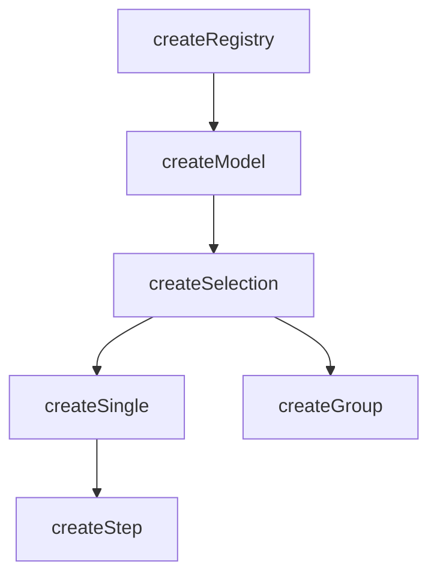

# createSelection

A composable for managing the selection of items in a collection with automatic indexing and lifecycle management.

<DocsPageFeatures :frontmatter />

## Usage

`createSelection` extends `createModel` with selection-specific concepts: `mandatory` enforcement, `multiple` selection mode, auto-enrollment, and ticket self-methods (`select()`, `unselect()`, `toggle()`). It is reactive and provides helper properties for working with selected IDs, values, and items.

```ts
import { createSelection } from '@vuetify/v0'

const selection = createSelection()

selection.register({ id: 'apple', value: 'Apple' })
selection.register({ id: 'banana', value: 'Banana' })

selection.select('apple')
selection.select('banana')

console.log(selection.selectedIds) // Set(2) { 'apple', 'banana' }
console.log(selection.selectedValues.value) // Set(2) { 'Apple', 'Banana' }
console.log(selection.has('apple')) // true
```

## Architecture

`createSelection` extends `createModel` with auto-enrollment and ticket self-methods:



## Reactivity

Selection state is **always reactive**. Collection methods follow the base `createRegistry` pattern.

| Property/Method | Reactive | Notes |
| - | :-: | - |
| `selectedIds` | <AppSuccessIcon /> | `shallowReactive(Set)` — always reactive |
| `selectedItems` | <AppSuccessIcon /> | Computed from `selectedIds` |
| `selectedValues` | <AppSuccessIcon /> | Computed from `selectedItems` |
| ticket `isSelected` | <AppSuccessIcon /> | Computed from `selectedIds` |

> [!TIP] Selection vs Collection
> Most UI patterns only need **selection reactivity** (which is always on). You rarely need the collection itself to be reactive.

<DocsApi />
