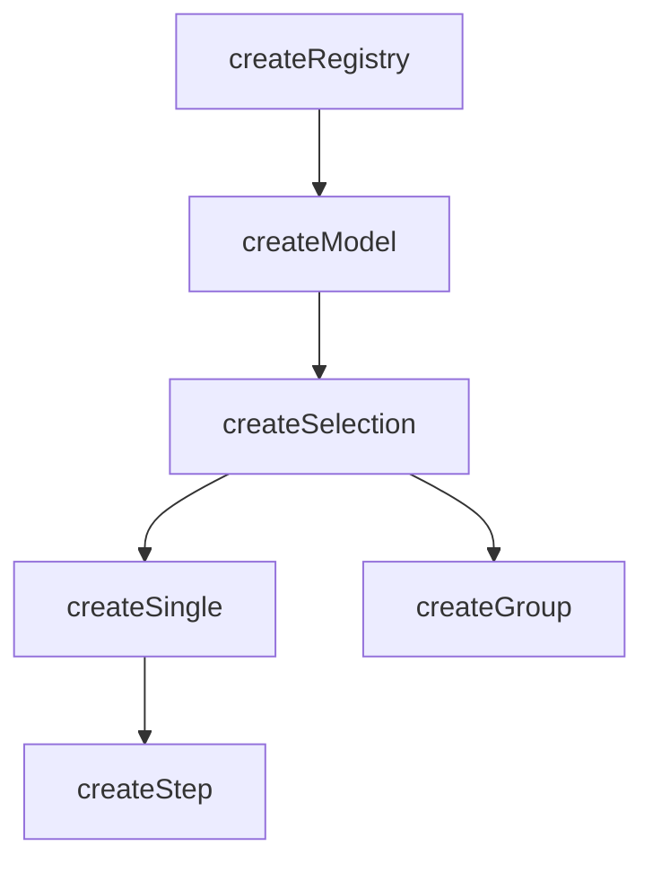

# createSelection

A composable for managing the selection of items in a collection with automatic indexing and lifecycle management.

<DocsPageFeatures :frontmatter />

## Usage

`createSelection` extends `createModel` with selection-specific concepts: `mandatory` enforcement, `multiple` selection mode, auto-enrollment, and ticket self-methods (`select()`, `unselect()`, `toggle()`). It is reactive and provides helper properties for working with selected IDs, values, and items.

```ts
import { createSelection } from '@vuetify/v0'

const selection = createSelection()

selection.register({ id: 'apple', value: 'Apple' })
selection.register({ id: 'banana', value: 'Banana' })

selection.select('apple')
selection.select('banana')

console.log(selection.selectedIds) // Set(2) { 'apple', 'banana' }
console.log(selection.selectedValues.value) // Set(2) { 'Apple', 'Banana' }
console.log(selection.has('apple')) // true
```

## Context / DI

Use `createSelectionContext` to share a selection instance across a component tree:

```ts
import { createSelectionContext } from '@vuetify/v0'

export const [useTabs, provideTabs, tabs] =
  createSelectionContext({ namespace: 'my:tabs', multiple: false })

// In parent component
provideTabs()

// In child component
const selection = useTabs()
selection.select('tab-1')
```

## Architecture

`createSelection` extends `createModel` with auto-enrollment and ticket self-methods:



## Options

| Option | Type | Default | Notes |
| - | - | - | - |
| `mandatory` | `MaybeRefOrGetter<boolean>` | `false` | Prevent deselecting the last selected item |
| `multiple` | `MaybeRefOrGetter<boolean>` | `false` | Allow multiple IDs to be selected simultaneously |
| `enroll` | `MaybeRefOrGetter<boolean>` | `false` | Auto-select tickets on registration[^enroll-createmodel] |

[^enroll-createmodel]: [createModel](/composables/selection/create-model) flips this default to `true` since two-way-bound items are typically expected to start enrolled.

## Reactivity

Selection state is **always reactive**. Collection methods follow the base `createRegistry` pattern.

| Property/Method | Reactive | Notes |
| - | :-: | - |
| `selectedIds` | <AppSuccessIcon /> | `shallowReactive(Set)` — always reactive |
| `selectedItems` | <AppSuccessIcon /> | Computed from `selectedIds` |
| `selectedValues` | <AppSuccessIcon /> | Computed from `selectedItems` |
| ticket `isSelected` | <AppSuccessIcon /> | Computed from `selectedIds` |
| `apply(values, options?)` | — | Sync selection from external values — resolves values to IDs via `browse()`, then adds/removes to match |

> [!TIP] Reactive options
> The `mandatory`, `multiple`, and `enroll` options all accept `MaybeRefOrGetter<boolean>`. Pass a getter to drive selection behavior from a prop or computed:
> ```ts no-filename
> const props = defineProps<{ multiple?: boolean }>()
> const selection = createSelection({ multiple: () => props.multiple ?? false })
> ```

> [!TIP] Selection vs Collection
> Most UI patterns only need **selection reactivity** (which is always on). You rarely need the collection itself to be reactive.

## Examples

::: example
/composables/create-selection/context.ts 2
/composables/create-selection/BookmarkProvider.vue 3
/composables/create-selection/BookmarkConsumer.vue 4
/composables/create-selection/bookmark-manager.vue 1

### Bookmark Manager

Multi-component bookmark manager using provide/inject. The provider creates and shares the selection context; consumers read and toggle selections independently.

| File | Role |
|------|------|
| `bookmark-manager.vue` | Entry point composing provider and consumers |
| `context.ts` | Creates and types the bookmark selection context |
| `BookmarkProvider.vue` | Provides the selection context and renders item list |
| `BookmarkConsumer.vue` | Consumes context to display and toggle selections |

:::

::: example
/composables/create-selection/file-picker

### File Picker

Multi-selectable file list with disabled states, demonstrating `mandatory`, `select()`, `unselect()`, and the `isSelected` ticket property.

:::

<DocsApi />
