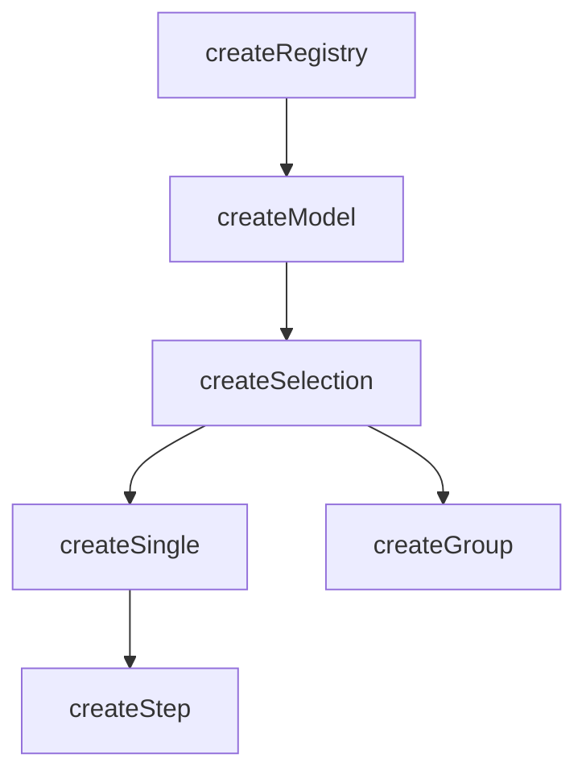

# createSelection

A composable for managing the selection of items in a collection with automatic indexing and lifecycle management.

<DocsPageFeatures :frontmatter />

## Usage

`createSelection` extends `createModel` with selection-specific concepts: `mandatory` enforcement, `multiple` selection mode, auto-enrollment, and ticket self-methods (`select()`, `unselect()`, `toggle()`). It is reactive and provides helper properties for working with selected IDs, values, and items.

```ts collapse
import { createSelection } from '@vuetify/v0'

const selection = createSelection()

selection.register({ id: 'apple', value: 'Apple' })
selection.register({ id: 'banana', value: 'Banana' })

selection.select('apple')
selection.select('banana')

console.log(selection.selectedIds) // Set(2) { 'apple', 'banana' }
console.log(selection.selectedValues.value) // Set(2) { 'Apple', 'Banana' }
console.log(selection.has('apple')) // true
```

## Context / DI

Use `createSelectionContext` to share a selection instance across a component tree:

```ts
import { createSelectionContext } from '@vuetify/v0'

export const [useTabs, provideTabs, tabs] =
  createSelectionContext({ namespace: 'my:tabs', multiple: false })

// In parent component
provideTabs()

// In child component
const selection = useTabs()
selection.select('tab-1')
```

## Architecture

`createSelection` extends `createModel` with auto-enrollment and ticket self-methods:



## Options

| Option | Type | Default | Notes |
| - | - | - | - |
| `mandatory` | `MaybeRefOrGetter<boolean>` | `false` | Prevent deselecting the last selected item |
| `multiple` | `MaybeRefOrGetter<boolean>` | `false` | Allow multiple IDs to be selected simultaneously |
| `enroll` | `MaybeRefOrGetter<boolean>` | `false` | Auto-select tickets on registration[^enroll-createmodel] |

[^enroll-createmodel]: [createModel](/composables/selection/create-model) flips this default to `true` since two-way-bound items are typically expected to start enrolled.

## Reactivity

Selection state is **always reactive**. Collection methods follow the base `createRegistry` pattern.

| Property/Method | Reactive | Notes |
| - | :-: | - |
| `selectedIds` | <AppSuccessIcon /> | `shallowReactive(Set)` — always reactive |
| `selectedItems` | <AppSuccessIcon /> | Computed from `selectedIds` |
| `selectedValues` | <AppSuccessIcon /> | Computed from `selectedItems` |
| ticket `isSelected` | <AppSuccessIcon /> | Computed from `selectedIds` |
| `apply(values, options?)` | — | Sync selection from external values — resolves values to IDs via `browse()`, then adds/removes to match |

> [!TIP] Reactive options
> The `mandatory`, `multiple`, and `enroll` options all accept `MaybeRefOrGetter<boolean>`. Pass a getter to drive selection behavior from a prop or computed:
> ```ts no-filename
> const props = defineProps<{ multiple?: boolean }>()
> const selection = createSelection({ multiple: () => props.multiple ?? false })
> ```

> [!TIP] Selection vs Collection
> Most UI patterns only need **selection reactivity** (which is always on). You rarely need the collection itself to be reactive.

## Examples

::: gn-example
/composables/create-selection/context.ts 2
/composables/create-selection/BookmarkProvider.vue 3
/composables/create-selection/BookmarkConsumer.vue 4
/composables/create-selection/bookmark-manager.vue 1

### Bookmark Manager

A full bookmark manager spread across three components, demonstrating `createSelection` paired with `createContext` to share selection state via provide/inject without prop-drilling.

`context.ts` defines the `BookmarkContext` interface — which extends `SelectionContext` and adds `pinnedIds`, `stats`, and pin/unpin helpers — then exports the `createContext` tuple `[useBookmarks, provideBookmarks]`. `BookmarkProvider.vue` calls `createBookmarks()` (which calls `createSelection({ multiple: true, events: true })`), seeds seven items including one disabled entry, builds the extended context object, and calls `provideBookmarks()` to make it available to all descendants. It is a renderless wrapper: its template is just `<slot />`. `BookmarkConsumer.vue` injects the context with `useBookmarks()` and uses `useProxyRegistry` to iterate tickets reactively — it never holds a reference to the selection instance directly.

The consumer exposes tag-based filtering via a local `filter` ref and derived `filtered` computed, select-all and clear-all bulk actions, an add-bookmark form, a pin/unpin button per row, and a live stats bar. All selection mutations go through `bookmarks.toggle()`, `bookmarks.select()`, and `bookmarks.unselect()` — the same API whether you're in the consumer or anywhere else in the tree.

This pattern is the right shape when a selection instance needs to be created in one component but read or mutated in unrelated components below it. Compare to the [Playlist Builder](#playlist-builder) below for the no-DI alternative — the same selection API driven from a plain composable, with no provide/inject.

| File | Role |
|------|------|
| `bookmark-manager.vue` | Entry point composing provider and consumers |
| `context.ts` | Creates and types the bookmark selection context |
| `BookmarkProvider.vue` | Provides the selection context and renders item list |
| `BookmarkConsumer.vue` | Consumes context to display and toggle selections |

:::

::: gn-example
/composables/create-selection/useTracklist.ts 1
/composables/create-selection/TrackList.vue 2
/composables/create-selection/track-list.vue 3

### Playlist Builder

A multi-select track list with a select-all lever and a bulk "add to queue" action, built on `createSelection` directly — no `createContext`, no provide/inject. State lives in a plain composable and is passed down as a single prop, the simplest way to share a selection instance between two components.

`useTracklist.ts` calls `createSelection({ multiple: true })` once and `onboard()`s seven tracks in a single pass, mapping each track's `unavailable` flag onto the ticket's `disabled` input so the inert row can never be selected. It exposes the returned `tickets` array plus a few derived signals: `count` (a `toRef` over `selectedIds.size`), `allSelected` (a `toRef` that folds every selectable ticket's `isSelected`), and the bulk operations `toggleAll`, `enqueue`, and `clearQueue`. `enqueue()` reads `selection.selectedValues.value` — the reactive Set of selected track objects — then calls `selection.reset()` to clear the selection in one shot.

`TrackList.vue` is purely presentational: it receives the composable's return value as a `tracklist` prop and renders the toolbar and rows, reading `ticket.isSelected.value`, calling `ticket.toggle()` per row, and driving the header checkbox from `allSelected` / `toggleAll`. Reach for this shape when selection state needs to live above the markup but a full context provider would be overkill; when the instance must be reachable from unrelated parts of the tree instead, see the [Bookmark Manager](#bookmark-manager) above for the provide/inject split. Related: [createSingle](/composables/selection/create-single) for single-select and [createGroup](/composables/selection/create-group) for tri-state select-all.

| File | Role |
|------|------|
| `useTracklist.ts` | Owns the track data, selection instance, derived signals, and bulk actions |
| `TrackList.vue` | Presentational list and toolbar driven by the composable's return value |
| `track-list.vue` | Entry point wiring the composable to the list and rendering the queue summary |

:::

## FAQ

::: faq

??? When should I reach for createSingle or createGroup instead of createSelection?

createSelection is the multi-select base. Use [createSingle](/composables/selection/create-single) when only one item may be active at a time, or [createGroup](/composables/selection/create-group) when you need tri-state select-all (indeterminate) plus batch operations. Both extend createSelection.

??? Why aren't my items selected after I register them?

createSelection defaults `enroll` to `false`, so tickets register inert — call `select()` to activate one. [createModel](/composables/selection/create-model) flips this default to `true` because two-way-bound values typically start enrolled.

??? How do I stop the user from clearing the last selection?

Pass `mandatory: true`. It prevents deselecting the final selected item, so the collection always keeps at least one active entry.

??? Why does selecting a second item clear the first?

`multiple` defaults to `false`, so `select()` replaces the current selection. Pass `multiple: true` to accumulate IDs — that's why both examples on this page construct `createSelection({ multiple: true })`.

??? How do I set the selection from an array of values?

Call `apply(values)`. It resolves each value to its ticket ID via `browse()`, then adds and removes IDs so the selection matches the array.

:::

<DocsApi />
