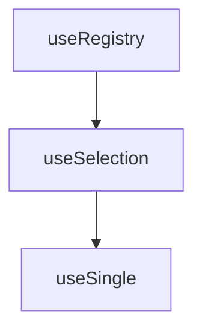

# createSingle

A composable that extends `useSelection` to enforce single-item selection. Automatically clears the previous selection before selecting a new item, ensuring only one item is selected at any time.

<DocsPageFeatures :frontmatter />

## Usage

The `useSingle` composable is used when you have a **collection of items** but want to allow **only one** to be selected at any time.

```ts
import { createSingle } from '@vuetify/v0'

const single = createSingle()

// Register items first
single.register({ id: 'apple', value: 'Apple' })
single.register({ id: 'banana', value: 'Banana' })

// Select by ID
single.select('apple')
console.log(single.selectedId) // 'apple'
console.log(single.selectedValue) // 'Apple'

// Selecting a new item automatically clears the previous selection
single.select('banana')
console.log(single.selectedId) // 'banana' (replaces apple)
```

## Architecture

The `useSingle` composable is comprised of the following hierarchy:



<DocsApi />
