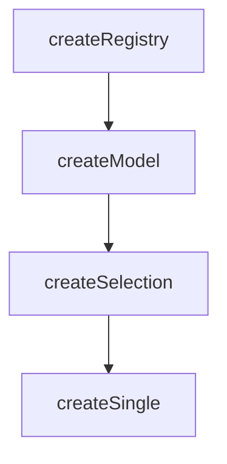

# createSingle

Extends `createSelection` to enforce single-item selection, automatically clearing the previous selection.

<DocsPageFeatures :frontmatter />

## Usage

The `createSingle` composable is used when you have a **collection of items** but want to allow **only one** to be selected at any time.

```ts collapse no-filename
import { createSingle } from '@vuetify/v0'

const single = createSingle()

// Register items first
single.register({ id: 'apple', value: 'Apple' })
single.register({ id: 'banana', value: 'Banana' })

// Select by ID
single.select('apple')
console.log(single.selectedId.value) // 'apple'
console.log(single.selectedValue.value) // 'Apple'

// Selecting a new item automatically clears the previous selection
single.select('banana')
console.log(single.selectedId.value) // 'banana' (replaces apple)
```

## Context / DI

Use `createSingleContext` to share a single-selection instance across a component tree:

```ts
import { createSingleContext } from '@vuetify/v0'

export const [useTabSelection, provideTabSelection, tabSelection] =
  createSingleContext({ namespace: 'my:tabs', mandatory: true })

// In parent component
provideTabSelection()

// In child component
const selection = useTabSelection()
selection.select('tab-home')
```

## Architecture

The `createSingle` composable is comprised of the following hierarchy:


```mermaid "Single Selection Hierarchy"
flowchart TD
  createRegistry --> createModel
  createModel --> createSelection
  createSelection --> createSingle
```

## Reactivity

Single-selection state is **always reactive**. All computed properties update automatically when the selection changes.

| Property/Method | Reactive | Notes |
| - | :-: | - |
| `selectedId` | <AppSuccessIcon /> | Computed from `selectedIds` |
| `selectedItem` | <AppSuccessIcon /> | Computed from `selectedId` |
| `selectedValue` | <AppSuccessIcon /> | Computed from `selectedItem` |
| `selectedIndex` | <AppSuccessIcon /> | Computed from `selectedItem` |
| ticket `isSelected` | <AppSuccessIcon /> | Computed from `selectedIds` |

> [!TIP] Perfect for UI controls
> `selectedId`, `selectedValue`, and `selectedIndex` work directly in templates without any extra setup.

## Examples

::: gn-example
/composables/create-single/theme-picker

### Theme Picker

A single-selection color theme switcher built entirely from `createSingle`. Each swatch is a registered item; clicking one selects it exclusively and automatically deselects the previous choice, so the preview panel always reflects exactly one active palette.

The example leans on three parts of the API working together. `onboard()` bulk-registers the five themes up front and returns one ticket per item, so the template iterates `tickets` directly — calling `ticket.select()` and reading `ticket.isSelected` without routing back through the parent instance. `mandatory: true` keeps the selection sticky: once a theme is active, clicking it again is a no-op, guaranteeing the preview never renders an empty state. `seek('first')?.select()` preselects the first item on mount so the UI starts valid rather than blank.

Reach for this whenever a fixed set of mutually exclusive options needs the selected *value* — not just its id — reactively available for rendering: theme pickers, density toggles, segmented controls. The trade-off of `mandatory` is that there is no "nothing selected" state; if you need one, omit it and guard the consumer on `selectedValue` being `undefined`. For ordered next/prev navigation over the same selection, see [createStep](/composables/selection/create-step); for the multi-select parent, see [createSelection](/composables/selection/create-selection).

:::

<DocsApi />
