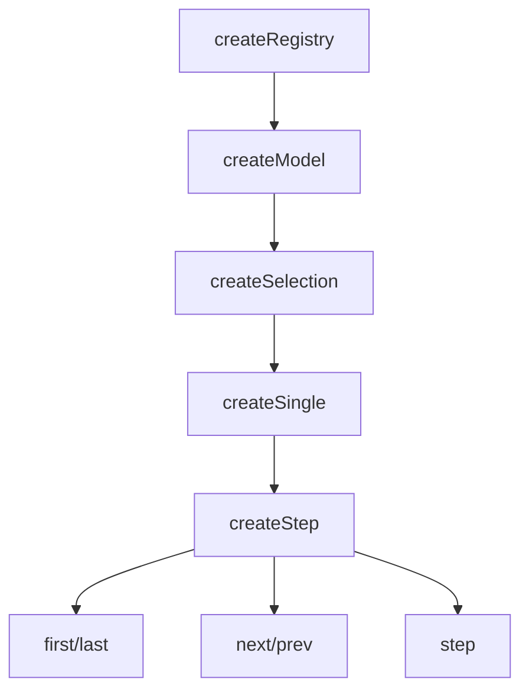

# createStep

Extends `createSingle` with bounded or circular navigation. Built for wizards, multi-step forms, and onboarding flows.

<DocsPageFeatures :frontmatter />

## Usage

The `createStep` composable manages a list of steps and allows navigation between them with configurable circular (wrapping) or bounded (stopping at edges) behavior.
You register each step (with an `id` and value) in the order they should be navigated, then use the navigation methods to move

```ts collapse no-filename
import { createStep } from '@vuetify/v0'

// Bounded navigation (default) - for wizards, forms
const wizard = createStep({ circular: false })

wizard.onboard([
  { id: 'step1', value: 'Account Info' },
  { id: 'step2', value: 'Payment' },
  { id: 'step3', value: 'Confirmation' },
])

wizard.first()    // Go to step1
wizard.next()     // Go to step2
wizard.next()     // Go to step3
wizard.next()     // Stays at step3 (bounded)

// Circular navigation - for carousels, theme switchers
const carousel = createStep({ circular: true })

carousel.onboard([
  { id: 'slide1', value: 'First' },
  { id: 'slide2', value: 'Second' },
  { id: 'slide3', value: 'Third' },
])

carousel.last()   // Go to slide3
carousel.next()   // Wraps to slide1
carousel.prev()   // Wraps to slide3
```

## Context / DI

Use `createStepContext` to share a step navigation instance across a component tree:

```ts
import { createStepContext } from '@vuetify/v0'

export const [useWizard, provideWizard, wizard] =
  createStepContext({ namespace: 'my:wizard', circular: false })

// In parent component
provideWizard()

// In child component
const step = useWizard()
step.next()
```

## Architecture

`createStep` extends `createSingle` with directional navigation:



## Reactivity

Step navigation state is **always reactive**. Use `selectedIndex` to derive disabled states for navigation buttons.

| Property/Method | Reactive | Notes |
| - | :-: | - |
| `selectedId` | <AppSuccessIcon /> | Computed — current step ID |
| `selectedIndex` | <AppSuccessIcon /> | Computed — current step position |
| `selectedItem` | <AppSuccessIcon /> | Computed — current step ticket |
| `selectedValue` | <AppSuccessIcon /> | Computed — current step value |
| `step(count)` | <AppErrorIcon /> | Move by `count` positions — positive forward, negative backward[^step-wrap-clamp] |

[^step-wrap-clamp]: `step(-2)` moves back two positions; `step(3)` skips ahead three. In circular mode it wraps at both ends; in bounded mode it clamps at the first and last steps. Disabled steps are skipped automatically.

> [!TIP] Navigation button state
> Derive boundary checks from `selectedIndex` and registry size:
> ```ts
> const atFirst = toRef(() => selection.selectedIndex.value === 0)
> const atLast  = toRef(() => selection.selectedIndex.value === selection.size - 1)
> ```
> In circular mode, buttons are never disabled.

## Examples

::: gn-example
/composables/create-step/useCheckout.ts 1
/composables/create-step/CheckoutWizard.vue 2
/composables/create-step/checkout-wizard.vue 3

### Multi-Step Checkout Wizard

A five-step checkout flow that puts the whole navigation contract in one composable and keeps the markup purely presentational. `useCheckout` registers the steps with `onboard`, calls `first()` to land on Cart, and then derives everything the UI needs from `selectedIndex` and `selectedValue` — `current` for the active panel, `isFirst` and `isLast` for the button guards, and a `progress` percentage for the connecting line. Because each derivation is a `toRef`, the view updates with no extra state to keep in sync.

The Gift wrap step is registered with `disabled: true`, so `next()` and `prev()` step right over it with no manual guard in the template; `step(count)` does the boundary math and skips disabled tickets automatically. The composable also projects the tickets into a `rows` view-model that tags each step as done, active, upcoming, or off, which is the only thing the wizard component reads to style its circles. Clicking a circle calls `select(id)` for non-linear jumps, and `select` is a no-op on a disabled ticket, so the skipped step stays unreachable from every entry point.

This is the composable-only shape: `useCheckout` owns the state and exposes a flat object of refs and methods, `CheckoutWizard` renders the v0 `Button` surface against that object, and the entry wires them together. Switch the instance to `createStep({ circular: true })` and `next()`/`prev()` wrap at the ends instead of clamping — the carousel behavior. The Prev/Next buttons won't wrap on their own, though: `isFirst`/`isLast` are derived from the index alone (`0` and `size - 1`), so their `:disabled` guards stay true at the boundaries regardless of `circular`. To let the buttons wrap too, drop the `isFirst`/`isLast` guards in circular mode — gate them on a non-circular flag instead. For single selection without navigation methods, reach for [createSingle](/composables/selection/create-single); for the provided component version, see [Step](/components/providers/step).

| File | Role |
|------|------|
| `useCheckout.ts` | Owns the `createStep` instance, registers steps, and derives index, current, progress, and the row view-model |
| `CheckoutWizard.vue` | Renders the progress track, step circles, active panel, and navigation buttons from the composable |
| `checkout-wizard.vue` | Entry point that instantiates the composable and shows the live step and progress readout |
:::

## FAQ

::: faq

??? What's the difference between circular and bounded navigation?

With `circular: false` (default) `next()`/`prev()` clamp at the first and last steps; with `circular: true` they wrap around — `next()` from the last step returns to the first. Use bounded for wizards, circular for carousels.

??? Why do my Prev/Next buttons stay disabled at the ends even with `circular: true`?

`circular` only affects `next()`/`prev()`. Boundary guards like `isFirst`/`isLast` are derived from the index (`0` and `size - 1`), so they're still true at the edges. Drop those guards in circular mode if you want the buttons to wrap too.

??? How are disabled steps handled during navigation?

`next()`, `prev()`, and `step(count)` skip tickets marked `disabled: true` automatically — no manual guard needed — and `select()` on a disabled ticket is a no-op, so it stays unreachable from every entry point.

??? When should I use createStep instead of the Step component?

Reach for createStep when you're building custom wizard or carousel UI and only need the navigation logic. The [Step](/components/providers/step) component wraps it as a ready-made compound surface. For exclusive selection without `next()`/`prev()`, drop down to [createSingle](/composables/selection/create-single).

:::

<DocsApi />
