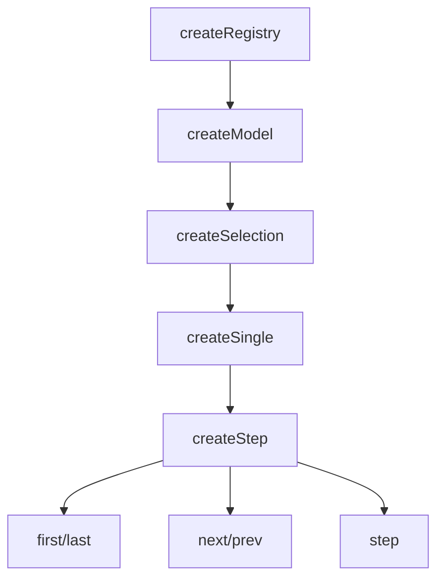

# createStep

Extends `createSingle` with bounded or circular navigation. Built for wizards, multi-step forms, and onboarding flows.

<DocsPageFeatures :frontmatter />

## Usage

The `createStep` composable manages a list of steps and allows navigation between them with configurable circular (wrapping) or bounded (stopping at edges) behavior.
You register each step (with an `id` and value) in the order they should be navigated, then use the navigation methods to move

```ts collapse no-filename
import { createStep } from '@vuetify/v0'

// Bounded navigation (default) - for wizards, forms
const wizard = createStep({ circular: false })

wizard.onboard([
  { id: 'step1', value: 'Account Info' },
  { id: 'step2', value: 'Payment' },
  { id: 'step3', value: 'Confirmation' },
])

wizard.first()    // Go to step1
wizard.next()     // Go to step2
wizard.next()     // Go to step3
wizard.next()     // Stays at step3 (bounded)

// Circular navigation - for carousels, theme switchers
const carousel = createStep({ circular: true })

carousel.onboard([
  { id: 'slide1', value: 'First' },
  { id: 'slide2', value: 'Second' },
  { id: 'slide3', value: 'Third' },
])

carousel.last()   // Go to slide3
carousel.next()   // Wraps to slide1
carousel.prev()   // Wraps to slide3
```

## Context / DI

Use `createStepContext` to share a step navigation instance across a component tree:

```ts
import { createStepContext } from '@vuetify/v0'

export const [useWizard, provideWizard, wizard] =
  createStepContext({ namespace: 'my:wizard', circular: false })

// In parent component
provideWizard()

// In child component
const step = useWizard()
step.next()
```

## Architecture

`createStep` extends `createSingle` with directional navigation:



## Reactivity

Step navigation state is **always reactive**. Use `selectedIndex` to derive disabled states for navigation buttons.

| Property/Method | Reactive | Notes |
| - | :-: | - |
| `selectedId` | <AppSuccessIcon /> | Computed — current step ID |
| `selectedIndex` | <AppSuccessIcon /> | Computed — current step position |
| `selectedItem` | <AppSuccessIcon /> | Computed — current step ticket |
| `selectedValue` | <AppSuccessIcon /> | Computed — current step value |
| `step(count)` | <AppErrorIcon /> | Move by `count` positions — positive forward, negative backward[^step-wrap-clamp] |

[^step-wrap-clamp]: `step(-2)` moves back two positions; `step(3)` skips ahead three. In circular mode it wraps at both ends; in bounded mode it clamps at the first and last steps. Disabled steps are skipped automatically.

> [!TIP] Navigation button state
> Derive boundary checks from `selectedIndex` and registry size:
> ```ts
> const atFirst = toRef(() => selection.selectedIndex.value === 0)
> const atLast  = toRef(() => selection.selectedIndex.value === selection.size - 1)
> ```
> In circular mode, buttons are never disabled.

## Examples

::: gn-example
/composables/create-step/stepper

### Multi-Step Stepper

A five-step checkout flow built on `createStep`, showing bounded navigation, a disabled step that is automatically skipped, and a CSS progress line derived entirely from `selectedIndex`.

`stepper.onboard()` registers five steps mapped from the data array; the Payment step carries `disabled: true` so `next()` and `prev()` skip it automatically without any manual guard in the template. `stepper.first()` is called after registration to land on Cart immediately. Two `computed` refs, `isFirst` and `isLast`, are derived from `currentIndex` and `stepper.size`; they drive the `disabled` attribute on the Prev/First and Next/Last buttons respectively, so edge states are handled declaratively.

The animated progress line is a single `<div>` whose `width` style is `(currentIndex / (steps.length - 1)) * 100%` — no extra reactive variable required because `selectedIndex` is already a computed ref. Each step circle reads the same `currentIndex` to pick among three CSS classes: completed (filled, checkmark icon), active (filled, ring, scaled up), and upcoming (outlined, hover effect). The disabled step gets a dashed border and a strikethrough label.

Clicking a step circle calls `stepper.select(step.id)` directly, providing non-linear navigation alongside the linear Prev/Next buttons. In circular mode the same API wraps at the ends instead of clamping — useful for carousels and theme pickers. For single-selection without navigation methods, see [createSingle](/composables/selection/create-single).

:::

<DocsApi />
