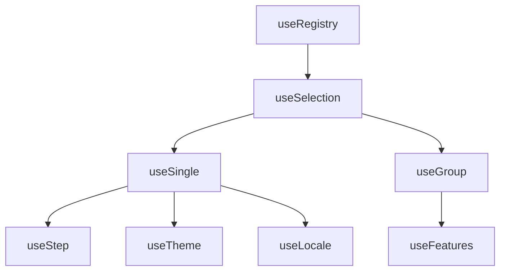

# useSelection

A composable for managing the selection of items in a collection with automatic indexing and lifecycle management.

<DocsPageFeatures :frontmatter />

## Usage

useSelection extends the functionality of useRegistry to manage selection states for a collection of items. It is reactive, supports both single and multi-select patterns, and provides helper properties for working with selected IDs, values, and items.

```ts
import { useSelection } from '@vuetify/v0'

const selection = useSelection()

selection.register({ id: 'apple', value: 'Apple' })
selection.register({ id: 'banana', value: 'Banana' })

selection.select('apple')
selection.select('banana')

console.log(selection.selectedIds) // Set(2) { 'apple', 'banana' }
console.log(selection.selectedValues) // ComputedRef<Set> { value: Set(2) { 'Apple', 'Banana' } }
console.log(selection.has('apple')) // true
```

## Architecture

`useSelection` extends `useRegistry` and is the base for all selection patterns:




<DocsApi />
