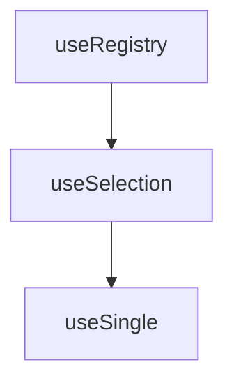

# useSingle

A composable that extends `useSelection` to enforce single-item selection. Automatically clears the previous selection before selecting a new item, ensuring only one item is selected at any time.

<DocsPageFeatures :frontmatter />

## Usage

The `useSingle` composable is used when you have a **collection of items** but want to allow **only one** to be selected at any time.

```ts
import { useSingle } from '@vuetify/v0'

const single = useSingle()

// Register items first
single.register({ id: 'apple', value: 'Apple' })
single.register({ id: 'banana', value: 'Banana' })

// Select by ID
single.select('apple')
console.log(single.selectedId) // 'apple'
console.log(single.selectedValue) // 'Apple'

// Selecting a new item automatically clears the previous selection
single.select('banana')
console.log(single.selectedId) // 'banana' (replaces apple)
```

## Architecture

The `useSingle` composable is comprised of the following hierarchy:



## API


| Composable | Description |
|---|---|
| [useSelection](/composables/selection/use-selection) | Base selection system that useSingle extends |
| [useGroup](/composables/selection/use-group) | Multi-selection variant |
| [useStep](/composables/selection/use-step) | Navigation through items (extends useSingle) |
| [useRegistry](/composables/registration/use-registry) | Base registry system |
- **Type**

  ```ts
  export interface SingleTicket extends SelectionTicket {}

  export interface SingleContext<Z extends SingleTicket> extends SelectionContext<Z> {
    selectedId: ComputedRef<ID | undefined>
    selectedIndex: ComputedRef<number>
    selectedItem: ComputedRef<Z | undefined>
    selectedValue: ComputedRef<unknown>
  }

  export interface SingleOptions extends SelectionOptions {}
  ```
- **Details**

  - `selectedId`: The ID of the currently selected item (or undefined if none).
  - `selectedIndex`: The index position of the selected item in the collection (-1 if none).
  - `selectedItem`: The full object of the selected item (or undefined if none).
  - `selectedValue`: The value property of the selected item (or undefined if none).

### `selectedId`

- **Type**
  ```ts
  ID | undefined
  ```

- **Details**
  Returns the ID of the currently selected item. undefined if no item is selected.

- **Example**
  ```ts
  const single = useSingle()
  single.register({ id: 'apple' })
  single.select('apple')
  console.log(single.selectedId) // 'apple'
  ```

### `selectedIndex`

- **Type**
  ```ts
  number
  ```

- **Details**
  The zero-based index of the selected item in the collection. Returns -1 if no item is selected.

- **Example**
  ```ts
  const single = useSingle()
  single.register({ id: 'apple', value: 'Apple' })
  single.register({ id: 'banana', value: 'Banana' })
  single.select('apple')
  console.log(single.selectedIndex) // 0 (if apple is first in collection)

### `selectedItem`

- **Type**
  ```ts
  Z | undefined
  ```

- **Details**
  The full object for the selected item, including all properties from the ticket.

- **Example**
  ```ts
  const single = useSingle()
  single.register({ id: 'apple', value: 'Apple', category: 'fruit' })
  single.register({ id: 'banana', value: 'Banana', category: 'fruit' })
  single.select('apple')
  console.log(single.selectedItem)
  // {
  //   id: 'apple',
  //   value: 'Apple',
  //   category: 'fruit',
  //   selected: true,
  //   ...
  // }
  ```

### `selectedValue`

- **Type**
  ```ts
  unknown
  ```

- **Details**
  Returns only the value property of the selected item.

- **Example**
  ```ts
  const single = useSingle()
  single.register({ id: 'apple', value: 'Apple' })
  single.register({ id: 'banana', value: 'Banana' })
  single.select('banana')
  console.log(single.selectedValue) // 'Banana'
  ```
