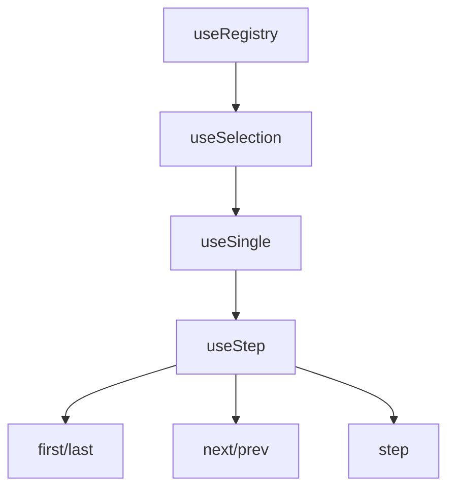

# useStep

A composable for managing navigation through multi-step processes like forms, wizards, or onboarding flows, with support for step tracking, completion, and navigation controls.

<DocsPageFeatures :frontmatter />

## Usage

The `useStep` composable manages a list of steps and allows navigation between them with configurable circular (wrapping) or bounded (stopping at edges) behavior.
You register each step (with an `id` and value) in the order they should be navigated, then use the navigation methods to move

```ts
import { createStep } from '@vuetify/v0'

// Bounded navigation (default) - for wizards, forms
const wizard = createStep({ circular: false })

wizard.onboard([
  { id: 'step1', value: 'Account Info' },
  { id: 'step2', value: 'Payment' },
  { id: 'step3', value: 'Confirmation' },
])

wizard.first()    // Go to step1
wizard.next()     // Go to step2
wizard.next()     // Go to step3
wizard.next()     // Stays at step3 (bounded)

// Circular navigation - for carousels, theme switchers
const carousel = createStep({ circular: true })

carousel.onboard([
  { id: 'slide1', value: 'First' },
  { id: 'slide2', value: 'Second' },
  { id: 'slide3', value: 'Third' },
])

carousel.last()   // Go to slide3
carousel.next()   // Wraps to slide1
carousel.prev()   // Wraps to slide3
```

## Architecture

`useStep` extends `useSingle` with directional navigation:



<DocsApi />
