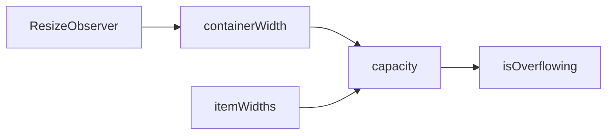

# createOverflow

A composable for computing how many items fit in a container based on available width, enabling responsive truncation for pagination, breadcrumbs, and similar components.

<DocsPageFeatures :frontmatter />

## Usage

The `createOverflow` composable provides reactive container width tracking and capacity calculation. It supports two modes: variable-width (for items with different widths like breadcrumbs) and uniform-width (for same-width items like pagination buttons).

```vue collapse
<script setup lang="ts">
  import { useTemplateRef } from 'vue'
  import { createOverflow } from '@vuetify/v0'

  const containerRef = useTemplateRef('container')

  // Pass container as a ref or getter for proper reactive tracking
  const overflow = createOverflow({
    container: containerRef,
    gap: 8,
    reserved: 40,
  })

  // Check capacity
  console.log(overflow.capacity.value) // Number of items that fit
  console.log(overflow.isOverflowing.value) // true if items exceed container
</script>

<template>
  <div ref="container">
    <!-- Items go here -->
  </div>
</template>
```

## Context / DI

Use `createOverflowContext` to share an overflow instance across a component tree:

```ts
import { createOverflowContext } from '@vuetify/v0'

export const [useNavOverflow, provideNavOverflow, navOverflow] =
  createOverflowContext({ namespace: 'my:nav-overflow' })

// In parent component
provideNavOverflow()

// In child component
const overflow = useNavOverflow()
overflow.capacity.value  // number of items that fit
```

Use `useOverflow` to inject the default (unnamespaced) overflow context provided by a parent:

```ts
import { useOverflow } from '@vuetify/v0'

const overflow = useOverflow()  // Injects the nearest provided overflow context
```

## Architecture

`createOverflow` uses ResizeObserver to compute container capacity:



## Reactivity

| Property/Method | Reactive | Notes |
| - | :-: | - |
| `container` | <AppSuccessIcon /> | ShallowRef, assign element for tracking |
| `width` | <AppSuccessIcon /> | ShallowRef, readonly (from ResizeObserver) |
| `capacity` | <AppSuccessIcon /> | Computed from width and measurements |
| `total` | <AppSuccessIcon /> | Computed, sum of all item widths |
| `isOverflowing` | <AppSuccessIcon /> | Computed from total vs available width |
| `gap` | <AppSuccessIcon /> | Accepts MaybeRefOrGetter |
| `reserved` | <AppSuccessIcon /> | Accepts MaybeRefOrGetter |
| `itemWidth` | <AppSuccessIcon /> | Accepts MaybeRefOrGetter (uniform mode) |

## Examples

::: gn-example
/composables/create-overflow/tag-overflow

### Tag Overflow

A 12-tag list that hides items when they overflow the container width, replacing them with a `+N more` count badge. Resizing the browser window — or embedding this example in a narrower panel — causes `capacity` to recalculate in real time via `ResizeObserver`, and the visible slice and badge update reactively.

The example shows the two key integration points: `overflow.measure(index, el)` is called via a ref callback for each rendered tag so `createOverflow` can track each element's width independently; `tags.slice(0, overflow.capacity.value)` drives the rendered list; and `overflow.isOverflowing.value` controls whether the badge appears. The `reserved: 60` option holds back 60px for the badge itself so it never gets clipped.

Reach for this when a fixed container must show as many items as possible and degrade gracefully — nav bars, tag lists, breadcrumb trails with an overflow menu. For the inverse (computing a virtual scroll viewport), see [createVirtual](/composables/data/create-virtual); for the pre-built component wrapper, see [Overflow](/components/semantic/overflow).

:::

<DocsApi />
