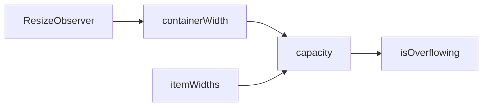

# createOverflow

A composable for computing how many items fit in a container based on available width, enabling responsive truncation for pagination, breadcrumbs, and similar components.

<DocsPageFeatures :frontmatter />

## Usage

The `createOverflow` composable provides reactive container width tracking and capacity calculation. It supports two modes: variable-width (for items with different widths like breadcrumbs) and uniform-width (for same-width items like pagination buttons).

```vue collapse
<script setup lang="ts">
  import { useTemplateRef } from 'vue'
  import { createOverflow } from '@vuetify/v0'

  const containerRef = useTemplateRef('container')

  // Pass container as a ref or getter for proper reactive tracking
  const overflow = createOverflow({
    container: containerRef,
    gap: 8,
    reserved: 40,
  })

  // Check capacity
  console.log(overflow.capacity.value) // Number of items that fit
  console.log(overflow.isOverflowing.value) // true if items exceed container
</script>

<template>
  <div ref="container">
    <!-- Items go here -->
  </div>
</template>
```

## Context / DI

Use `createOverflowContext` to share an overflow instance across a component tree:

```ts
import { createOverflowContext } from '@vuetify/v0'

export const [useNavOverflow, provideNavOverflow, navOverflow] =
  createOverflowContext({ namespace: 'my:nav-overflow' })

// In parent component
provideNavOverflow()

// In child component
const overflow = useNavOverflow()
overflow.capacity.value  // number of items that fit
```

Use `useOverflow` to inject the default (unnamespaced) overflow context provided by a parent:

```ts
import { useOverflow } from '@vuetify/v0'

const overflow = useOverflow()  // Injects the nearest provided overflow context
```

## Architecture

`createOverflow` uses ResizeObserver to compute container capacity:



## Reactivity

| Property/Method | Reactive | Notes |
| - | :-: | - |
| `container` | <AppSuccessIcon /> | ShallowRef, assign element for tracking |
| `width` | <AppSuccessIcon /> | ShallowRef, readonly (from ResizeObserver) |
| `capacity` | <AppSuccessIcon /> | Computed from width and measurements |
| `total` | <AppSuccessIcon /> | Computed, sum of all item widths |
| `isOverflowing` | <AppSuccessIcon /> | Computed from total vs available width |
| `gap` | <AppSuccessIcon /> | Accepts MaybeRefOrGetter |
| `reserved` | <AppSuccessIcon /> | Accepts MaybeRefOrGetter |
| `itemWidth` | <AppSuccessIcon /> | Accepts MaybeRefOrGetter (uniform mode) |

## Examples

::: gn-example
/composables/create-overflow/useOverflowNav.ts 1
/composables/create-overflow/NavItem.vue 2
/composables/create-overflow/OverflowNav.vue 3
/composables/create-overflow/overflow-nav.vue 4

### Collapsing Navigation Bar

A responsive nav bar that shows as many destinations as fit and folds the rest into a `+N more` Popover menu. The composable owns the destination list and a single `createOverflow` instance configured with `gap` and a `reserved` band that keeps room for the overflow trigger; the display component supplies its `<ul>` as the tracked container and reads `capacity` to decide how many items stay inline, `isOverflowing` to decide whether the trigger renders, and `hidden` to populate the menu. Use the width presets in the entry to drive the container narrower and wider without resizing the browser.

The load-bearing detail is the measurement contract. Each `NavItem` measures its own element exactly once on mount — while `capacity` is still `Infinity` and every item is visible — then toggles with `v-show` instead of unmounting. Because the measured widths stay in the map after an item is hidden, `capacity` recomputes correctly in both directions: the bar collapses as the container shrinks and restores items as it grows. A naive `slice(0, capacity)` that unmounts overflowing items throws their widths away, so the bar can collapse but never recover — measuring every item and hiding with `v-show` is what makes the demo bidirectional, and it mirrors how the [Overflow](/components/semantic/overflow) component works internally.

Reach for `createOverflow` directly when you need full control over how truncation is presented — an overflow menu, a breadcrumb ellipsis, or a responsive toolbar. When the default presentation is enough, the [Overflow](/components/semantic/overflow) component wraps this composable with item registration and an indicator slot. For windowing a long scrollable list instead of a single row, see [createVirtual](/composables/data/create-virtual).

| File | Role |
|------|------|
| `useOverflowNav.ts` | Owns the destination data and the `createOverflow` instance; derives the hidden slice and exposes a `measure` helper |
| `NavItem.vue` | Renders one destination and self-measures its element on mount, toggling visibility with `v-show` |
| `OverflowNav.vue` | Binds the container, renders the items and the `+N more` Popover menu, and shows a live capacity readout |
| `overflow-nav.vue` | Entry point; constrains the container with width presets to demonstrate responsive recalculation |
:::

<DocsApi />
