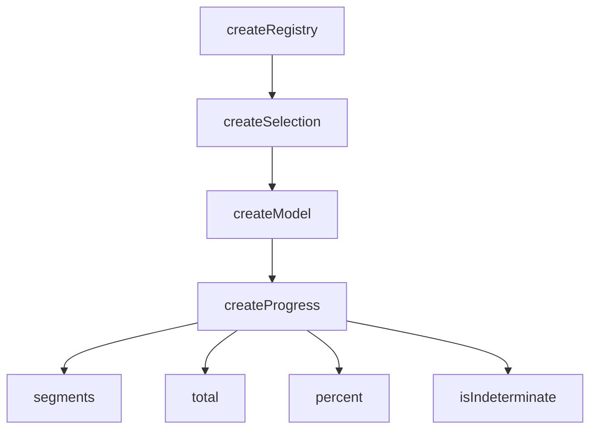

# createProgress

A composable for tracking progress across one or more segments, with percentage computation and indeterminate state detection.

<DocsPageFeatures :frontmatter />

## Usage

The `createProgress` composable creates a progress instance backed by `createModel`. Each segment registers as a model ticket with a `ShallowRef<number>` value. The total, percent, and indeterminate state are computed reactively from all registered segments.

```ts collapse no-filename
import { createProgress } from '@vuetify/v0'

const progress = createProgress({ max: 100 })

// Register segments
const first = progress.register(50)
const second = progress.register(25)

progress.total.value    // 75
progress.percent.value  // 75
progress.isIndeterminate.value // false

// Update a segment
first.value.value = 80
progress.total.value    // 105 → clamped to 100
progress.percent.value  // 100

// Convert raw value to percentage
progress.fromValue(50)  // 50

// Unregister
first.unregister()
progress.total.value    // 25
```

## Architecture

`createProgress` extends `createModel` with sum-based aggregation:



Each segment is a model ticket whose value is a `ShallowRef<number>`. All segments stay selected (`multiple: true`, `enroll: true`) so `selectedValues` always reflects the full set. The `total` sums all segment values and clamps to `[min, max]`. The `percent` normalizes the total to `0–100`.

## Reactivity

| Property | Reactive | Notes |
| - | :-: | - |
| `segments` | <AppSuccessIcon /> | Computed — sorted list of registered segment tickets |
| `selectedValues` | <AppSuccessIcon /> | Computed — array of current segment values |
| `total` | <AppSuccessIcon /> | Computed — sum of segment values, clamped to [min, max] |
| `percent` | <AppSuccessIcon /> | Computed — total as percentage of range |
| `isIndeterminate` | <AppSuccessIcon /> | Computed — `true` when no segments or all values are 0 |

> [!TIP] Segment values are ShallowRef
> Each ticket's `value` is a `ShallowRef<number>`. Updating it (`ticket.value.value = 80`) triggers recomputation of `total` and `percent` automatically.

## Examples

::: example
/composables/create-progress/useUpload.ts 1
/composables/create-progress/upload.vue 2

### File Upload Tracker

Demonstrates standalone `createProgress` usage — no component needed. Each uploaded file registers a segment and simulates progress via a timer.

| File | Role |
|------|------|
| `useUpload.ts` | Composable — wraps createProgress with file-upload semantics |
| `upload.vue` | Demo — add files and watch individual + aggregate progress |

:::

<DocsApi />
