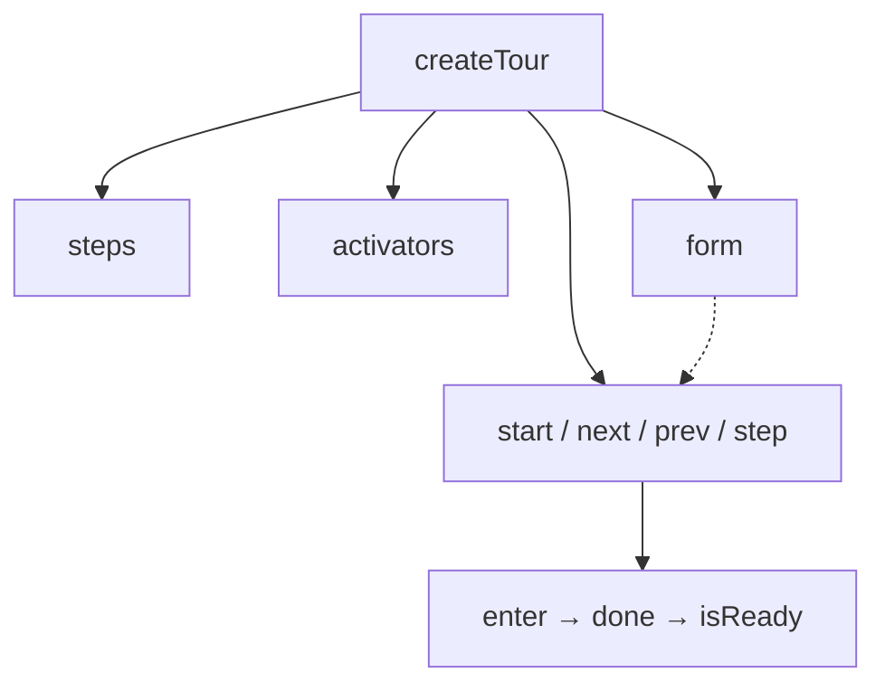

# createTour

<DocsPageFeatures :frontmatter />

Sequence a guided tour through your UI. Register steps, activate a target on enter, and advance only when the step is ready.

## Usage

`createTour` owns one step collection, an activator registry, and a form gate. Add steps with `steps.onboard` or `steps.register` — there is no `items` option. `start()` selects the first step, or `start({ stepId })` a given one. `next()`, `prev()`, and `step(n)` no-op while inactive, unready, or at a boundary. `step` is 1-based. `complete()` marks the tour done; `stop()` dismisses without completing; `reset()` stops and clears steps, activators, and the form.

```ts collapse no-filename
import { createTour } from '@vuetify/v0'

const tour = createTour()

tour.steps.onboard([
  {
    id: 'search',
    placement: 'bottom',
    enter: ({ done, activate }) => {
      const el = document.querySelector('[data-tour="search"]')
      if (el) activate(el)
      done()
    },
  },
  { id: 'settings' },
])

tour.start()
await tour.next()
tour.complete()
```

`placement` is `TourPlacement` (`top`, `bottom`, `left`, `right`, `center`). The composable stores it; `Tour.Content` uses it to override its own `placement` prop. `noActivator` marks a step with no target: the card centers immediately. The last step does that even without the flag. `activate()` sets a 100px scroll margin on the target and restores it on `deactivate()`. Extra fields survive `onboard` / `register` when you pass them through `createTour`'s ticket generic.

Filter the list *before* onboard. The factory does not drop steps for viewport, platform, or catalog rules.

```ts
tour.steps.onboard(isMobile ? steps.filter(step => step.id !== 'sidebar') : steps)
```

An `enter` handler that takes a context must call `done()` (or return a promise) before `next` / `prev` / `step` will move. Omit `enter` and the step is ready immediately. `tour.ready()` is the public alias of `done()`. `activate(el)` registers the current step's target, sets `anchor-name` to `--tour-{id}`, and scrolls it into view unless `{ scroll: false }`. Resolve selectors in the handler (`document.querySelector`) — the factory does not query the DOM. `deactivate()` restores the previous `anchor-name`; leave already calls it.

If a form field is registered under the current step id, `next()` and `step()` call `form.submit(id)` and stay put when it returns false. `prev()` does not validate and does not emit `completed`. Ticket handlers (`enter`, `leave`, `completed`) and `steps` events of the same names both fire; `completed` runs on successful next, on `step()`, and on `complete()` — not on `prev` or `stop`. `start()` is a no-op when not in the browser.

## Context / DI

Use `createTourContext` to share a tour instance across a component tree. This is a factory-owned trinity, not a plugin — there is no `createTourPlugin`.

```ts
import { createTourContext } from '@vuetify/v0'

export const [useOnboardingTour, provideOnboardingTour, onboarding] =
  createTourContext({ namespace: 'app:onboarding' })

// In parent component
provideOnboardingTour()

// In child component
const tour = useOnboardingTour()
await tour.next()
```

Use `useTour` to inject the default (`v0:tour`) context provided by a parent:

```ts
import { useTour } from '@vuetify/v0'

const tour = useTour()
await tour.next()
```

## Architecture

`createTour` composes a step collection, an activator registry, and a form. Navigation runs `enter` on the selected step, waits for `done()` / `ready()`, and on `next` / `step` submits the form field registered under that step id when one exists.



`prev()` skips the form gate and does not emit `completed`. Visual chrome — highlight, floating content, keyboard — is out of scope for this composable.

## Reactivity

| Property | Reactive | Notes |
| - | :-: | - |
| `isActive` | <AppSuccessIcon /> | ShallowRef, readonly — `true` between `start` and `stop` / `complete` |
| `isComplete` | <AppSuccessIcon /> | ShallowRef, readonly — `true` after `complete()`, cleared by `start` / `reset` |
| `isReady` | <AppSuccessIcon /> | ShallowRef, readonly — `false` until `enter` calls `done()` / `ready()` (or there is no `enter`) |
| `isFirst` | <AppSuccessIcon /> | `true` when `selectedIndex === 0` |
| `isLast` | <AppSuccessIcon /> | `true` when the selected step is the last |
| `canGoBack` | <AppSuccessIcon /> | `isReady && !isFirst` |
| `canGoNext` | <AppSuccessIcon /> | `isReady && !isLast` |
| `selectedId` | <AppSuccessIcon /> | Current step id |
| `total` | <AppErrorIcon /> | Number getter over `steps.size` — read `tour.total`, not `tour.total.value` |

> [!TIP] Navigation is gated on isReady
> `canGoNext` / `canGoBack` stay false until `done()` runs, so Prev/Next disable themselves while a step is still entering. `next()` / `prev()` / `step()` also no-op on that flag — the buttons are not the only guard.

## Examples

::: gn-example
/composables/create-tour/useOnboarding.ts 1
/composables/create-tour/basic.vue 2

### Headless chrome walkthrough

A three-step tour of two fake chrome nodes — a search field and an avatar — driven only by `createTour`. There is no Tour compound here: `enter` queries `[data-tour="…"]` and passes the element to `activate()` so the current target gets `--tour-{id}` as its `anchor-name`, and the demo paints a ring from `selectedId`. Start, Prev, Next, and Stop are the whole control surface; Next becomes Complete on the last step because `next()` is a no-op there.

`useOnboarding.ts` owns the instance and the copy. It onboards three tickets (`welcome`, `search`, `avatar`), leaves `welcome` without an `enter` so it is ready immediately, and on the other two activates the matching `[data-tour]` node with `{ scroll: false }` so the docs preview does not jump. `placement` is set on the tickets and `Tour.Content` uses it for that step's position. `basic.vue` renders the chrome, the current title/body, and the buttons from `isActive`, `canGoBack`, `canGoNext`, and `isLast`.

Reach for this shape when the walkthrough is a handful of existing DOM nodes and you want the sequencer without shipping highlight/content chrome. Filter the array before `onboard` if a step should not run on a given viewport; register a form field under the step id when Next must validate. A Tour compound for the visual layer is forthcoming.

| File | Role |
|------|------|
| `useOnboarding.ts` | Owns the `createTour` instance, onboards the three steps, and derives the current copy |
| `basic.vue` | Fake chrome bar, step card, and Start / Prev / Next / Stop controls |

:::

## Recipes

### Filter steps before onboard

The factory does not filter. Drop steps the caller does not want, then onboard.

```ts
const visible = isMobile
  ? catalog.filter(step => step.id !== 'sidebar')
  : catalog

tour.steps.onboard(visible)
```

### Gate next on a form field

Register a validation under the same id as the step. `next()` and `step()` call `form.submit(id)` and stay put when it returns false. `prev()` does not validate.

```ts
import { createTour, createValidation } from '@vuetify/v0'
import { shallowRef } from 'vue'

const tour = createTour()
const name = shallowRef('')
const validation = createValidation({
  value: name,
  rules: ['required'],
})

tour.form.register({ id: 'profile', value: validation })
tour.steps.onboard([{ id: 'profile' }, { id: 'done' }])
```

## FAQ

::: faq

??? Why won't next advance?

The tour is inactive, the current step is not ready, or you are already on the last step. An `enter` that takes a context must call `done()` (or return a promise); until then `isReady` is false and `next()` / `prev()` / `step()` no-op. If a form field is registered under this step id, `next()` also stays put when `form.submit(id)` returns false.

??? What is the difference between stop and complete?

`stop()` dismisses without marking complete — `isComplete` stays false, and `completed` does not fire. `complete()` runs the current step's `completed` handler and event, then dismisses and sets `isComplete` to true. `reset()` stops, resets the form, and clears steps and activators.

??? Is step 0-based or 1-based?

1-based. `tour.step(3)` jumps to the third step (`steps.lookup(2)`). It validates when leaving a form step, emits `completed` for the step you leave, and enters with direction `jump`.

??? Why is total not a ref?

It is a number getter over `steps.size`. Read `tour.total`, never `tour.total.value`. The other flags (`isActive`, `isReady`, `selectedId`, …) are refs.

??? Does createTour ship a plugin or visual chrome?

No. It is a factory with an optional `createTourContext` / `useTour` trinity, like [createOverflow](/composables/semantic/create-overflow). There is no `createTourPlugin`. Highlight, floating content, and keyboard belong to a forthcoming Tour compound — this composable only sequences steps, activators, and the form gate.

:::

<DocsApi />
