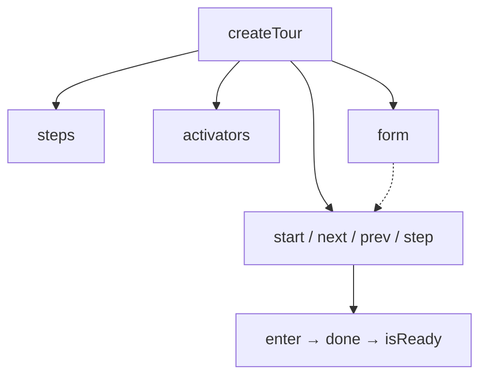

# createTour

<DocsPageFeatures :frontmatter />

Sequence a guided tour. Register each step, point it at a target when it opens, and move on when that step is ready.

## Installation

Install the plugin when a target lives in the layout or on another page. Call `useTour()` during component setup. It returns that same tour.

```ts
import { createTourPlugin } from '@vuetify/v0'

app.use(createTourPlugin())
```

Skip the plugin when the whole tour is born and dies inside one component. Provide `createTourContext` on that component instead. A local provide shadows the plugin for its subtree.

## Usage

Create a tour, add the steps, and start it. Steps join through `steps.onboard` or `steps.register`. There is no `items` option.

```ts collapse no-filename
import { createTour } from '@vuetify/v0'

const tour = createTour()

tour.steps.onboard([
  {
    id: 'search',
    placement: 'bottom',
    enter: ({ done, activate }) => {
      const el = document.querySelector('[data-tour="search"]')
      if (el) activate(el)
      done()
    },
  },
  { id: 'settings' },
])

tour.start()
await tour.next()
tour.complete()
```

### Start, move, and finish

- `start()` opens the first step. `start({ stepId })` opens that step instead.
- `next()`, `prev()`, and `step(n)` do nothing while the tour is stopped, the current step is not ready, or you are already at that end.
- `step` counts from 1. `tour.step(3)` opens the third step.
- `complete()` finishes the tour and sets `isComplete`.
- `stop()` closes the tour and leaves `isComplete` false.
- `reset()` stops the tour, resets the form, and clears the steps and activators.

### Tell the card where to sit

`placement` is `top`, `bottom`, `left`, `right`, or `center`. createTour stores the value. [Tour.Content](/components/disclosure/tour) uses it in place of its own `placement` prop.

- Set `noActivator` on a step that has no target. The card centers immediately.
- The last step centers the same way, even without that flag.
- `activate()` sets a 100px scroll margin on the target. `deactivate()` puts the previous margin back.
- Extra fields you pass to `onboard` or `register` stay on the ticket. Type them through `createTour`'s generic so they survive.

### Skip a step you do not want

Filter the list before you onboard. createTour keeps every step you give it.

```ts
tour.steps.onboard(isMobile ? steps.filter(step => step.id !== 'sidebar') : steps)
```

### Let the step finish opening

`enter` runs when the step opens. The tour will not move until that step is ready.

- Call `done()`, or return a promise, when `enter` accepts the context. `next()`, `prev()`, and `step()` wait for that.
- Leave `enter` off and the step is ready as soon as it opens.
- A handler with no parameters is ready immediately too. A parameter that only has a default value still counts as no parameters. Accept the context argument when you need to call `done()` yourself.
- Return a promise and the tour waits for it, then marks the step ready. If `enter` throws, or the promise rejects, the step is still marked ready and a warning is logged.
- Call `tour.ready(stepId, visit)` when the work continues after `enter` returns. `visit` is the number on the enter context. The call does nothing unless the tour is still active, that step is still selected, and `visit` is still the current one.
- Call `activate(el)` to register this step's target. It sets `anchor-name` to `--tour-{id}` and scrolls the element into view. Pass `{ scroll: false }` to keep the page still.
- Find the element yourself, usually with `document.querySelector`. createTour does not search the DOM for you.
- `deactivate()` restores the previous `anchor-name`. Leaving the step already calls it.

### Check a form before Next

Register a form field under the step id when Next should validate it.

- `next()` and `step()` call `form.submit(id)` and stay on the step when it returns false.
- `prev()` does not validate, and it does not emit `completed`.
- A ticket's `enter`, `leave`, and `completed` functions run, and `steps` emits those same names.
- `completed` runs after a successful `next()`, after `step()`, and from `complete()`. It does not run for `prev()` or `stop()`.
- `start()` does nothing outside the browser.

## Context / DI

`createTourPlugin()` provides one tour for the app. `useTour()` reads it.

A page that should run a different tour calls `createTourContext` and provides the result. Descendants of that page read the local tour. The rest of the app still reads the plugin.

```ts
import { createTourContext } from '@vuetify/v0'

export const [useOnboardingTour, provideOnboardingTour, onboarding] =
  createTourContext({ namespace: 'app:onboarding' })

// In the page that owns this tour
provideOnboardingTour()

// In a child of that page
const tour = useOnboardingTour()
await tour.next()
```

Read the plugin tour, or a parent that already provided `v0:tour`, with `useTour`:

```ts
import { useTour } from '@vuetify/v0'

const tour = useTour()
await tour.next()
```

## Architecture

`createTour` keeps the steps, the activators, and a form. Opening a step runs `enter`, then waits for `done()` or `ready(stepId, visit)`. `next()` and `step()` submit the form field registered under that step id, when one exists.


```mermaid "Tour Architecture"
flowchart TD
  createTour:::primary
  steps
  activators
  form
  nav["start / next / prev / step"]
  enter["enter → done → isReady"]

  createTour --> steps
  createTour --> activators
  createTour --> form
  createTour --> nav
  nav --> enter
  form -.-> nav
```

`prev()` skips the form and does not emit `completed`. The highlight, the card, and the keyboard live on [Tour](/components/disclosure/tour).

## Reactivity

| Property | Reactive | Notes |
| - | :-: | - |
| `isActive` | <AppSuccessIcon /> | ShallowRef, readonly. True from `start()` until `stop()` or `complete()` |
| `isComplete` | <AppSuccessIcon /> | ShallowRef, readonly. True after `complete()`. `start()` and `reset()` clear it |
| `isReady` | <AppSuccessIcon /> | ShallowRef, readonly. False until `enter` calls `done()` or `ready(stepId, visit)`. A step with no `enter` is ready immediately |
| `isFirst` | <AppSuccessIcon /> | True when `selectedIndex === 0` |
| `isLast` | <AppSuccessIcon /> | True when the selected step is the last |
| `canGoBack` | <AppSuccessIcon /> | `isReady && !isFirst` |
| `canGoNext` | <AppSuccessIcon /> | `isReady && !isLast` |
| `selectedId` | <AppSuccessIcon /> | Current step id |
| `total` | <AppErrorIcon /> | A number from `steps.size`. Read `tour.total`, not `tour.total.value` |

> [!TIP] Navigation waits for isReady
> `canGoNext` and `canGoBack` stay false until `done()` runs, so Prev and Next stay disabled while a step is still opening. `next()`, `prev()`, and `step()` check the same flag.

## Examples

::: gn-example
/composables/create-tour/useOnboarding.ts 1
/composables/create-tour/basic.vue 2

### A tour without card chrome

Three steps, a search field, and an avatar, sequenced only by `createTour`. `enter` finds `[data-tour]` and passes the element to `activate()`, which sets `anchor-name` to `--tour-{id}`. The demo draws a ring from `selectedId`. Start, Prev, Next, and Stop are the controls. On the last step, Next becomes Complete, because `next()` does nothing there.

`useOnboarding.ts` owns the tour and the copy. It onboards `welcome`, `search`, and `avatar`. `welcome` has no `enter`, so it is ready immediately. The other two call `activate` with `{ scroll: false }` so the docs page does not jump. `placement` on the ticket is what [Tour.Content](/components/disclosure/tour) would use for that step. `basic.vue` renders the targets, the current title and body, and the buttons from `isActive`, `canGoBack`, `canGoNext`, and `isLast`.

Use this when the targets are already on the page and you only need the sequencer. Filter the array before `onboard` when a step should not run on a small screen. Register a form field under the step id when Next must validate. The card and highlight ship as [Tour](/components/disclosure/tour).

| File | Role |
|------|------|
| `useOnboarding.ts` | Creates the tour, onboards the three steps, and picks the current copy |
| `basic.vue` | Targets, the step copy, and Start, Prev, Next, and Stop |

:::

## Recipes

### Run one tour at a time

The plugin holds one step list. Keep each tour's steps in the app. `app.use` belongs in `main.ts`. Call `useTour()` while a component is setting up, and close `startTour` over that tour.

Starting a tour stops whatever is running, clears that list, and onboards the chosen steps. Activators stay registered, so a target in the layout is found when its step opens. `reset()` clears activators too. Use `stop()` and `steps.clear()` instead.

```ts
// main.ts
import { createTourPlugin } from '@vuetify/v0'

app.use(createTourPlugin())
```

```ts
// component setup
import { useTour } from '@vuetify/v0'

const tour = useTour()

const catalog = {
  search: [{ id: 'search' }, { id: 'search-input' }],
  examples: [{ id: 'intro' }, { id: 'preview' }],
}

function startTour (id: keyof typeof catalog) {
  tour.stop()
  tour.steps.clear()
  tour.steps.onboard(catalog[id])
  tour.start()
}
```

### Filter steps before onboard

createTour does not filter. Remove the steps you do not want, then onboard what is left.

```ts
const visible = isMobile
  ? catalog.filter(step => step.id !== 'sidebar')
  : catalog

tour.steps.onboard(visible)
```

### Gate next on a form field

Register validation under the same id as the step. `next()` and `step()` call `form.submit(id)` and stay on the step when it returns false. `prev()` does not validate.

```ts
import { createTour, createValidation } from '@vuetify/v0'
import { shallowRef } from 'vue'

const tour = createTour()
const name = shallowRef('')
const validation = createValidation({
  value: name,
  rules: ['required'],
})

tour.form.register({ id: 'profile', value: validation })
tour.steps.onboard([{ id: 'profile' }, { id: 'done' }])
```

## FAQ

::: faq

??? Why won't next advance?

`next()` stays put for one of these reasons:

- The tour is not active.
- The current step is not ready. If `enter` accepts a context, call `done()` or return a promise. Until then `isReady` is false, and `prev()` and `step()` wait too.
- You are already on the last step.
- A form field is registered under this step id, and `form.submit(id)` returned false.

??? What is the difference between stop and complete?

- `stop()` closes the tour. `isComplete` stays false, and `completed` does not run.
- `complete()` runs the current step's `completed` handler and event, closes the tour, and sets `isComplete` to true.
- `reset()` stops the tour, resets the form, and clears the steps and activators.

??? Is step 0-based or 1-based?

`step` counts from 1. `tour.step(3)` opens the third step (`steps.lookup(2)`). Leaving a form step still validates. The step you leave emits `completed`. The step you open receives direction `jump`.

??? Why is total not a ref?

`total` is a number, read from `steps.size`. Use `tour.total`. `isActive`, `isReady`, and `selectedId` are refs.

??? Does createTour ship a plugin or visual chrome?

`createTourPlugin()` provides one tour for the app. It does not store the list of tours. The app loads one tour at a time, as in the recipe above. A page can still provide its own tour with `createTourContext`. The highlight, the card, and the keyboard are on [Tour](/components/disclosure/tour).

:::

<DocsApi />
