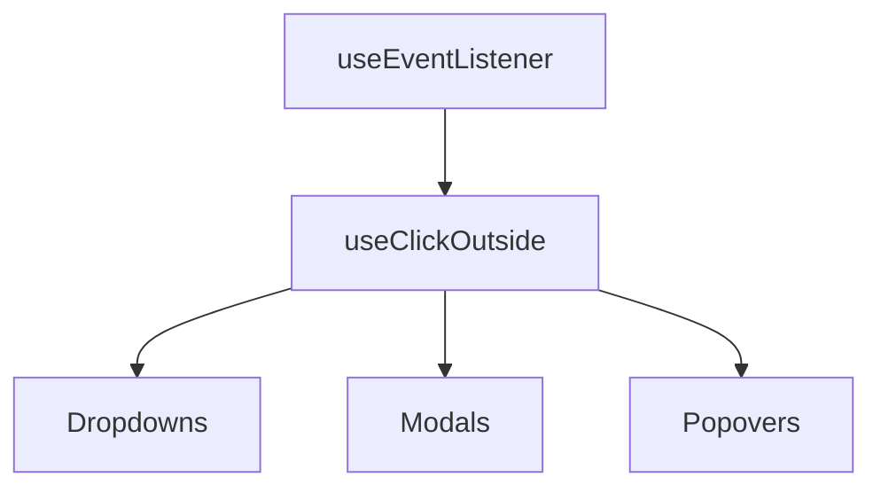

# useClickOutside

A composable for detecting clicks outside of specified element(s) with automatic cleanup.

<DocsPageFeatures :frontmatter />

## Usage

The `useClickOutside` composable detects when users click outside target elements. It uses two-phase detection (pointerdown → pointerup) to prevent false positives when dragging, and includes touch scroll handling for mobile.

::: example
/composables/use-click-outside/basic
:::

## Architecture

`useClickOutside` builds on `useEventListener` for pointer and focus event detection:

## Reactivity

| Property/Method | Reactive | Notes |
| - | :-: | - |
| `isActive` | <AppSuccessIcon /> | Computed from `!isPaused` |
| `isPaused` | <AppSuccessIcon /> | ShallowRef, readonly |

<DocsApi />
