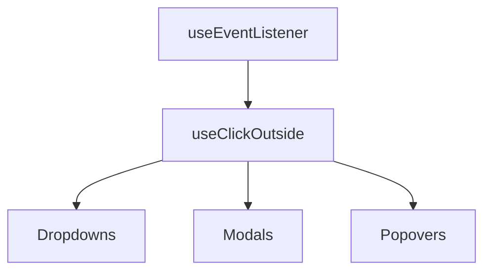

# useClickOutside

A composable for detecting clicks outside of specified element(s) with automatic cleanup.

<DocsPageFeatures :frontmatter />

## Usage

The `useClickOutside` composable detects when users click outside target elements. It uses two-phase detection (pointerdown → pointerup) to prevent false positives when dragging, and includes touch scroll handling for mobile.

<DocsExample file="basic.vue" title="Dropdown Menu" :code="BasicExampleRaw">
  <BasicExample />
</DocsExample>

## Architecture

`useClickOutside` builds on `useEventListener` for pointer and focus event detection:

<DocsApi />
