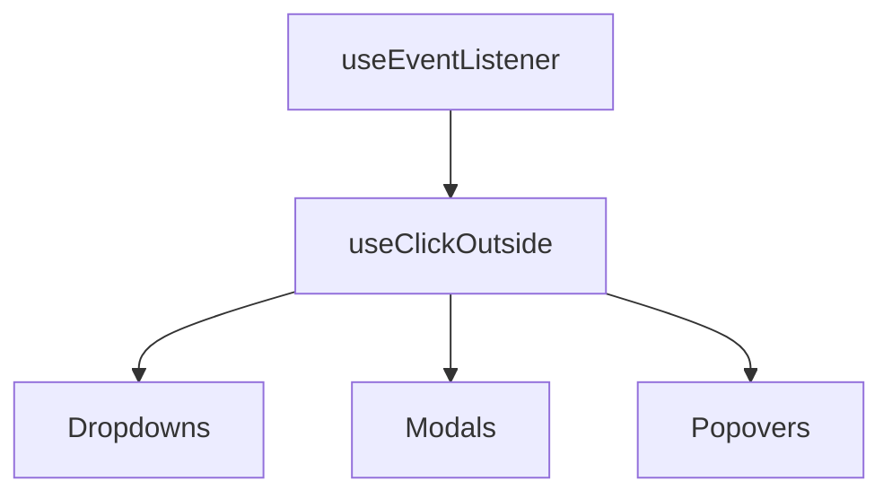

# useClickOutside

A composable for detecting clicks outside of specified element(s) with automatic cleanup.

<DocsPageFeatures :frontmatter />

## Usage

The `useClickOutside` composable detects when users click outside target elements. It uses two-phase detection (pointerdown → pointerup) to prevent false positives when dragging, and includes touch scroll handling for mobile.

```vue collapse no-filename UseClickOutside
<script setup lang="ts">
  import { useClickOutside } from '@vuetify/v0'
  import { useTemplateRef } from 'vue'

  const menu = useTemplateRef('menu')

  useClickOutside(menu, () => {
    console.log('Clicked outside the menu')
  })
</script>

<template>
  <div ref="menu">
    Menu content
  </div>
</template>
```

## Architecture

`useClickOutside` builds on `useEventListener` for pointer and focus event detection:


```mermaid "Click Outside Hierarchy"
flowchart TD
  useEventListener --> useClickOutside
  useClickOutside --> Dropdowns
  useClickOutside --> Modals
  useClickOutside --> Popovers
```

## Options

| Option | Type | Default | Description |
| - | - | - | - |
| `bounds` | `boolean` | `false` | Use bounding-rect detection instead of DOM containment. Required for native `<dialog>` elements — backdrop clicks have the `<dialog>` as the event target, so containment checks always pass |

```ts
import { useClickOutside } from '@vuetify/v0'

const dialog = useTemplateRef('dialog')

// For native <dialog> — backdrop clicks are detected via coordinates
useClickOutside(dialog, () => dialog.value?.close(), { bounds: true })
```

## Reactivity

| Property/Method | Reactive | Notes |
| - | :-: | - |
| `isActive` | <AppSuccessIcon /> | Computed from `!isPaused` |
| `isPaused` | <AppSuccessIcon /> | ShallowRef, readonly |
| `pause()` | - | Stop detection, preserve state |
| `resume()` | - | Resume detection |
| `stop()` | - | Stop and clean up listeners |

## Examples

::: gn-example
/composables/use-click-outside/basic

### Dropdown with Outside Dismiss

A three-item dropdown menu that opens on button click and automatically closes when the user clicks anywhere outside the menu container. The entire `menu` div — trigger button and panel together — is passed as the target ref, so clicking the trigger itself is treated as "inside" and doesn't trigger the dismiss callback.

The example uses `useClickOutside` in its simplest form: one ref target and one callback. No options are needed because the target is a regular `div` (not a native `<dialog>`), so the default DOM-containment check works correctly. The callback flips `isOpen.value = false`, and because `isOpen` is a `shallowRef`, the template re-renders without a full reactive traversal.

Reach for this when dismissing a popover, dropdown, or context menu on outside click. For elements where the event target doesn't reliably reflect DOM containment — such as native `<dialog>` backdrops — pass `{ bounds: true }` to switch to bounding-rect detection instead.

:::

## Recipes

### Multiple Targets

Pass an array of refs to ignore clicks inside any of them:

```ts
import { useClickOutside } from '@vuetify/v0'
import { useTemplateRef } from 'vue'

const trigger = useTemplateRef('trigger')
const panel = useTemplateRef('panel')

// Clicks inside EITHER trigger or panel are ignored
useClickOutside([trigger, panel], () => {
  console.log('Clicked outside both elements')
})
```

The `target` parameter accepts `MaybeArray<ClickOutsideTarget>` — a single ref/getter or an array of refs/getters.

## FAQ

::: faq

??? Why isn't a click on my native `<dialog>` backdrop detected?

Backdrop clicks report the `<dialog>` itself as the event target, so DOM-containment checks always pass. Pass `{ bounds: true }` to switch to bounding-rect detection, which tests the click coordinates against the element's rectangle instead.

??? How do I keep my trigger button from dismissing its own panel?

Pass an array of targets — `useClickOutside([trigger, panel], cb)` — and clicks inside either are treated as inside. Alternatively wrap the trigger and panel in one element and pass that single ref.

??? Why doesn't a drag that ends outside the element fire the callback?

Detection is two-phase (`pointerdown` → `pointerup`) and both must land outside. A drag that starts inside and releases outside is ignored, which keeps text selection and slider drags from triggering a false dismiss.

??? How do I temporarily suspend outside-click detection?

Call `pause()` to stop detection while preserving state, then `resume()` to re-enable it; `stop()` removes the listeners for good. `isActive` reflects whether detection is currently running.

:::

<DocsApi />
